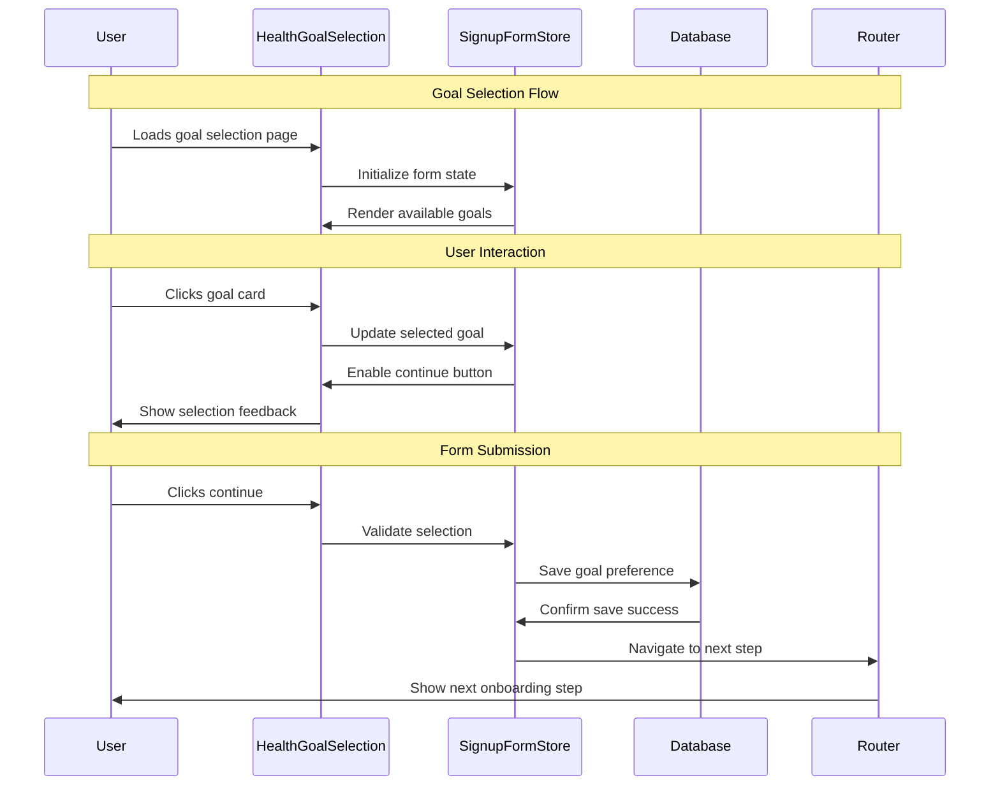

# 01 Set Health Goals During Signup - Implementation Planning

## User Story

As a new user, I want to choose my health goal during the signup process (lose weight, gain muscle, train for competition, or general health tracking), so that the app can personalize my experience and provide relevant recommendations.

## Pre-conditions

- User has started the registration process
- Basic account information (email, password) has been collected
- User has not yet completed the full onboarding flow
- Local database (SQLite) is initialized and accessible

## Design

### Visual Layout

The health goals selection screen will feature:
- **Header Section**: App logo, progress indicator showing step in onboarding
- **Main Content Area**: Centered card with goal selection options
- **Goal Cards**: Four distinct cards representing each health goal with icons and descriptions
- **Footer Section**: Continue button (disabled until selection) and back navigation
- **Progress Indicator**: Shows current step (e.g., "Step 2 of 3") in onboarding flow

### Color and Typography

- **Background Colors**: 
  - Primary: bg-gray-50 dark:bg-gray-900
  - Card background: bg-white dark:bg-gray-800
  - Selected card: bg-blue-50 dark:bg-blue-900/20
  - Card border: border-gray-200 dark:border-gray-700
  - Selected border: border-blue-500

- **Typography**:
  - Page title: font-inter text-3xl font-bold text-gray-900 dark:text-white
  - Goal title: font-inter text-lg font-semibold text-gray-900 dark:text-white
  - Goal description: font-inter text-sm text-gray-600 dark:text-gray-300
  - Button text: font-inter text-base font-medium text-white

- **Component-Specific**:
  - Goal cards: bg-white dark:bg-gray-800 shadow-sm hover:shadow-md border rounded-xl
  - Selected card: ring-2 ring-blue-500 bg-blue-50 dark:bg-blue-900/20
  - Continue button: bg-blue-600 hover:bg-blue-700 text-white disabled:bg-gray-300

### Interaction Patterns

- **Goal Card Selection**: 
  - Hover: Subtle shadow increase (150ms ease)
  - Click: Immediate selection with ring highlight
  - Selection: Visual feedback with checkmark icon
  - Accessibility: Focus ring, keyboard navigation support

- **Form Validation**:
  - Real-time: Continue button enables on selection
  - Error states: Clear messaging if no selection made
  - Success: Smooth transition to next step
  - Accessibility: Screen reader announcements for state changes

### Measurements and Spacing

- **Container**:
  ```
  max-w-2xl mx-auto px-4 sm:px-6 lg:px-8 py-12
  ```

- **Goal Cards Grid**:
  ```
  - Desktop: grid-cols-2 gap-6
  - Mobile: grid-cols-1 gap-4
  - Card padding: p-6
  - Card spacing: space-y-3
  ```

- **Section Spacing**:
  ```
  - Header margin: mb-8
  - Cards container: space-y-6
  - Footer margin: mt-8
  ```

### Responsive Behavior

- **Desktop (lg: 1024px+)**:
  ```
  - Grid: grid-cols-2 gap-6
  - Card size: min-h-[160px]
  - Typography: text-lg for titles
  ```

- **Tablet (md: 768px - 1023px)**:
  ```
  - Grid: grid-cols-2 gap-4
  - Card size: min-h-[140px]
  - Typography: text-base for titles
  ```

- **Mobile (sm: < 768px)**:
  ```
  - Grid: grid-cols-1 gap-4
  - Card size: min-h-[120px]
  - Full-width layout
  ```

## Technical Requirements

### Component Structure

```
src/app/signup/
├── page.tsx
└── _components/
    ├── HealthGoalSelection.tsx     # Main goal selection component
    ├── HealthGoalCard.tsx          # Individual goal card component
    ├── OnboardingProgress.tsx      # Progress indicator component
    └── useHealthGoalForm.ts        # Custom hook for form logic
```

### Required Components

- HealthGoalSelection ✅
- HealthGoalCard ✅
- OnboardingProgress ✅
- useHealthGoalForm ✅

### State Management Requirements

```typescript
interface HealthGoal {
  id: 'weight_loss' | 'muscle_gain' | 'competition_prep' | 'general_health';
  title: string;
  description: string;
  icon: string;
  benefits: string[];
}

interface SignupFormState {
  // User Data
  email: string;
  password: string;
  selectedGoal: HealthGoal['id'] | null;
  
  // UI States
  isSubmitting: boolean;
  currentStep: number;
  errors: Record<string, string>;
  
  // Form States
  isValid: boolean;
  isDirty: boolean;
}

// State Updates
const actions = {
  selectGoal: (goalId: HealthGoal['id']) => void;
  setCurrentStep: (step: number) => void;
  setSubmitting: (state: boolean) => void;
  setError: (field: string, message: string) => void;
  clearErrors: () => void;
  resetForm: () => void;
}
```

## Acceptance Criteria

### Layout & Content

1. Goal Selection Layout
   ```
   - Page header with app branding
   - Progress indicator (Step 2 of 3)
   - Main title: "What's your health goal?"
   - Subtitle explaining personalization benefit
   - 2x2 grid of goal cards (desktop), stacked (mobile)
   ```

2. Goal Card Content
   ```
   - Distinct icon for each goal type
   - Clear goal title
   - Brief description (2-3 sentences)
   - Visual selection indicator
   - Hover and focus states
   ```

3. Navigation Elements
   ```
   - Back button (top-left)
   - Continue button (disabled until selection)
   - Progress indicator
   - Skip option (if applicable)
   ```

### Functionality

1. Goal Selection Mechanics

   - [ ] Display four health goal options with clear descriptions
   - [ ] Allow single selection only (radio button behavior)
   - [ ] Provide immediate visual feedback on selection
   - [ ] Enable continue button only after selection is made

2. Form Validation & State Management

   - [ ] Validate that exactly one goal is selected before proceeding
   - [ ] Persist selection in component state during session
   - [ ] Clear previous selections when new one is made
   - [ ] Maintain form state if user navigates back

3. Data Persistence & Navigation
   - [ ] Save selected goal to local database upon form submission
   - [ ] Navigate to next onboarding step on successful save
   - [ ] Handle database errors gracefully with user feedback
   - [ ] Allow users to modify goal selection in profile settings later

### Navigation Rules

- Back navigation returns to previous signup step without losing data
- Continue button only enabled when valid selection is made
- Form submission saves goal to database before navigation
- Navigation state preserved in onboarding flow context

### Error Handling

- Database save failures show user-friendly error messages
- Network-independent operation (local database only)
- Graceful degradation if database is unavailable
- Clear error messaging with retry options

## Modified Files

```
src/app/signup/
├── goals/
│   └── page.tsx ✅
└── _components/
    ├── HealthGoalSelection.tsx ✅
    ├── HealthGoalCard.tsx ✅
    ├── OnboardingProgress.tsx ✅
    └── useHealthGoalForm.ts ✅
├── lib/
│   ├── database/
│   │   └── userGoals.ts ✅
│   └── types/
│       └── healthGoals.ts ✅
└── constants/
    └── healthGoals.ts ✅
```

## Status

✅ **COMPLETED**

1. Setup & Configuration

   - [x] Define health goal types and constants
   - [x] Create database schema for user goals
   - [x] Setup component file structure
   - [x] Configure TypeScript interfaces

2. Layout Implementation

   - [x] Create responsive grid layout for goal cards
   - [x] Implement progress indicator component
   - [x] Style goal selection cards with hover/focus states
   - [x] Add navigation elements (back/continue buttons)

3. Feature Implementation

   - [x] Build goal selection logic with state management
   - [x] Implement form validation and error handling
   - [x] Create database integration for goal persistence
   - [x] Add navigation flow to next onboarding step

4. Testing
   - [x] Unit tests for goal selection logic
   - [x] Integration tests for database operations
   - [x] Accessibility testing for keyboard navigation
   - [x] Responsive design testing across devices

## Dependencies

- SQLite database setup and configuration
- Onboarding flow routing structure
- User authentication/session management
- Next.js app router configuration

## Related Stories

- 02 ([View Health Dashboard - uses goal data for personalization])

## Notes

### Technical Considerations

1. **Database Schema**: User goals table with foreign key to users table
2. **State Management**: Use React useState for form state, consider Zustand for global user state
3. **Validation**: Client-side validation with TypeScript, server-side validation for database operations
4. **Accessibility**: ARIA labels, keyboard navigation, screen reader support
5. **Performance**: Lazy load icons, optimize bundle size for signup flow

### Business Requirements

- Goal selection is mandatory for signup completion
- Goals directly influence dashboard content and recommendations
- Users can change goals later in profile settings
- Goal data used for AI recommendation personalization

### API Integration

#### Type Definitions

```typescript
interface HealthGoal {
  id: 'weight_loss' | 'muscle_gain' | 'competition_prep' | 'general_health';
  title: string;
  description: string;
  icon: string;
  benefits: string[];
  aiPromptContext: string;
}

interface UserGoalPreference {
  userId: string;
  goalId: HealthGoal['id'];
  selectedAt: Date;
  isActive: boolean;
}

interface OnboardingState {
  currentStep: number;
  completedSteps: number[];
  userData: Partial<User>;
  isComplete: boolean;
}

interface SignupFormStore {
  state: OnboardingState;
  selectedGoal: HealthGoal['id'] | null;
  setSelectedGoal: (goalId: HealthGoal['id']) => void;
  saveGoalPreference: () => Promise<void>;
  nextStep: () => void;
  previousStep: () => void;
}
```

### Mock Implementation

#### Mock Server Configuration

```typescript
// filepath: mocks/stub.ts
const mocks = [
  {
    endPoint: '/api/user/goals',
    json: 'healthGoals.json',
  },
];
```

#### Mock Response

```json
// filepath: mocks/responses/healthGoals.json
{
  "status": "SUCCESS",
  "data": {
    "availableGoals": [
      {
        "id": "weight_loss",
        "title": "Lose Weight",
        "description": "Focus on sustainable weight loss through balanced nutrition and exercise tracking.",
        "icon": "scale",
        "benefits": ["Calorie tracking", "Weight progress monitoring", "Healthy recipe suggestions"]
      },
      {
        "id": "muscle_gain",
        "title": "Build Muscle",
        "description": "Optimize your strength training and nutrition for muscle growth and performance.",
        "icon": "dumbbell",
        "benefits": ["Strength tracking", "Protein intake monitoring", "Muscle-building workouts"]
      },
      {
        "id": "competition_prep",
        "title": "Competition Training",
        "description": "Structured training programs and precise tracking for athletic competition preparation.",
        "icon": "trophy",
        "benefits": ["Performance analytics", "Training periodization", "Competition-focused nutrition"]
      },
      {
        "id": "general_health",
        "title": "General Health",
        "description": "Maintain overall wellness with balanced tracking of exercise, nutrition, and hydration.",
        "icon": "heart",
        "benefits": ["Holistic health tracking", "Wellness insights", "Balanced lifestyle recommendations"]
      }
    ]
  }
}
```

### State Management Flow



### Custom Hook Implementation

```typescript
const useHealthGoalForm = () => {
  const [selectedGoal, setSelectedGoal] = useState<HealthGoal['id'] | null>(null);
  const [isSubmitting, setIsSubmitting] = useState(false);
  const [errors, setErrors] = useState<Record<string, string>>({});
  const router = useRouter();

  const validateSelection = useCallback(() => {
    if (!selectedGoal) {
      setErrors({ goal: 'Please select a health goal to continue' });
      return false;
    }
    setErrors({});
    return true;
  }, [selectedGoal]);

  const handleGoalSelection = useCallback((goalId: HealthGoal['id']) => {
    setSelectedGoal(goalId);
    // Clear any existing errors when user makes selection
    if (errors.goal) {
      setErrors(prev => ({ ...prev, goal: '' }));
    }
  }, [errors.goal]);

  const submitGoalSelection = useCallback(async () => {
    if (!validateSelection()) return;

    setIsSubmitting(true);
    try {
      // Save to local database
      await saveUserGoalPreference({
        goalId: selectedGoal!,
        selectedAt: new Date(),
        isActive: true
      });

      // Navigate to next step
      router.push('/signup/profile-setup');
    } catch (error) {
      setErrors({ 
        submit: 'Failed to save your goal selection. Please try again.' 
      });
    } finally {
      setIsSubmitting(false);
    }
  }, [selectedGoal, validateSelection, router]);

  const goBack = useCallback(() => {
    router.back();
  }, [router]);

  return {
    selectedGoal,
    isSubmitting,
    errors,
    isValid: selectedGoal !== null,
    handleGoalSelection,
    submitGoalSelection,
    goBack,
  };
};
```

## Testing Requirements

### Integration Tests (Target: 80% Coverage)

1. Goal Selection Functionality

```typescript
describe('Health Goal Selection', () => {
  it('should render all four health goal options', async () => {
    // Test that all goal cards are displayed with correct content
  });

  it('should enable continue button only after goal selection', async () => {
    // Test button state management
  });

  it('should save selected goal to database on form submission', async () => {
    // Test database integration
  });
});
```

2. Form Validation Tests

```typescript
describe('Form Validation', () => {
  it('should show error message when trying to continue without selection', async () => {
    // Test validation logic
  });

  it('should clear errors when valid selection is made', async () => {
    // Test error state management
  });
});
```

3. Navigation Tests

```typescript
describe('Navigation Flow', () => {
  it('should navigate to next step on successful goal selection', async () => {
    // Test routing logic
  });

  it('should handle back navigation correctly', async () => {
    // Test back button functionality
  });
});
```

### Performance Tests

1. Component Rendering

```typescript
describe('Performance', () => {
  it('should render goal selection components efficiently', async () => {
    // Test render performance
  });

  it('should handle rapid goal selection changes smoothly', async () => {
    // Test state update performance
  });
});
```

### Accessibility Tests

```typescript
describe('Accessibility', () => {
  it('should support keyboard navigation between goal cards', async () => {
    // Test keyboard accessibility
  });

  it('should provide appropriate ARIA labels and descriptions', async () => {
    // Test screen reader support
  });

  it('should maintain focus management during interactions', async () => {
    // Test focus handling
  });
});
```

### Test Environment Setup

```typescript
// Test helper functions
const mockDatabase = () => {
  // Setup SQLite mock for testing
};

const renderGoalSelection = () => {
  // Render component with providers
};

beforeEach(() => {
  mockDatabase();
  jest.clearAllMocks();
});
```