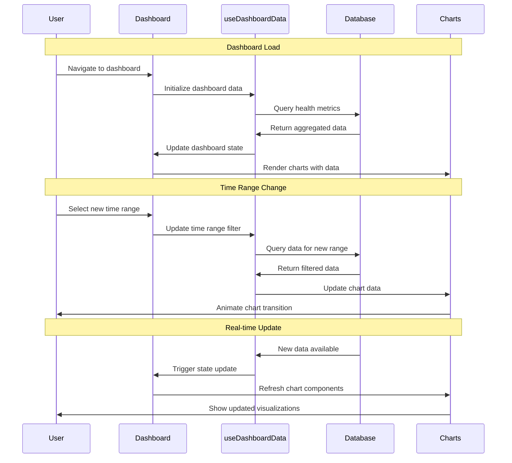

# 02 View Health Dashboard - Implementation Planning

## User Story

As a user, I want to see a dashboard on my homepage that displays my tracked health data over a customizable time period, so that I can quickly understand my progress and patterns.

## Pre-conditions

- User has completed the signup process and selected health goals
- User has access to the main application interface
- Local database (SQLite) contains user's health data (exercise, food, water tracking)
- User authentication/session is established
- At least some historical health data exists (or empty state handling is implemented)

## Design

### Visual Layout

The health dashboard will feature:
- **Header Section**: App navigation, user profile, and time period selector
- **Summary Cards Row**: Key metrics overview (total exercises, calories, water intake)
- **Main Chart Area**: Large visualization showing progress over selected time period
- **Secondary Metrics Grid**: Detailed breakdowns of exercise types, nutrition, hydration
- **Quick Actions Section**: Shortcuts to add new data or view detailed reports
- **Responsive Layout**: Stacked on mobile, grid-based on desktop

### Color and Typography

- **Background Colors**: 
  - Primary: bg-gray-50 dark:bg-gray-900
  - Card backgrounds: bg-white dark:bg-gray-800
  - Chart area: bg-white dark:bg-gray-800
  - Success metrics: bg-green-50 dark:bg-green-900/20
  - Warning indicators: bg-yellow-50 dark:bg-yellow-900/20

- **Typography**:
  - Page title: font-inter text-3xl font-bold text-gray-900 dark:text-white
  - Card titles: font-inter text-lg font-semibold text-gray-900 dark:text-white
  - Metric values: font-inter text-2xl font-bold text-blue-600 dark:text-blue-400
  - Metric labels: font-inter text-sm text-gray-600 dark:text-gray-300
  - Chart labels: font-inter text-xs text-gray-500 dark:text-gray-400

- **Component-Specific**:
  - Summary cards: bg-white dark:bg-gray-800 shadow-sm border border-gray-200 dark:border-gray-700
  - Chart containers: bg-white dark:bg-gray-800 shadow-md rounded-lg
  - Time selector: bg-blue-50 dark:bg-blue-900/20 border-blue-200 dark:border-blue-800
  - Quick action buttons: bg-blue-600 hover:bg-blue-700 text-white

### Interaction Patterns

- **Time Period Selection**: 
  - Hover: Subtle background highlight (150ms ease)
  - Active: Distinct background color and border
  - Transition: Smooth chart animation (300ms ease-in-out)
  - Accessibility: Focus ring, keyboard navigation

- **Chart Interaction**:
  - Hover: Data point tooltips with detailed information
  - Click: Drill-down to specific day/period details
  - Touch: Mobile-friendly touch interactions
  - Accessibility: Keyboard navigation through data points

### Measurements and Spacing

- **Container**:
  ```
  max-w-7xl mx-auto px-4 sm:px-6 lg:px-8 py-6
  ```

- **Grid Layout**:
  ```
  - Summary cards: grid-cols-1 md:grid-cols-3 gap-4 md:gap-6
  - Main content: grid-cols-1 lg:grid-cols-3 gap-6
  - Chart area: lg:col-span-2
  - Sidebar metrics: lg:col-span-1
  ```

- **Component Spacing**:
  ```
  - Section margins: space-y-6
  - Card padding: p-4 md:p-6
  - Chart padding: p-6
  - Button spacing: space-x-3
  ```

### Responsive Behavior

- **Desktop (lg: 1024px+)**:
  ```
  - Grid: grid-cols-3 gap-6
  - Summary cards: 3-column layout
  - Chart: 2/3 width, sidebar: 1/3 width
  - Full navigation visible
  ```

- **Tablet (md: 768px - 1023px)**:
  ```
  - Grid: grid-cols-2 gap-4
  - Summary cards: 2-column layout
  - Chart: full width above sidebar
  - Condensed navigation
  ```

- **Mobile (sm: < 768px)**:
  ```
  - Stack layout: flex flex-col space-y-4
  - Summary cards: single column
  - Chart: full width, reduced height
  - Hamburger navigation
  ```

## Technical Requirements

### Component Structure

```
src/app/dashboard/
├── page.tsx
└── _components/
    ├── HealthDashboard.tsx           # Main dashboard container
    ├── TimeRangeSelector.tsx         # Time period selection component
    ├── SummaryCards.tsx              # Overview metrics cards
    ├── HealthChart.tsx               # Main progress chart
    ├── MetricsGrid.tsx               # Detailed metrics breakdown
    ├── QuickActions.tsx              # Action shortcuts
    ├── EmptyState.tsx                # No data state component
    └── useDashboardData.ts           # Custom hook for data management
```

### Required Components

- HealthDashboard ⬜
- TimeRangeSelector ⬜
- SummaryCards ⬜
- HealthChart ⬜
- MetricsGrid ⬜
- QuickActions ⬜
- EmptyState ⬜
- useDashboardData ⬜

### State Management Requirements

```typescript
interface DashboardState {
  // UI States
  isLoading: boolean;
  selectedTimeRange: TimeRange;
  chartType: 'overview' | 'exercise' | 'nutrition' | 'hydration';
  
  // Data States
  healthData: HealthDataPoint[];
  summaryMetrics: SummaryMetrics;
  chartData: ChartDataPoint[];
  
  // Filter States
  dateRange: DateRange;
  dataFilters: DataFilter[];
  refreshTimestamp: Date;
}

interface TimeRange {
  label: string;
  value: 'week' | 'month' | 'quarter' | 'year';
  days: number;
}

interface HealthDataPoint {
  date: Date;
  exerciseMinutes: number;
  caloriesConsumed: number;
  waterIntake: number;
  weight?: number;
}

// State Updates
const actions = {
  setTimeRange: (range: TimeRange) => void;
  setChartType: (type: string) => void;
  refreshData: () => Promise<void>;
  updateDateRange: (range: DateRange) => void;
  addDataPoint: (data: HealthDataPoint) => void;
}
```

## Acceptance Criteria

### Layout & Content

1. Dashboard Header
   ```
   - Welcome message with user's name
   - Time range selector (7 days, 30 days, 90 days, 1 year)
   - Last updated timestamp
   - Refresh data action
   ```

2. Summary Cards Section
   ```
   - Total exercise sessions this period
   - Average daily water intake
   - Nutrition tracking streak
   - Goal completion percentage
   ```

3. Main Chart Area
   ```
   - Interactive line/bar chart showing progress
   - Customizable metric display (exercise, nutrition, hydration)
   - Data point tooltips with detailed information
   - Smooth animations for data updates
   ```

4. Detailed Metrics Grid
   ```
   - Exercise breakdown by type
   - Nutrition insights and trends
   - Hydration patterns
   - Progress toward personal goals
   ```

### Functionality

1. Data Visualization

   - [ ] Display visual summaries of health data for selected time period
   - [ ] Show key metrics: exercise sessions, food intake, water consumption
   - [ ] Provide interactive charts with hover tooltips and click interactions
   - [ ] Update charts smoothly when time period changes

2. Time Period Management

   - [ ] Allow users to select from predefined time periods (7d, 30d, 90d, 1y)
   - [ ] Update all dashboard components when time period changes
   - [ ] Maintain selected time period in user session
   - [ ] Show appropriate loading states during data fetching

3. Real-time Updates
   - [ ] Automatically refresh dashboard when new data is tracked
   - [ ] Show live updates without requiring page refresh
   - [ ] Handle concurrent data updates gracefully
   - [ ] Provide manual refresh option for users

### Navigation Rules

- Dashboard serves as the main landing page after login
- Time period selection persists across browser sessions
- Quick actions navigate to respective data entry pages
- Chart interactions provide drill-down to detailed views

### Error Handling

- Graceful degradation when database is unavailable
- Empty state handling for new users with no data
- Error messages for data loading failures with retry options
- Fallback charts/visualizations when chart library fails

## Modified Files

```
src/app/dashboard/
├── page.tsx ⬜
└── _components/
    ├── HealthDashboard.tsx ⬜
    ├── TimeRangeSelector.tsx ⬜
    ├── SummaryCards.tsx ⬜
    ├── HealthChart.tsx ⬜
    ├── MetricsGrid.tsx ⬜
    ├── QuickActions.tsx ⬜
    ├── EmptyState.tsx ⬜
    └── useDashboardData.ts ⬜
├── lib/
│   ├── database/
│   │   └── healthData.ts ⬜
│   ├── charts/
│   │   └── chartConfig.ts ⬜
│   └── utils/
│       └── dateHelpers.ts ⬜
└── types/
    └── dashboard.ts ⬜
```

## Status

🟨 IN PROGRESS

1. Setup & Configuration

   - [ ] Install and configure chart library (Recharts/Chart.js)
   - [ ] Define TypeScript interfaces for dashboard data
   - [ ] Setup database queries for health metrics
   - [ ] Configure date/time utilities and helpers

2. Layout Implementation

   - [ ] Create responsive grid layout for dashboard components
   - [ ] Implement summary cards with metric displays
   - [ ] Build time range selector with smooth transitions
   - [ ] Add loading skeletons and empty states

3. Feature Implementation

   - [ ] Integrate chart library with health data
   - [ ] Implement real-time data updates and refresh logic
   - [ ] Build interactive chart features (tooltips, drill-down)
   - [ ] Add data filtering and time period management

4. Testing
   - [ ] Unit tests for data aggregation and chart logic
   - [ ] Integration tests for database queries and updates
   - [ ] Visual regression tests for chart rendering
   - [ ] Performance tests for large datasets

## Dependencies

- Chart/visualization library (Recharts recommended for React)
- Date manipulation library (date-fns or dayjs)
- User health data from stories 03, 04, 05 (exercise, food, water tracking)
- User goal preferences from story 01 (for personalized insights)
- SQLite database with indexed health data tables

## Related Stories

- 01 ([Set Health Goals During Signup - provides goal data for personalization])
- 03 ([Record Exercise Activities - provides exercise data for dashboard])
- 04 ([Record Food Intake - provides nutrition data for dashboard])
- 05 ([Track Daily Water Consumption - provides hydration data for dashboard])

## Notes

### Technical Considerations

1. **Performance Optimization**: Implement data caching and pagination for large datasets
2. **Chart Library Selection**: Use Recharts for React compatibility and accessibility
3. **Real-time Updates**: WebSocket or polling mechanism for live data updates
4. **Data Aggregation**: Pre-compute summary statistics for faster dashboard loading
5. **Responsive Charts**: Ensure chart components work well across all device sizes

### Business Requirements

- Dashboard must load within 2 seconds for optimal user experience
- Charts should be accessible to users with disabilities (screen readers, keyboard navigation)
- Data visualization should align with user's selected health goals
- Empty states should encourage users to start tracking their health data

### API Integration

#### Type Definitions

```typescript
interface HealthMetrics {
  totalExerciseSessions: number;
  averageDailyWater: number;
  nutritionTrackingStreak: number;
  goalCompletionPercentage: number;
}

interface ChartDataPoint {
  date: string;
  exercise: number;
  nutrition: number;
  hydration: number;
  weight?: number;
}

interface SummaryMetrics {
  currentPeriod: HealthMetrics;
  previousPeriod: HealthMetrics;
  percentageChanges: Record<keyof HealthMetrics, number>;
}

interface DashboardStore {
  data: SummaryMetrics;
  chartData: ChartDataPoint[];
  selectedTimeRange: TimeRange;
  isLoading: boolean;
  lastUpdated: Date;
  
  setTimeRange: (range: TimeRange) => void;
  refreshData: () => Promise<void>;
  updateRealtime: (newData: HealthDataPoint) => void;
}
```

### Mock Implementation

#### Mock Server Configuration

```typescript
// filepath: mocks/stub.ts
const mocks = [
  {
    endPoint: '/api/dashboard/metrics',
    json: 'dashboardMetrics.json',
  },
  {
    endPoint: '/api/dashboard/chart-data',
    json: 'chartData.json',
  },
];
```

#### Mock Response

```json
// filepath: mocks/responses/dashboardMetrics.json
{
  "status": "SUCCESS",
  "data": {
    "summaryMetrics": {
      "totalExerciseSessions": 12,
      "averageDailyWater": 2.1,
      "nutritionTrackingStreak": 7,
      "goalCompletionPercentage": 85
    },
    "chartData": [
      {
        "date": "2025-10-28",
        "exercise": 45,
        "nutrition": 1800,
        "hydration": 2.2
      },
      {
        "date": "2025-10-29",
        "exercise": 60,
        "nutrition": 1950,
        "hydration": 2.0
      }
    ],
    "timeRange": {
      "label": "Last 7 Days",
      "value": "week",
      "days": 7
    }
  }
}
```

### State Management Flow



### Custom Hook Implementation

```typescript
const useDashboardData = (initialTimeRange: TimeRange = defaultTimeRange) => {
  const [data, setData] = useState<SummaryMetrics | null>(null);
  const [chartData, setChartData] = useState<ChartDataPoint[]>([]);
  const [selectedTimeRange, setSelectedTimeRange] = useState(initialTimeRange);
  const [isLoading, setIsLoading] = useState(true);
  const [lastUpdated, setLastUpdated] = useState<Date>(new Date());

  const fetchDashboardData = useCallback(async (timeRange: TimeRange) => {
    setIsLoading(true);
    try {
      const endDate = new Date();
      const startDate = subDays(endDate, timeRange.days);
      
      // Fetch aggregated metrics
      const metrics = await getHealthMetrics(startDate, endDate);
      const chartPoints = await getChartData(startDate, endDate);
      
      setData(metrics);
      setChartData(chartPoints);
      setLastUpdated(new Date());
    } catch (error) {
      console.error('Failed to fetch dashboard data:', error);
      // Handle error state
    } finally {
      setIsLoading(false);
    }
  }, []);

  const updateTimeRange = useCallback((newRange: TimeRange) => {
    setSelectedTimeRange(newRange);
    fetchDashboardData(newRange);
  }, [fetchDashboardData]);

  const refreshData = useCallback(() => {
    fetchDashboardData(selectedTimeRange);
  }, [fetchDashboardData, selectedTimeRange]);

  // Real-time updates when new health data is added
  useEffect(() => {
    const handleNewData = (event: CustomEvent) => {
      // Refresh data when new health data is tracked
      refreshData();
    };

    window.addEventListener('healthDataUpdated', handleNewData);
    return () => window.removeEventListener('healthDataUpdated', handleNewData);
  }, [refreshData]);

  // Initial data load
  useEffect(() => {
    fetchDashboardData(selectedTimeRange);
  }, []);

  return {
    data,
    chartData,
    selectedTimeRange,
    isLoading,
    lastUpdated,
    updateTimeRange,
    refreshData,
  };
};
```

## Testing Requirements

### Integration Tests (Target: 80% Coverage)

1. Dashboard Data Loading

```typescript
describe('Dashboard Data Loading', () => {
  it('should load and display health metrics for default time range', async () => {
    // Test initial data loading and display
  });

  it('should update charts when time range is changed', async () => {
    // Test time range selection and data updates
  });

  it('should handle empty data state for new users', async () => {
    // Test empty state rendering and messaging
  });
});
```

2. Chart Interactions

```typescript
describe('Chart Interactions', () => {
  it('should show tooltips on data point hover', async () => {
    // Test chart interactivity
  });

  it('should navigate to detail view on chart click', async () => {
    // Test drill-down functionality
  });

  it('should animate smoothly during data updates', async () => {
    // Test chart animations and transitions
  });
});
```

3. Real-time Updates

```typescript
describe('Real-time Updates', () => {
  it('should refresh data when new health data is added', async () => {
    // Test automatic data refresh
  });

  it('should maintain chart state during updates', async () => {
    // Test state persistence during updates
  });
});
```

### Performance Tests

1. Data Aggregation Performance

```typescript
describe('Performance', () => {
  it('should load dashboard within 2 seconds', async () => {
    // Test initial load performance
  });

  it('should handle large datasets efficiently', async () => {
    // Test with 1+ year of daily data
  });

  it('should optimize chart rendering for mobile devices', async () => {
    // Test mobile performance
  });
});
```

### Accessibility Tests

```typescript
describe('Accessibility', () => {
  it('should provide keyboard navigation for chart elements', async () => {
    // Test keyboard accessibility
  });

  it('should announce data changes to screen readers', async () => {
    // Test screen reader compatibility
  });

  it('should maintain proper color contrast in charts', async () => {
    // Test visual accessibility
  });
});
```

### Test Environment Setup

```typescript
// Test helper functions
const mockHealthData = (days: number): HealthDataPoint[] => {
  // Generate mock health data for testing
};

const renderDashboard = (props?: Partial<DashboardProps>) => {
  // Render dashboard with providers and mock data
};

beforeEach(() => {
  jest.clearAllMocks();
  mockDatabase.reset();
});
```