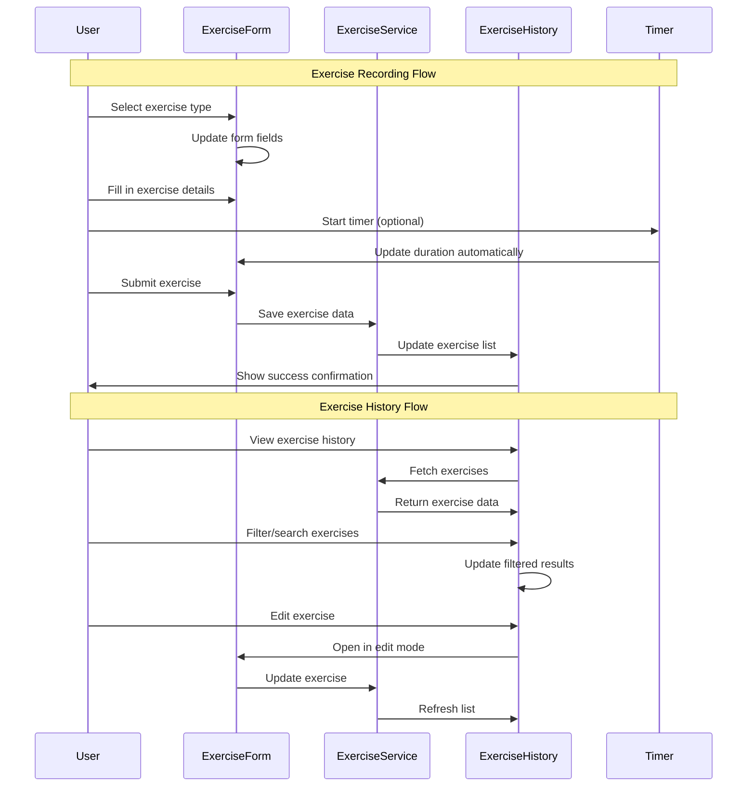

# 03-record-exercise-activities - Implementation Planning

## User Story

As a user, I want to record my exercise activities in the app, so that I can track my fitness progress and maintain a comprehensive health diary.

## Pre-conditions

- User must be authenticated and logged in
- Dashboard and profile pages are implemented and functional
- Authentication system is working properly
- Navigation system supports additional menu items
- Database/storage system is set up for persisting exercise data

## Design

### Visual Layout

The exercise tracking feature will consist of:
- **Exercise Tracking Page**: Main page accessible from navigation with exercise logging interface
- **Exercise Form Component**: Form for recording new exercise activities with dynamic fields based on exercise type
- **Exercise History Component**: List view of previously recorded exercises with edit/delete capabilities
- **Exercise Cards**: Individual exercise entry display cards with quick actions
- **Exercise Type Selector**: Dropdown/button group for selecting different exercise categories
- **Timer Component**: Optional live workout timer for real-time logging
- **Quick Actions**: Floating action button or sidebar for rapid exercise entry

### Color and Typography

- **Background Colors**: 
  - Primary: bg-white dark:bg-gray-900
  - Secondary: bg-gray-50 dark:bg-gray-800
  - Exercise Cards: bg-white dark:bg-gray-800 with exercise-type color accents
  - Form Background: bg-gradient-to-br from-gray-50 to-blue-50/30

- **Typography**:
  - Page Heading: text-2xl font-bold text-gray-900 dark:text-white
  - Section Headers: text-lg font-semibold text-gray-800 dark:text-gray-200
  - Exercise Names: text-base font-medium text-gray-900 dark:text-white
  - Duration/Stats: text-sm text-gray-600 dark:text-gray-400
  - Form Labels: text-sm font-medium text-gray-700 dark:text-gray-300

- **Component-Specific**:
  - Exercise Cards: bg-white dark:bg-gray-800 shadow-sm hover:shadow-md border-l-4 with type-specific colors
  - Form Fields: bg-white dark:bg-gray-800 border border-gray-300 focus:ring-2 focus:ring-blue-500
  - Action Buttons: bg-blue-600 text-white hover:bg-blue-700 active:bg-blue-800
  - Timer: bg-gradient-to-r from-green-500 to-emerald-600 text-white
  - Type Badges: Exercise-specific gradient backgrounds (HIIT: orange, Cardio: blue, Strength: green, etc.)

### Interaction Patterns

- **Exercise Type Selection**: 
  - Click/Tap: Immediate form field updates based on selected type
  - Visual feedback: Selected type highlights with accent color
  - Smooth transition: 200ms ease for form field changes

- **Form Interaction**:
  - Real-time validation: Instant feedback on required fields
  - Auto-save drafts: Save form data every 30 seconds during entry
  - Smart defaults: Pre-fill common values based on user history
  - Quick entry: Keyboard shortcuts for power users

- **Exercise History**:
  - Hover effects: Card elevation and action button reveal
  - Edit mode: Inline editing with save/cancel actions
  - Swipe gestures: Mobile swipe-to-edit/delete functionality
  - Filtering: Real-time search and category filtering

### Measurements and Spacing

- **Container**:
  ```
  max-w-7xl mx-auto px-4 sm:px-6 lg:px-8 py-8
  ```

- **Component Spacing**:
  ```
  - Section spacing: space-y-8
  - Card grid gap: gap-4 md:gap-6
  - Form field spacing: space-y-4
  - Button spacing: space-x-3
  - Card padding: p-4 md:p-6
  ```

- **Exercise Cards**:
  ```
  - Card dimensions: min-h-[120px] rounded-lg
  - Border accent: border-l-4
  - Icon size: w-8 h-8 for exercise type icons
  - Stats grid: grid-cols-2 md:grid-cols-4 gap-2
  ```

### Responsive Behavior

- **Desktop (lg: 1024px+)**:
  ```
  - Two-column layout: form on left (2/3), recent exercises on right (1/3)
  - Exercise grid: grid-cols-2 gap-6
  - Form: max-w-2xl
  - Sidebar: sticky positioning for quick access
  ```

- **Tablet (md: 768px - 1023px)**:
  ```
  - Single column layout with form above history
  - Exercise grid: grid-cols-1 gap-4
  - Form: full width with max-w-xl mx-auto
  - Collapsible sections for better space usage
  ```

- **Mobile (sm: < 768px)**:
  ```
  - Stacked layout: vertical flow
  - Form: full-width with optimized touch targets
  - Exercise cards: simplified layout, key stats only
  - Floating action button for quick exercise entry
  ```

## Technical Requirements

### Component Structure

```
src/app/exercises/
├── page.tsx                           # Main exercise tracking page
└── _components/
    ├── ExerciseForm.tsx              # Form for logging new exercises
    ├── ExerciseHistory.tsx           # List of previously recorded exercises
    ├── ExerciseCard.tsx              # Individual exercise display card
    ├── ExerciseTypeSelector.tsx      # Exercise category selection
    ├── WorkoutTimer.tsx              # Live workout timer component
    ├── QuickEntryFAB.tsx             # Floating action button for quick entry
    └── useExerciseForm.ts            # Custom hook for form state management
```

### Required Components

- ExerciseForm ⬜
- ExerciseHistory ⬜
- ExerciseCard ⬜
- ExerciseTypeSelector ⬜
- WorkoutTimer ⬜
- QuickEntryFAB ⬜
- useExerciseForm ⬜

### State Management Requirements

```typescript
interface ExerciseFormState {
  // UI States
  isLoading: boolean;
  isTimerActive: boolean;
  currentType: ExerciseType | null;
  showQuickEntry: boolean;
  
  // Form States
  formData: ExerciseFormData;
  errors: Record<string, string>;
  isDirty: boolean;
  isValid: boolean;
  
  // Data States
  exercises: Exercise[];
  filteredExercises: Exercise[];
  searchQuery: string;
  selectedDate: Date;
  
  // Timer States
  startTime: Date | null;
  elapsedTime: number;
  isRecording: boolean;
}

// State Updates
const actions = {
  setExerciseType: (type: ExerciseType) => void;
  updateFormField: (field: string, value: any) => void;
  startTimer: () => void;
  stopTimer: () => void;
  saveExercise: (exercise: ExerciseFormData) => Promise<void>;
  deleteExercise: (id: string) => Promise<void>;
  filterExercises: (query: string, type?: ExerciseType) => void;
  resetForm: () => void;
}
```

## Acceptance Criteria

### Layout & Content

1. Exercise Tracking Page Layout
   ```
   - Header with page title and quick stats summary
   - Exercise type selector prominently displayed
   - Exercise form with dynamic fields based on selected type
   - Recent exercises section with search/filter capabilities
   - Responsive design that works on mobile and desktop
   ```

2. Exercise Form Layout
   ```
   - Exercise type selection (HIIT, Cardio, Strength, Flexibility, Sports)
   - Common fields: Duration, Intensity level, Date/Time
   - Type-specific fields that appear based on selection
   - Notes/comments section for additional details
   - Save/Cancel actions with proper validation
   ```

3. Exercise History Layout
   ```
   - Chronological list of exercises with most recent first
   - Exercise cards showing type, duration, intensity, date
   - Search and filter functionality
   - Edit/Delete actions for each entry
   - Pagination or infinite scroll for large datasets
   ```

### Functionality

1. Exercise Recording

   - [ ] Users can select from multiple exercise types (HIIT, weightlifting, cardio, flexibility, sports)
   - [ ] Form dynamically updates fields based on selected exercise type
   - [ ] Required fields include: type, duration, intensity, date
   - [ ] Optional fields include: calories burned, notes, specific exercises/sets
   - [ ] Real-time validation with helpful error messages
   - [ ] Auto-save functionality for partially completed forms

2. Exercise Types & Fields

   - [ ] **HIIT**: Duration, rounds, work/rest intervals, exercises performed
   - [ ] **Weightlifting**: Duration, exercises, sets, reps, weight, rest periods
   - [ ] **Cardio**: Duration, type (running, cycling, etc.), distance, pace, heart rate
   - [ ] **Flexibility**: Duration, type (yoga, stretching), focus areas
   - [ ] **Sports**: Duration, sport type, score/performance metrics
   - [ ] **Arms-focused**: Duration, specific exercises, sets, reps, weight

3. Live Workout Recording
   - [ ] Optional timer functionality for recording exercises in real-time
   - [ ] Start/stop/pause timer controls
   - [ ] Ability to log exercises while timer is running
   - [ ] Auto-populate duration from timer when saving
   - [ ] Background timer continues if user navigates away

### Navigation Rules

- Exercise tracking page accessible from main navigation menu
- Form submission redirects to exercise history or shows success message
- Edit mode for existing exercises opens in-place or modal overlay
- Back navigation preserves unsaved form data with confirmation dialog
- Deep linking support for sharing specific exercise entries

### Error Handling

- Network error handling with retry mechanisms for saving exercises
- Form validation with specific error messages for each field type
- Graceful handling of missing or corrupted exercise data
- Offline support with sync when connection is restored
- Data loss prevention with auto-save and recovery mechanisms

## Modified Files

```
src/app/exercises/
├── page.tsx ⬜
└── _components/
    ├── ExerciseForm.tsx ⬜
    ├── ExerciseHistory.tsx ⬜
    ├── ExerciseCard.tsx ⬜
    ├── ExerciseTypeSelector.tsx ⬜
    ├── WorkoutTimer.tsx ⬜
    ├── QuickEntryFAB.tsx ⬜
    └── useExerciseForm.ts ⬜
src/lib/
├── types/
│   └── exercise.ts ⬜
├── services/
│   └── exerciseService.ts ⬜
└── data/
    └── exerciseTypes.ts ⬜
src/components/
└── Navigation.tsx ⬜ (update to include exercise tracking link)
```

## Status

🟨 IN PROGRESS

1. Setup & Configuration

   - [ ] Create exercise types and data structures
   - [ ] Set up exercise service for data persistence
   - [ ] Configure navigation to include exercise tracking
   - [ ] Create base page structure and routing

2. Layout Implementation

   - [ ] Build main exercise tracking page layout
   - [ ] Implement responsive grid system for forms and history
   - [ ] Create exercise type selector component
   - [ ] Design and implement exercise card layouts

3. Feature Implementation

   - [ ] Develop dynamic exercise form with type-specific fields
   - [ ] Implement exercise history with search and filtering
   - [ ] Build workout timer with start/stop/pause functionality
   - [ ] Create quick entry floating action button
   - [ ] Add edit/delete functionality for existing exercises
   - [ ] Implement auto-save and form state persistence

4. Testing
   - [ ] Unit tests for exercise form validation and state management
   - [ ] Integration tests for exercise CRUD operations
   - [ ] UI/UX testing for responsive design and accessibility
   - [ ] Performance testing for large exercise datasets

## Dependencies

- Authentication system (user must be logged in)
- Navigation component (needs update to include exercise tracking)
- Local storage or database system for exercise data persistence
- Date/time utility functions for exercise scheduling and history
- Form validation utilities

## Related Stories

- 01-set-health-goals (Health goals may influence exercise recommendations)
- 02-view-health-dashboard (Exercise data will be displayed in dashboard)

## Notes

### Technical Considerations

1. **Data Storage**: Use local storage for offline support with cloud sync capability
2. **Performance**: Implement virtual scrolling for large exercise history lists
3. **Accessibility**: Ensure form controls are keyboard navigable and screen reader friendly
4. **Real-time Features**: Consider WebSocket connections for live workout sharing
5. **Data Export**: Allow users to export exercise data in common formats (CSV, JSON)

### Business Requirements

- Support both during-workout and post-workout logging preferences
- Flexible exercise categorization to accommodate various fitness routines
- Comprehensive data capture without overwhelming the user interface
- Integration with existing health goals and progress tracking

### API Integration

#### Type Definitions

```typescript
interface Exercise {
  id: string;
  userId: string;
  type: ExerciseType;
  name: string;
  duration: number; // in minutes
  intensity: IntensityLevel;
  date: Date;
  notes?: string;
  caloriesBurned?: number;
  createdAt: Date;
  updatedAt: Date;
  typeSpecificData: ExerciseTypeData;
}

interface ExerciseTypeData {
  // HIIT specific
  rounds?: number;
  workInterval?: number;
  restInterval?: number;
  
  // Strength training specific
  exercises?: ExerciseSet[];
  totalWeight?: number;
  
  // Cardio specific
  distance?: number;
  pace?: number;
  heartRate?: number[];
  
  // Sports specific
  sport?: string;
  score?: string;
  opponent?: string;
}

interface ExerciseSet {
  exercise: string;
  sets: number;
  reps: number;
  weight: number;
  restTime: number;
}

enum ExerciseType {
  HIIT = 'hiit',
  WEIGHTLIFTING = 'weightlifting',
  CARDIO = 'cardio',
  FLEXIBILITY = 'flexibility',
  SPORTS = 'sports',
  ARMS = 'arms'
}

enum IntensityLevel {
  LOW = 'low',
  MODERATE = 'moderate',
  HIGH = 'high',
  MAXIMUM = 'maximum'
}

interface ExerciseFormData {
  type: ExerciseType;
  name: string;
  duration: number;
  intensity: IntensityLevel;
  date: string;
  notes: string;
  caloriesBurned: number;
  typeSpecificData: Partial<ExerciseTypeData>;
}

interface ExerciseFilters {
  type?: ExerciseType;
  dateRange?: { start: Date; end: Date };
  intensity?: IntensityLevel;
  searchQuery?: string;
}

interface ExerciseStats {
  totalExercises: number;
  totalDuration: number;
  averageIntensity: number;
  favoriteType: ExerciseType;
  currentStreak: number;
  weeklyGoalProgress: number;
}
```

### Mock Implementation

#### Mock Server Configuration

```typescript
// filepath: src/lib/services/exerciseService.ts
const mockExercises: Exercise[] = [
  {
    id: 'ex_001',
    userId: 'user_123',
    type: ExerciseType.HIIT,
    name: 'Morning HIIT Session',
    duration: 30,
    intensity: IntensityLevel.HIGH,
    date: new Date('2025-11-03T07:00:00'),
    notes: 'Great energy today, pushed through all rounds',
    caloriesBurned: 250,
    typeSpecificData: {
      rounds: 5,
      workInterval: 45,
      restInterval: 15
    }
  }
];
```

#### Mock Response

```json
{
  "status": "SUCCESS",
  "data": {
    "exercises": [
      {
        "id": "ex_001",
        "type": "hiit",
        "name": "Morning HIIT Session",
        "duration": 30,
        "intensity": "high",
        "date": "2025-11-03T07:00:00Z",
        "caloriesBurned": 250,
        "typeSpecificData": {
          "rounds": 5,
          "workInterval": 45,
          "restInterval": 15
        }
      }
    ],
    "stats": {
      "totalExercises": 15,
      "totalDuration": 450,
      "currentStreak": 3
    }
  }
}
```

### State Management Flow



### Custom Hook Implementation

```typescript
const useExerciseForm = () => {
  const [formState, setFormState] = useState<ExerciseFormState>({
    isLoading: false,
    isTimerActive: false,
    currentType: null,
    formData: initialFormData,
    errors: {},
    isDirty: false,
    isValid: false,
    exercises: [],
    filteredExercises: [],
    searchQuery: '',
    selectedDate: new Date(),
    startTime: null,
    elapsedTime: 0,
    isRecording: false
  });

  const setExerciseType = useCallback((type: ExerciseType) => {
    setFormState(prev => ({
      ...prev,
      currentType: type,
      formData: {
        ...prev.formData,
        type,
        typeSpecificData: getDefaultTypeData(type)
      }
    }));
  }, []);

  const updateFormField = useCallback((field: string, value: any) => {
    setFormState(prev => ({
      ...prev,
      formData: { ...prev.formData, [field]: value },
      isDirty: true,
      errors: { ...prev.errors, [field]: undefined }
    }));
  }, []);

  const startTimer = useCallback(() => {
    setFormState(prev => ({
      ...prev,
      isTimerActive: true,
      isRecording: true,
      startTime: new Date(),
      elapsedTime: 0
    }));
  }, []);

  const stopTimer = useCallback(() => {
    setFormState(prev => {
      const duration = prev.startTime 
        ? Math.round((Date.now() - prev.startTime.getTime()) / 60000)
        : 0;
      
      return {
        ...prev,
        isTimerActive: false,
        isRecording: false,
        formData: { ...prev.formData, duration }
      };
    });
  }, []);

  const saveExercise = useCallback(async (exerciseData: ExerciseFormData) => {
    setFormState(prev => ({ ...prev, isLoading: true }));
    
    try {
      const savedExercise = await exerciseService.createExercise(exerciseData);
      setFormState(prev => ({
        ...prev,
        exercises: [savedExercise, ...prev.exercises],
        formData: initialFormData,
        isDirty: false,
        isLoading: false
      }));
      return { success: true, exercise: savedExercise };
    } catch (error) {
      setFormState(prev => ({ 
        ...prev, 
        isLoading: false,
        errors: { general: 'Failed to save exercise' }
      }));
      return { success: false, error };
    }
  }, []);

  const filterExercises = useCallback((query: string, type?: ExerciseType) => {
    setFormState(prev => {
      let filtered = prev.exercises;
      
      if (query) {
        filtered = filtered.filter(exercise => 
          exercise.name.toLowerCase().includes(query.toLowerCase()) ||
          exercise.notes?.toLowerCase().includes(query.toLowerCase())
        );
      }
      
      if (type) {
        filtered = filtered.filter(exercise => exercise.type === type);
      }
      
      return {
        ...prev,
        filteredExercises: filtered,
        searchQuery: query
      };
    });
  }, []);

  return {
    ...formState,
    setExerciseType,
    updateFormField,
    startTimer,
    stopTimer,
    saveExercise,
    filterExercises
  };
};
```

## Testing Requirements

### Integration Tests (Target: 80% Coverage)

1. Core Functionality Tests

```typescript
describe('Exercise Recording', () => {
  it('should create exercise with correct data based on type', async () => {
    // Test exercise creation with type-specific fields
  });

  it('should validate required fields before saving', async () => {
    // Test form validation
  });

  it('should handle timer integration correctly', async () => {
    // Test timer start/stop with duration auto-fill
  });
});
```

2. Exercise History Tests

```typescript
describe('Exercise History', () => {
  it('should display exercises in chronological order', async () => {
    // Test exercise list sorting
  });

  it('should filter exercises by type and search query', async () => {
    // Test filtering functionality
  });

  it('should handle edit and delete operations', async () => {
    // Test CRUD operations
  });
});
```

3. Edge Cases

```typescript
describe('Edge Cases', () => {
  it('should handle offline exercise recording', async () => {
    // Test offline functionality
  });

  it('should recover unsaved form data', async () => {
    // Test auto-save and recovery
  });

  it('should handle long exercise sessions gracefully', async () => {
    // Test extended timer usage
  });
});
```

### Performance Tests

1. Large Dataset Handling

```typescript
describe('Performance', () => {
  it('should handle large exercise history efficiently', async () => {
    // Test with 1000+ exercise entries
  });

  it('should maintain responsive UI during timer operation', async () => {
    // Test UI responsiveness with active timer
  });
});
```

### Accessibility Tests

```typescript
describe('Accessibility', () => {
  it('should support keyboard navigation for all form controls', async () => {
    // Test keyboard accessibility
  });

  it('should provide proper ARIA labels for exercise data', async () => {
    // Test screen reader compatibility
  });

  it('should maintain focus management during form updates', async () => {
    // Test focus handling
  });
});
```