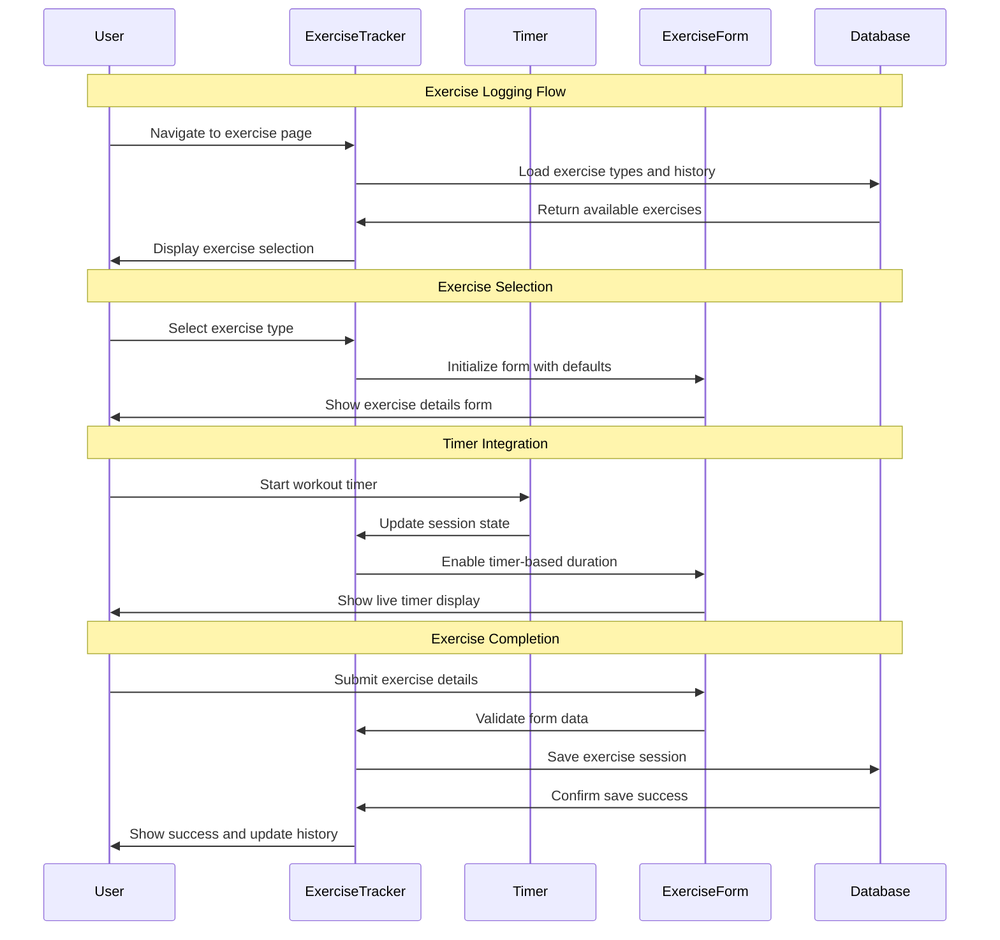

# 03 Record Exercise Activities - Implementation Planning

## User Story

As a user, I want to record my exercise activities in the app, so that I can track my fitness progress and maintain a comprehensive health diary.

## Pre-conditions

- User has completed signup and goal selection process
- User has access to the main application with navigation
- Local database (SQLite) is initialized with exercise tracking tables
- User authentication/session is established
- Exercise types and categories are defined in the system

## Design

### Visual Layout

The exercise recording interface will feature:
- **Header Section**: Page title, navigation breadcrumbs, and quick action buttons
- **Exercise Entry Form**: Multi-step form for logging exercise details
- **Exercise Type Selector**: Visual cards for different exercise categories (HIIT, weightlifting, cardio)
- **Exercise History Section**: List of recent exercises with edit/delete options
- **Quick Start Options**: One-tap logging for frequently used exercises
- **Timer Integration**: Optional live timer for tracking workout duration
- **Save Actions**: Draft saving, complete logging, and social sharing options

### Color and Typography

- **Background Colors**: 
  - Primary: bg-gray-50 dark:bg-gray-900
  - Form background: bg-white dark:bg-gray-800
  - Exercise type cards: bg-white dark:bg-gray-800
  - Active exercise: bg-blue-50 dark:bg-blue-900/20
  - Success states: bg-green-50 dark:bg-green-900/20

- **Typography**:
  - Page title: font-inter text-3xl font-bold text-gray-900 dark:text-white
  - Form labels: font-inter text-sm font-medium text-gray-700 dark:text-gray-300
  - Exercise names: font-inter text-lg font-semibold text-gray-900 dark:text-white
  - Duration display: font-mono text-2xl font-bold text-blue-600 dark:text-blue-400
  - Helper text: font-inter text-sm text-gray-500 dark:text-gray-400

- **Component-Specific**:
  - Exercise type cards: bg-white dark:bg-gray-800 shadow-sm border border-gray-200 dark:border-gray-700
  - Selected card: ring-2 ring-blue-500 bg-blue-50 dark:bg-blue-900/20
  - Form inputs: border-gray-300 dark:border-gray-600 focus:border-blue-500 focus:ring-blue-500
  - Save button: bg-blue-600 hover:bg-blue-700 text-white
  - Timer button: bg-green-600 hover:bg-green-700 text-white

### Interaction Patterns

- **Exercise Type Selection**: 
  - Hover: Subtle shadow increase and border highlight (150ms ease)
  - Click: Immediate selection with visual feedback
  - Selection: Ring highlight and icon change
  - Accessibility: Focus ring, keyboard navigation, ARIA labels

- **Form Field Interactions**:
  - Focus: Border color change with ring effect
  - Validation: Real-time feedback with success/error states
  - Auto-save: Draft saving with visual indicators
  - Accessibility: Error announcements, field descriptions

- **Timer Controls**:
  - Start/Stop: Clear visual state changes with color coding
  - Pause: Distinct pause state with resume option
  - Reset: Confirmation dialog for data protection
  - Background operation: Continue timing when app is backgrounded

### Measurements and Spacing

- **Container**:
  ```
  max-w-4xl mx-auto px-4 sm:px-6 lg:px-8 py-6
  ```

- **Form Layout**:
  ```
  - Form sections: space-y-6
  - Input groups: space-y-4
  - Label spacing: mb-2
  - Button groups: space-x-3
  - Card grid: grid-cols-2 md:grid-cols-3 lg:grid-cols-4 gap-4
  ```

- **Component Spacing**:
  ```
  - Section padding: p-6
  - Card padding: p-4
  - Input padding: px-3 py-2
  - Button padding: px-4 py-2
  ```

### Responsive Behavior

- **Desktop (lg: 1024px+)**:
  ```
  - Two-column layout: form (2/3) and history sidebar (1/3)
  - Exercise type grid: 4 columns
  - Full form fields visible
  - Expanded timer controls
  ```

- **Tablet (md: 768px - 1023px)**:
  ```
  - Single column with collapsible history
  - Exercise type grid: 3 columns
  - Condensed form layout
  - Standard timer controls
  ```

- **Mobile (sm: < 768px)**:
  ```
  - Stack layout: full-width components
  - Exercise type grid: 2 columns
  - Mobile-optimized form inputs
  - Touch-friendly timer buttons
  ```

## Technical Requirements

### Component Structure

```
src/app/exercises/
├── page.tsx
├── add/
│   └── page.tsx
└── _components/
    ├── ExerciseTracker.tsx          # Main exercise tracking component
    ├── ExerciseTypeSelector.tsx     # Exercise category selection
    ├── ExerciseForm.tsx             # Exercise details form
    ├── ExerciseTimer.tsx            # Workout timer component
    ├── ExerciseHistory.tsx          # Recent exercises list
    ├── ExerciseCard.tsx             # Individual exercise display
    ├── QuickStartExercises.tsx      # Frequently used exercises
    └── useExerciseTracking.ts       # Custom hook for exercise logic
```

### Required Components

- ExerciseTracker ⬜
- ExerciseTypeSelector ⬜
- ExerciseForm ⬜
- ExerciseTimer ⬜
- ExerciseHistory ⬜
- ExerciseCard ⬜
- QuickStartExercises ⬜
- useExerciseTracking ⬜

### State Management Requirements

```typescript
interface ExerciseEntry {
  id: string;
  userId: string;
  type: ExerciseType;
  name: string;
  duration: number; // in minutes
  intensity: 'low' | 'moderate' | 'high' | 'very_high';
  caloriesBurned?: number;
  notes?: string;
  startTime: Date;
  endTime?: Date;
  createdAt: Date;
  updatedAt: Date;
}

interface ExerciseType {
  id: string;
  name: string;
  category: 'cardio' | 'strength' | 'flexibility' | 'sports' | 'hiit';
  icon: string;
  defaultDuration: number;
  caloriesPerMinute: number;
}

interface ExerciseTrackingState {
  // UI States
  isLogging: boolean;
  isTimerActive: boolean;
  currentView: 'type-selection' | 'form' | 'timer' | 'summary';
  
  // Form States
  selectedType: ExerciseType | null;
  formData: Partial<ExerciseEntry>;
  errors: Record<string, string>;
  isDirty: boolean;
  
  // Timer States
  timerDuration: number;
  timerStartTime: Date | null;
  isPaused: boolean;
  
  // Data States
  recentExercises: ExerciseEntry[];
  quickStartExercises: ExerciseType[];
  exerciseTypes: ExerciseType[];
}

// State Updates
const actions = {
  selectExerciseType: (type: ExerciseType) => void;
  updateFormData: (data: Partial<ExerciseEntry>) => void;
  startTimer: () => void;
  pauseTimer: () => void;
  stopTimer: () => void;
  saveExercise: () => Promise<void>;
  loadRecentExercises: () => Promise<void>;
  editExercise: (id: string) => void;
  deleteExercise: (id: string) => Promise<void>;
}
```

## Acceptance Criteria

### Layout & Content

1. Exercise Tracking Page Layout
   ```
   - Clear page header with "Log Exercise" title
   - Navigation breadcrumbs (Dashboard > Exercises > Log)
   - Main content area with form and history sections
   - Floating action button for quick access (mobile)
   ```

2. Exercise Type Selection
   ```
   - Visual grid of exercise categories with icons
   - Clear labels: HIIT, Weightlifting, Cardio, Flexibility, Sports
   - Quick search/filter functionality
   - Recently used exercises prominently displayed
   ```

3. Exercise Entry Form
   ```
   - Exercise name (searchable dropdown with suggestions)
   - Duration input (manual entry or timer-based)
   - Intensity level selector (Low, Moderate, High, Very High)
   - Optional notes field for additional details
   - Estimated calories burned (auto-calculated)
   ```

4. Exercise History Section
   ```
   - List of recent exercises (last 10-20 entries)
   - Each entry shows: name, duration, intensity, date
   - Edit and delete actions for each entry
   - Pagination or infinite scroll for older entries
   ```

### Functionality

1. Exercise Type Management

   - [ ] Display categorized exercise types with visual icons
   - [ ] Allow users to select from predefined exercise categories
   - [ ] Support search and filtering of exercise types
   - [ ] Show recently used exercises for quick access

2. Exercise Data Entry

   - [ ] Capture exercise name, duration, type, and intensity level
   - [ ] Allow manual duration entry or timer-based tracking
   - [ ] Support optional notes and additional exercise details
   - [ ] Auto-calculate estimated calories burned based on type and duration
   - [ ] Validate all required fields before saving

3. Timer Functionality

   - [ ] Provide start, pause, resume, and stop timer controls
   - [ ] Display real-time timer with minutes and seconds
   - [ ] Continue timing when app is backgrounded (mobile)
   - [ ] Allow manual adjustment of timer duration

4. Data Persistence & History

   - [ ] Save all exercise data to local SQLite database
   - [ ] Display history of previously recorded exercises
   - [ ] Allow editing and deletion of existing exercise entries
   - [ ] Support bulk operations for managing multiple exercises

### Navigation Rules

- Exercise tracking page accessible from main navigation
- Form navigation supports both linear flow and free-form editing
- Back navigation preserves form data as drafts
- Timer continues running during navigation within the app
- Deep linking support for adding specific exercise types

### Error Handling

- Form validation with clear error messages and correction guidance
- Network-independent operation (local database only)
- Auto-save drafts to prevent data loss during interruptions
- Graceful handling of timer interruptions and background state changes
- Data backup and recovery for exercise history

## Modified Files

```
src/app/exercises/
├── page.tsx ⬜
├── add/
│   └── page.tsx ⬜
└── _components/
    ├── ExerciseTracker.tsx ⬜
    ├── ExerciseTypeSelector.tsx ⬜
    ├── ExerciseForm.tsx ⬜
    ├── ExerciseTimer.tsx ⬜
    ├── ExerciseHistory.tsx ⬜
    ├── ExerciseCard.tsx ⬜
    ├── QuickStartExercises.tsx ⬜
    └── useExerciseTracking.ts ⬜
├── lib/
│   ├── database/
│   │   └── exercises.ts ⬜
│   ├── utils/
│   │   ├── calorieCalculation.ts ⬜
│   │   └── timerHelpers.ts ⬜
│   └── constants/
│       └── exerciseTypes.ts ⬜
└── types/
    └── exercise.ts ⬜
```

## Status

🟨 IN PROGRESS

1. Setup & Configuration

   - [ ] Define exercise types and categories constants
   - [ ] Create database schema for exercise tracking
   - [ ] Setup component file structure and routing
   - [ ] Configure TypeScript interfaces and validation

2. Layout Implementation

   - [ ] Create responsive layout for exercise tracking page
   - [ ] Implement exercise type selection grid with icons
   - [ ] Build exercise entry form with validation
   - [ ] Add exercise history list with CRUD operations

3. Feature Implementation

   - [ ] Build timer functionality with start/pause/stop controls
   - [ ] Implement form validation and auto-save drafts
   - [ ] Create database integration for exercise CRUD operations
   - [ ] Add calorie calculation and exercise recommendations

4. Testing
   - [ ] Unit tests for exercise tracking logic and timer functionality
   - [ ] Integration tests for database operations and form validation
   - [ ] User experience testing for timer during background operations
   - [ ] Performance testing for exercise history with large datasets

## Dependencies

- SQLite database setup with exercise tracking tables
- Exercise type definitions and calorie calculation formulas
- Timer/background processing capabilities for mobile apps
- Form validation library (React Hook Form or similar)
- Icon library for exercise type visualization

## Related Stories

- 02 ([View Health Dashboard - receives exercise data for visualization])
- 07 ([Access Pre-Built Exercise Sets - integrates with exercise logging])
- 08 ([Generate Custom Exercise Routines - uses exercise tracking data])

## Notes

### Technical Considerations

1. **Timer Background Processing**: Implement service worker or background task for continuous timing
2. **Auto-Save Mechanism**: Implement draft saving every 30 seconds to prevent data loss
3. **Calorie Calculation**: Use MET (Metabolic Equivalent) values for accurate calorie estimation
4. **Exercise Database**: Pre-populate with common exercises and allow user additions
5. **Performance Optimization**: Implement virtual scrolling for large exercise history lists

### Business Requirements

- Exercise tracking must work offline for gym environments with poor connectivity
- Timer accuracy should be maintained even when app is backgrounded
- Exercise data should integrate seamlessly with dashboard visualizations
- Support for both during-workout and post-workout logging scenarios
- Exercise types should align with popular fitness categories and user goals

### API Integration

#### Type Definitions

```typescript
interface ExerciseType {
  id: string;
  name: string;
  category: ExerciseCategory;
  icon: string;
  metValue: number; // Metabolic equivalent for calorie calculation
  description?: string;
  instructions?: string[];
  targetMuscleGroups?: string[];
}

interface ExerciseCategory {
  id: string;
  name: string;
  description: string;
  icon: string;
  color: string;
}

interface ExerciseSession {
  id: string;
  exerciseTypeId: string;
  userId: string;
  startTime: Date;
  endTime?: Date;
  duration: number;
  intensity: IntensityLevel;
  caloriesBurned: number;
  heartRateAvg?: number;
  notes?: string;
  isCompleted: boolean;
}

interface ExerciseTrackingStore {
  currentSession: ExerciseSession | null;
  recentExercises: ExerciseSession[];
  exerciseTypes: ExerciseType[];
  categories: ExerciseCategory[];
  
  startExercise: (type: ExerciseType) => void;
  updateSession: (updates: Partial<ExerciseSession>) => void;
  completeExercise: () => Promise<void>;
  loadExerciseHistory: (limit?: number) => Promise<void>;
}
```

### Mock Implementation

#### Mock Server Configuration

```typescript
// filepath: mocks/stub.ts
const mocks = [
  {
    endPoint: '/api/exercises/types',
    json: 'exerciseTypes.json',
  },
  {
    endPoint: '/api/exercises/sessions',
    json: 'exerciseSessions.json',
  },
];
```

#### Mock Response

```json
// filepath: mocks/responses/exerciseTypes.json
{
  "status": "SUCCESS",
  "data": {
    "categories": [
      {
        "id": "cardio",
        "name": "Cardio",
        "description": "Cardiovascular exercises to improve heart health",
        "icon": "heart",
        "color": "red"
      },
      {
        "id": "strength",
        "name": "Strength Training",
        "description": "Resistance exercises to build muscle",
        "icon": "dumbbell",
        "color": "blue"
      },
      {
        "id": "hiit",
        "name": "HIIT",
        "description": "High-intensity interval training",
        "icon": "zap",
        "color": "orange"
      }
    ],
    "exerciseTypes": [
      {
        "id": "running",
        "name": "Running",
        "category": "cardio",
        "icon": "running",
        "metValue": 8.0,
        "description": "Outdoor or treadmill running",
        "targetMuscleGroups": ["legs", "core"]
      },
      {
        "id": "bench-press",
        "name": "Bench Press",
        "category": "strength",
        "icon": "bench-press",
        "metValue": 6.0,
        "description": "Chest exercise with barbell or dumbbells",
        "targetMuscleGroups": ["chest", "triceps", "shoulders"]
      }
    ]
  }
}
```

### State Management Flow



### Custom Hook Implementation

```typescript
const useExerciseTracking = () => {
  const [currentSession, setCurrentSession] = useState<ExerciseSession | null>(null);
  const [timerDuration, setTimerDuration] = useState(0);
  const [isTimerActive, setIsTimerActive] = useState(false);
  const [recentExercises, setRecentExercises] = useState<ExerciseSession[]>([]);
  const [exerciseTypes, setExerciseTypes] = useState<ExerciseType[]>([]);

  const startExercise = useCallback((type: ExerciseType) => {
    const newSession: ExerciseSession = {
      id: generateId(),
      exerciseTypeId: type.id,
      userId: getCurrentUserId(),
      startTime: new Date(),
      duration: 0,
      intensity: 'moderate',
      caloriesBurned: 0,
      isCompleted: false,
    };
    setCurrentSession(newSession);
  }, []);

  const startTimer = useCallback(() => {
    setIsTimerActive(true);
    const startTime = Date.now();
    
    const timerInterval = setInterval(() => {
      if (isTimerActive) {
        const elapsed = Math.floor((Date.now() - startTime) / 1000);
        setTimerDuration(elapsed);
      }
    }, 1000);

    return () => clearInterval(timerInterval);
  }, [isTimerActive]);

  const completeExercise = useCallback(async (sessionData: Partial<ExerciseSession>) => {
    if (!currentSession) return;

    const completedSession: ExerciseSession = {
      ...currentSession,
      ...sessionData,
      endTime: new Date(),
      duration: timerDuration || sessionData.duration || 0,
      isCompleted: true,
    };

    // Calculate calories based on MET value, duration, and user weight
    const exerciseType = exerciseTypes.find(t => t.id === completedSession.exerciseTypeId);
    if (exerciseType) {
      completedSession.caloriesBurned = calculateCalories(
        exerciseType.metValue,
        completedSession.duration,
        getUserWeight() // Get from user profile
      );
    }

    try {
      await saveExerciseSession(completedSession);
      setRecentExercises(prev => [completedSession, ...prev.slice(0, 19)]);
      setCurrentSession(null);
      setTimerDuration(0);
      setIsTimerActive(false);
      
      // Trigger dashboard update
      window.dispatchEvent(new CustomEvent('healthDataUpdated', {
        detail: { type: 'exercise', data: completedSession }
      }));
    } catch (error) {
      console.error('Failed to save exercise:', error);
      throw error;
    }
  }, [currentSession, timerDuration, exerciseTypes]);

  const loadExerciseHistory = useCallback(async () => {
    try {
      const exercises = await getRecentExercises(20);
      setRecentExercises(exercises);
    } catch (error) {
      console.error('Failed to load exercise history:', error);
    }
  }, []);

  useEffect(() => {
    loadExerciseHistory();
    loadExerciseTypes().then(setExerciseTypes);
  }, [loadExerciseHistory]);

  return {
    currentSession,
    timerDuration,
    isTimerActive,
    recentExercises,
    exerciseTypes,
    startExercise,
    startTimer,
    completeExercise,
    loadExerciseHistory,
  };
};
```

## Testing Requirements

### Integration Tests (Target: 80% Coverage)

1. Exercise Logging Workflow

```typescript
describe('Exercise Logging', () => {
  it('should allow users to select exercise type and log details', async () => {
    // Test complete exercise logging workflow
  });

  it('should save exercise data to local database', async () => {
    // Test database persistence
  });

  it('should calculate calories burned accurately', async () => {
    // Test calorie calculation logic
  });

  it('should handle timer-based duration tracking', async () => {
    // Test timer integration with exercise logging
  });
});
```

2. Timer Functionality

```typescript
describe('Exercise Timer', () => {
  it('should track time accurately during workout', async () => {
    // Test timer accuracy and state management
  });

  it('should persist timer state during app backgrounding', async () => {
    // Test background timer functionality
  });

  it('should allow pause and resume of timer', async () => {
    // Test timer controls
  });
});
```

3. Exercise History Management

```typescript
describe('Exercise History', () => {
  it('should display recent exercises in chronological order', async () => {
    // Test history display and sorting
  });

  it('should allow editing of existing exercise entries', async () => {
    // Test exercise editing functionality
  });

  it('should support deletion of exercise entries with confirmation', async () => {
    // Test exercise deletion with safety measures
  });
});
```

### Performance Tests

1. Database Operations

```typescript
describe('Performance', () => {
  it('should load exercise history quickly with large datasets', async () => {
    // Test performance with 1000+ exercise entries
  });

  it('should handle concurrent timer and form operations smoothly', async () => {
    // Test multitasking performance
  });
});
```

### Accessibility Tests

```typescript
describe('Accessibility', () => {
  it('should provide keyboard navigation for all exercise controls', async () => {
    // Test keyboard accessibility
  });

  it('should announce timer updates to screen readers', async () => {
    // Test screen reader integration for timer
  });

  it('should support voice control for exercise logging', async () => {
    // Test voice accessibility features
  });
});
```

### Test Environment Setup

```typescript
// Test helper functions
const mockExerciseTypes = (): ExerciseType[] => {
  // Generate mock exercise types for testing
};

const createMockExerciseSession = (overrides?: Partial<ExerciseSession>): ExerciseSession => {
  // Create mock exercise session data
};

const renderExerciseTracker = (props?: Partial<ExerciseTrackerProps>) => {
  // Render exercise tracker with providers and mock data
};

beforeEach(() => {
  jest.clearAllMocks();
  mockDatabase.reset();
  jest.useFakeTimers();
});

afterEach(() => {
  jest.useRealTimers();
});
```