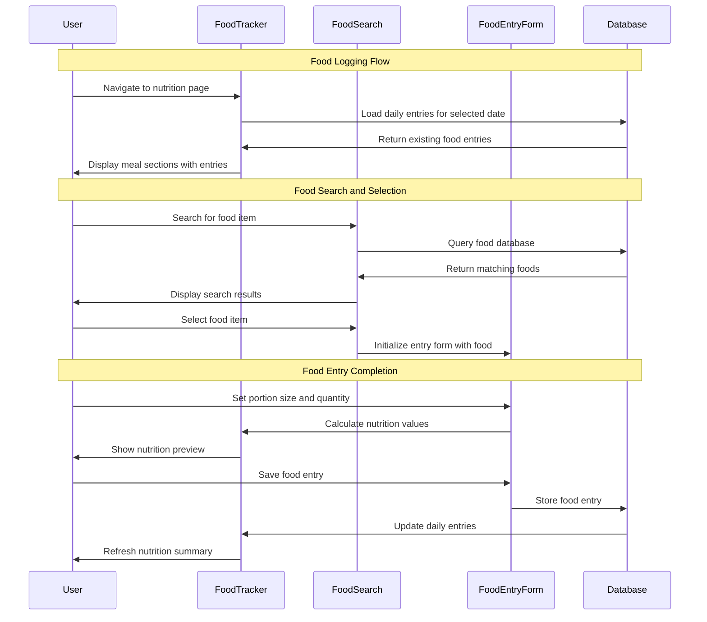

# 04 Record Food Intake - Implementation Planning

## User Story

As a user, I want to record the food I eat throughout the day, so that I can track my nutritional intake and maintain awareness of my eating habits.

## Pre-conditions

- User has completed signup and goal selection process
- User has access to the main application with navigation
- Local database (SQLite) is initialized with food tracking tables
- User authentication/session is established
- Food database with nutritional information is available
- Portion size standards and measurement units are defined

## Design

### Visual Layout

The food intake tracking interface will feature:
- **Header Section**: Page title, date selector, and daily nutrition summary
- **Meal Categories**: Breakfast, lunch, dinner, and snacks with visual separators
- **Food Search Interface**: Smart search with autocomplete and barcode scanning option
- **Food Entry Form**: Detailed nutrition input with portion size controls
- **Daily Summary Cards**: Calories, macronutrients, and goal progress visualization
- **Food History Timeline**: Chronological list of today's food entries with edit options
- **Quick Add Section**: Frequently consumed foods and recent items
- **Nutrition Insights**: Visual breakdown of nutritional goals vs. actual intake

### Color and Typography

- **Background Colors**: 
  - Primary: bg-gray-50 dark:bg-gray-900
  - Meal section cards: bg-white dark:bg-gray-800
  - Food entry cards: bg-white dark:bg-gray-800
  - Calorie progress: bg-green-50 dark:bg-green-900/20
  - Macro nutrients: bg-blue-50 dark:bg-blue-900/20
  - Over-consumption warning: bg-red-50 dark:bg-red-900/20

- **Typography**:
  - Page title: font-inter text-3xl font-bold text-gray-900 dark:text-white
  - Meal headings: font-inter text-xl font-semibold text-gray-900 dark:text-white
  - Food names: font-inter text-base font-medium text-gray-900 dark:text-white
  - Nutritional values: font-mono text-sm font-medium text-blue-600 dark:text-blue-400
  - Calorie counts: font-mono text-lg font-bold text-green-600 dark:text-green-400
  - Helper text: font-inter text-sm text-gray-500 dark:text-gray-400

- **Component-Specific**:
  - Meal cards: bg-white dark:bg-gray-800 shadow-sm border border-gray-200 dark:border-gray-700
  - Food search: border-gray-300 dark:border-gray-600 focus:border-blue-500 focus:ring-blue-500
  - Add food button: bg-blue-600 hover:bg-blue-700 text-white
  - Progress bars: bg-gradient-to-r from-green-400 to-blue-500
  - Quick add buttons: bg-gray-100 dark:bg-gray-700 hover:bg-gray-200 dark:hover:bg-gray-600

### Interaction Patterns

- **Food Search and Selection**: 
  - Type-ahead search with debounced API calls (300ms)
  - Click/tap selection with immediate form population
  - Barcode scanning with camera integration (mobile)
  - Accessibility: ARIA live regions for search results, keyboard navigation

- **Portion Size Controls**:
  - Visual portion size selector with common measurements
  - Increment/decrement buttons with haptic feedback
  - Quick portion multipliers (0.5x, 1x, 2x)
  - Custom portion input with validation
  - Accessibility: Clear labels, value announcements

- **Meal Category Management**:
  - Drag and drop between meal categories
  - Time-based auto-categorization suggestions
  - Custom meal categories for users with specific schedules
  - Accessibility: Keyboard-accessible drag and drop alternatives

### Measurements and Spacing

- **Container**:
  ```
  max-w-6xl mx-auto px-4 sm:px-6 lg:px-8 py-6
  ```

- **Meal Section Layout**:
  ```
  - Meal cards: space-y-4
  - Food entries: space-y-2
  - Nutrition summary: grid-cols-2 md:grid-cols-4 gap-4
  - Quick add grid: grid-cols-3 md:grid-cols-6 gap-2
  ```

- **Component Spacing**:
  ```
  - Section padding: p-4 md:p-6
  - Card margins: mb-6
  - Input spacing: space-y-3
  - Button groups: space-x-2
  ```

### Responsive Behavior

- **Desktop (lg: 1024px+)**:
  ```
  - Two-column layout: meals (2/3) and summary sidebar (1/3)
  - Expanded nutrition details
  - Full search interface with advanced filters
  - Drag and drop between meal categories
  ```

- **Tablet (md: 768px - 1023px)**:
  ```
  - Single column with collapsible summary
  - Condensed nutrition cards in 2x2 grid
  - Simplified search interface
  - Touch-friendly portion controls
  ```

- **Mobile (sm: < 768px)**:
  ```
  - Stack layout with sticky summary header
  - Swipe gestures for meal navigation
  - Bottom sheet for food entry
  - Camera integration for barcode scanning
  ```

## Technical Requirements

### Component Structure

```
src/app/nutrition/
├── page.tsx
├── add/
│   └── page.tsx
└── _components/
    ├── FoodTracker.tsx              # Main food tracking interface
    ├── MealSection.tsx              # Individual meal category (breakfast, lunch, etc.)
    ├── FoodSearch.tsx               # Food search with autocomplete
    ├── FoodEntryForm.tsx            # Detailed food entry form
    ├── NutritionSummary.tsx         # Daily nutrition overview
    ├── FoodCard.tsx                 # Individual food item display
    ├── PortionSelector.tsx          # Portion size selection controls
    ├── QuickAddFoods.tsx            # Frequently used foods
    ├── BarcodeScanner.tsx           # Barcode scanning component
    └── useFoodTracking.ts           # Custom hook for food tracking logic
```

### Required Components

- FoodTracker ⬜
- MealSection ⬜
- FoodSearch ⬜
- FoodEntryForm ⬜
- NutritionSummary ⬜
- FoodCard ⬜
- PortionSelector ⬜
- QuickAddFoods ⬜
- BarcodeScanner ⬜
- useFoodTracking ⬜

### State Management Requirements

```typescript
interface FoodItem {
  id: string;
  name: string;
  brand?: string;
  barcode?: string;
  nutritionPer100g: NutritionInfo;
  commonPortions: PortionSize[];
  category: FoodCategory;
  isCustom: boolean;
}

interface NutritionInfo {
  calories: number;
  protein: number; // grams
  carbohydrates: number; // grams
  fat: number; // grams
  fiber: number; // grams
  sugar: number; // grams
  sodium: number; // milligrams
  cholesterol?: number; // milligrams
  vitamins?: Record<string, number>;
  minerals?: Record<string, number>;
}

interface FoodEntry {
  id: string;
  userId: string;
  foodItemId: string;
  foodItem: FoodItem;
  portion: PortionSize;
  quantity: number;
  mealType: MealType;
  consumedAt: Date;
  notes?: string;
  createdAt: Date;
  updatedAt: Date;
}

interface PortionSize {
  id: string;
  name: string; // "1 cup", "1 medium", "100g"
  grams: number;
  description?: string;
}

type MealType = 'breakfast' | 'lunch' | 'dinner' | 'snack';

interface FoodTrackingState {
  // UI States
  selectedDate: Date;
  selectedMeal: MealType | null;
  isSearching: boolean;
  isAddingFood: boolean;
  
  // Search States
  searchQuery: string;
  searchResults: FoodItem[];
  recentFoods: FoodItem[];
  frequentFoods: FoodItem[];
  
  // Form States
  currentFoodEntry: Partial<FoodEntry>;
  formErrors: Record<string, string>;
  
  // Data States
  dailyEntries: Record<MealType, FoodEntry[]>;
  dailyNutrition: NutritionInfo;
  nutritionGoals: NutritionInfo;
  weeklyEntries: FoodEntry[];
}

// State Updates
const actions = {
  setSelectedDate: (date: Date) => void;
  searchFoods: (query: string) => Promise<void>;
  selectFood: (food: FoodItem, mealType: MealType) => void;
  updatePortion: (portion: PortionSize, quantity: number) => void;
  saveFoodEntry: () => Promise<void>;
  deleteFoodEntry: (id: string) => Promise<void>;
  loadDailyEntries: (date: Date) => Promise<void>;
  calculateDailyNutrition: () => void;
}
```

## Acceptance Criteria

### Layout & Content

1. Food Tracking Page Layout
   ```
   - Daily food diary with date navigation
   - Meal sections: Breakfast, Lunch, Dinner, Snacks
   - Nutrition summary dashboard with progress indicators
   - Quick access to frequently consumed foods
   ```

2. Food Search Interface
   ```
   - Real-time search with autocomplete suggestions
   - Search results with nutrition preview
   - Barcode scanning capability (mobile)
   - Custom food creation option
   ```

3. Food Entry Form
   ```
   - Food name and brand information
   - Portion size selector with common measurements
   - Quantity input with increment/decrement controls
   - Meal type selection and timing
   - Optional notes field
   ```

4. Nutrition Summary
   ```
   - Daily calorie intake vs. goal
   - Macronutrient breakdown (protein, carbs, fat)
   - Micronutrient tracking (fiber, sodium, vitamins)
   - Progress visualization with charts/bars
   ```

### Functionality

1. Food Database and Search

   - [ ] Search comprehensive food database with nutritional information
   - [ ] Support custom food entries with manual nutrition input
   - [ ] Implement barcode scanning for packaged foods (mobile)
   - [ ] Provide autocomplete suggestions based on search history

2. Food Entry Management

   - [ ] Log foods with accurate portion sizes and timing information
   - [ ] Support multiple portion size formats (cups, grams, pieces, etc.)
   - [ ] Allow editing and deletion of existing food entries
   - [ ] Categorize foods by meal type (breakfast, lunch, dinner, snacks)

3. Nutrition Calculation and Tracking

   - [ ] Calculate total daily nutrition based on food entries
   - [ ] Display real-time progress toward nutritional goals
   - [ ] Show detailed macronutrient and micronutrient breakdowns
   - [ ] Provide historical nutrition data for daily, weekly, and monthly views

4. Data Persistence and History

   - [ ] Save all food data to local SQLite database
   - [ ] Support offline functionality for food logging
   - [ ] Display comprehensive food intake history with filtering options
   - [ ] Export nutrition data for external analysis

### Navigation Rules

- Food tracking page accessible from main navigation
- Date navigation allows viewing historical food intake
- Quick add functionality accessible from all meal sections
- Food search accessible via floating action button (mobile)
- Meal navigation supports swipe gestures (mobile)

### Error Handling

- Graceful handling of missing nutritional data with user warnings
- Offline food database with sync capability when connection restored
- Form validation with clear error messages for portion sizes and quantities
- Data backup and recovery for food intake history
- Fallback nutrition calculations when specific data unavailable

## Modified Files

```
src/app/nutrition/
├── page.tsx ⬜
├── add/
│   └── page.tsx ⬜
└── _components/
    ├── FoodTracker.tsx ⬜
    ├── MealSection.tsx ⬜
    ├── FoodSearch.tsx ⬜
    ├── FoodEntryForm.tsx ⬜
    ├── NutritionSummary.tsx ⬜
    ├── FoodCard.tsx ⬜
    ├── PortionSelector.tsx ⬜
    ├── QuickAddFoods.tsx ⬜
    ├── BarcodeScanner.tsx ⬜
    └── useFoodTracking.ts ⬜
├── lib/
│   ├── database/
│   │   ├── foods.ts ⬜
│   │   └── foodEntries.ts ⬜
│   ├── nutrition/
│   │   ├── calculations.ts ⬜
│   │   └── goals.ts ⬜
│   └── utils/
│       ├── portionConversions.ts ⬜
│       └── nutritionHelpers.ts ⬜
└── types/
    └── nutrition.ts ⬜
```

## Status

🟨 IN PROGRESS

1. Setup & Configuration

   - [ ] Setup food database schema and nutritional data structure
   - [ ] Configure barcode scanning library and camera permissions
   - [ ] Define portion size standards and conversion utilities
   - [ ] Create TypeScript interfaces for nutrition tracking

2. Layout Implementation

   - [ ] Create responsive layout for daily food diary
   - [ ] Implement meal section components with drag-and-drop
   - [ ] Build nutrition summary dashboard with progress indicators
   - [ ] Add date navigation and historical data viewing

3. Feature Implementation

   - [ ] Build food search with autocomplete and barcode scanning
   - [ ] Implement portion size selection with accurate conversions
   - [ ] Create nutrition calculation engine with goal tracking
   - [ ] Add food entry CRUD operations with local database

4. Testing
   - [ ] Unit tests for nutrition calculations and portion conversions
   - [ ] Integration tests for food search and database operations
   - [ ] User experience testing for food logging workflow
   - [ ] Performance testing with large food databases

## Dependencies

- Food nutrition database (USDA FoodData Central or similar)
- Barcode scanning library (react-native-camera or web API)
- Camera permissions and device access (mobile)
- SQLite database with full-text search capabilities
- Date manipulation library (date-fns or dayjs)

## Related Stories

- 02 ([View Health Dashboard - receives nutrition data for visualization])
- 06 ([Get AI-Generated Recipe Suggestions - uses food preferences and nutrition goals])

## Notes

### Technical Considerations

1. **Food Database Management**: Implement efficient search indexing and caching for large nutrition databases
2. **Portion Size Accuracy**: Use standardized portion measurements with accurate gram conversions
3. **Offline Functionality**: Cache frequently used foods and ensure offline food logging capability
4. **Nutrition Calculations**: Implement precise calculations for macronutrients and micronutrients
5. **Performance Optimization**: Use virtual scrolling for large food lists and debounced search

### Business Requirements

- Food tracking must work offline for users in areas with poor connectivity
- Nutrition calculations should be accurate and based on reliable data sources
- Food database should include both generic foods and branded products
- Barcode scanning should work for common grocery store products
- Historical data should be easily accessible and exportable

### API Integration

#### Type Definitions

```typescript
interface FoodDatabase {
  foods: FoodItem[];
  lastUpdated: Date;
  version: string;
}

interface NutritionGoals {
  userId: string;
  calories: number;
  protein: number;
  carbohydrates: number;
  fat: number;
  fiber: number;
  sodium: number;
  basedOnGoal: 'weight_loss' | 'muscle_gain' | 'maintenance' | 'custom';
  createdAt: Date;
  updatedAt: Date;
}

interface DailyNutritionSummary {
  date: Date;
  totalCalories: number;
  macronutrients: {
    protein: number;
    carbohydrates: number;
    fat: number;
  };
  micronutrients: {
    fiber: number;
    sodium: number;
    sugar: number;
  };
  mealBreakdown: Record<MealType, NutritionInfo>;
  goalProgress: Record<keyof NutritionInfo, number>; // percentage
}

interface FoodTrackingStore {
  dailyEntries: Record<string, FoodEntry[]>; // date string as key
  nutritionGoals: NutritionGoals;
  recentFoods: FoodItem[];
  favoriteFoods: FoodItem[];
  
  addFoodEntry: (entry: FoodEntry) => Promise<void>;
  updateFoodEntry: (id: string, updates: Partial<FoodEntry>) => Promise<void>;
  deleteFoodEntry: (id: string) => Promise<void>;
  searchFoods: (query: string) => Promise<FoodItem[]>;
  loadDailyEntries: (date: Date) => Promise<void>;
  calculateNutrition: (entries: FoodEntry[]) => NutritionInfo;
}
```

### Mock Implementation

#### Mock Server Configuration

```typescript
// filepath: mocks/stub.ts
const mocks = [
  {
    endPoint: '/api/foods/search',
    json: 'foodSearch.json',
  },
  {
    endPoint: '/api/nutrition/daily',
    json: 'dailyNutrition.json',
  },
];
```

#### Mock Response

```json
// filepath: mocks/responses/foodSearch.json
{
  "status": "SUCCESS",
  "data": {
    "foods": [
      {
        "id": "banana-medium",
        "name": "Banana",
        "brand": null,
        "category": "fruits",
        "nutritionPer100g": {
          "calories": 89,
          "protein": 1.1,
          "carbohydrates": 22.8,
          "fat": 0.3,
          "fiber": 2.6,
          "sugar": 12.2,
          "sodium": 1
        },
        "commonPortions": [
          {
            "id": "medium",
            "name": "1 medium (7-8 inches)",
            "grams": 118,
            "description": "Standard medium banana"
          },
          {
            "id": "large",
            "name": "1 large (8-9 inches)",
            "grams": 136,
            "description": "Large banana"
          }
        ]
      },
      {
        "id": "chicken-breast-grilled",
        "name": "Chicken Breast, Grilled",
        "brand": null,
        "category": "meat",
        "nutritionPer100g": {
          "calories": 165,
          "protein": 31,
          "carbohydrates": 0,
          "fat": 3.6,
          "fiber": 0,
          "sugar": 0,
          "sodium": 74
        },
        "commonPortions": [
          {
            "id": "breast",
            "name": "1 breast (6 oz)",
            "grams": 170,
            "description": "Boneless, skinless chicken breast"
          }
        ]
      }
    ]
  }
}
```

### State Management Flow



### Custom Hook Implementation

```typescript
const useFoodTracking = (initialDate: Date = new Date()) => {
  const [selectedDate, setSelectedDate] = useState(initialDate);
  const [dailyEntries, setDailyEntries] = useState<Record<MealType, FoodEntry[]>>({
    breakfast: [],
    lunch: [],
    dinner: [],
    snack: []
  });
  const [dailyNutrition, setDailyNutrition] = useState<NutritionInfo | null>(null);
  const [nutritionGoals, setNutritionGoals] = useState<NutritionInfo | null>(null);
  const [recentFoods, setRecentFoods] = useState<FoodItem[]>([]);

  const loadDailyEntries = useCallback(async (date: Date) => {
    try {
      const entries = await getFoodEntriesForDate(date);
      const groupedEntries = groupBy(entries, 'mealType');
      setDailyEntries({
        breakfast: groupedEntries.breakfast || [],
        lunch: groupedEntries.lunch || [],
        dinner: groupedEntries.dinner || [],
        snack: groupedEntries.snack || []
      });
      
      // Calculate daily nutrition
      const totalNutrition = calculateTotalNutrition(entries);
      setDailyNutrition(totalNutrition);
    } catch (error) {
      console.error('Failed to load daily entries:', error);
    }
  }, []);

  const addFoodEntry = useCallback(async (foodEntry: Omit<FoodEntry, 'id' | 'createdAt' | 'updatedAt'>) => {
    try {
      const newEntry = await saveFoodEntry({
        ...foodEntry,
        id: generateId(),
        createdAt: new Date(),
        updatedAt: new Date()
      });

      setDailyEntries(prev => ({
        ...prev,
        [newEntry.mealType]: [...prev[newEntry.mealType], newEntry]
      }));

      // Recalculate daily nutrition
      const allEntries = Object.values(dailyEntries).flat().concat(newEntry);
      const totalNutrition = calculateTotalNutrition(allEntries);
      setDailyNutrition(totalNutrition);

      // Update recent foods
      if (!recentFoods.some(f => f.id === newEntry.foodItem.id)) {
        setRecentFoods(prev => [newEntry.foodItem, ...prev.slice(0, 9)]);
      }

      // Trigger dashboard update
      window.dispatchEvent(new CustomEvent('healthDataUpdated', {
        detail: { type: 'nutrition', data: newEntry }
      }));

    } catch (error) {
      console.error('Failed to save food entry:', error);
      throw error;
    }
  }, [dailyEntries, recentFoods]);

  const deleteFoodEntry = useCallback(async (entryId: string) => {
    try {
      await removeFoodEntry(entryId);
      
      setDailyEntries(prev => {
        const updated = { ...prev };
        Object.keys(updated).forEach(mealType => {
          updated[mealType as MealType] = updated[mealType as MealType].filter(
            entry => entry.id !== entryId
          );
        });
        return updated;
      });

      // Recalculate nutrition
      const allEntries = Object.values(dailyEntries).flat().filter(e => e.id !== entryId);
      const totalNutrition = calculateTotalNutrition(allEntries);
      setDailyNutrition(totalNutrition);
    } catch (error) {
      console.error('Failed to delete food entry:', error);
      throw error;
    }
  }, [dailyEntries]);

  const searchFoods = useCallback(async (query: string): Promise<FoodItem[]> => {
    try {
      return await searchFoodDatabase(query);
    } catch (error) {
      console.error('Failed to search foods:', error);
      return [];
    }
  }, []);

  // Load data when date changes
  useEffect(() => {
    loadDailyEntries(selectedDate);
  }, [selectedDate, loadDailyEntries]);

  // Load nutrition goals on mount
  useEffect(() => {
    getUserNutritionGoals().then(setNutritionGoals);
    getRecentFoods(10).then(setRecentFoods);
  }, []);

  return {
    selectedDate,
    setSelectedDate,
    dailyEntries,
    dailyNutrition,
    nutritionGoals,
    recentFoods,
    addFoodEntry,
    deleteFoodEntry,
    searchFoods,
    loadDailyEntries,
  };
};
```

## Testing Requirements

### Integration Tests (Target: 80% Coverage)

1. Food Logging Workflow

```typescript
describe('Food Logging', () => {
  it('should allow users to search and add foods to meals', async () => {
    // Test complete food logging workflow
  });

  it('should calculate nutrition accurately based on portion sizes', async () => {
    // Test nutrition calculation accuracy
  });

  it('should save food entries to local database', async () => {
    // Test database persistence
  });

  it('should update daily nutrition summary when foods are added', async () => {
    // Test real-time nutrition updates
  });
});
```

2. Food Search and Database

```typescript
describe('Food Search', () => {
  it('should return relevant results for food queries', async () => {
    // Test food search functionality
  });

  it('should handle barcode scanning for packaged foods', async () => {
    // Test barcode scanning integration
  });

  it('should support custom food creation with manual nutrition input', async () => {
    // Test custom food functionality
  });
});
```

3. Nutrition Calculations

```typescript
describe('Nutrition Calculations', () => {
  it('should calculate daily nutrition totals accurately', async () => {
    // Test nutrition aggregation
  });

  it('should convert between different portion sizes correctly', async () => {
    // Test portion conversion accuracy
  });

  it('should track progress toward nutritional goals', async () => {
    // Test goal progress calculation
  });
});
```

### Performance Tests

1. Database Operations

```typescript
describe('Performance', () => {
  it('should load daily food entries quickly', async () => {
    // Test data loading performance
  });

  it('should handle large food search results efficiently', async () => {
    // Test search performance with large datasets
  });

  it('should calculate nutrition in real-time without delays', async () => {
    // Test calculation performance
  });
});
```

### Accessibility Tests

```typescript
describe('Accessibility', () => {
  it('should provide keyboard navigation for food search and selection', async () => {
    // Test keyboard accessibility
  });

  it('should announce nutrition changes to screen readers', async () => {
    // Test screen reader integration
  });

  it('should support voice control for food logging', async () => {
    // Test voice accessibility features
  });
});
```

### Test Environment Setup

```typescript
// Test helper functions
const mockFoodDatabase = (): FoodItem[] => {
  // Generate mock food database for testing
};

const createMockFoodEntry = (overrides?: Partial<FoodEntry>): FoodEntry => {
  // Create mock food entry data
};

const renderFoodTracker = (props?: Partial<FoodTrackerProps>) => {
  // Render food tracker with providers and mock data
};

beforeEach(() => {
  jest.clearAllMocks();
  mockDatabase.reset();
  mockCamera.reset(); // For barcode scanning tests
});
```