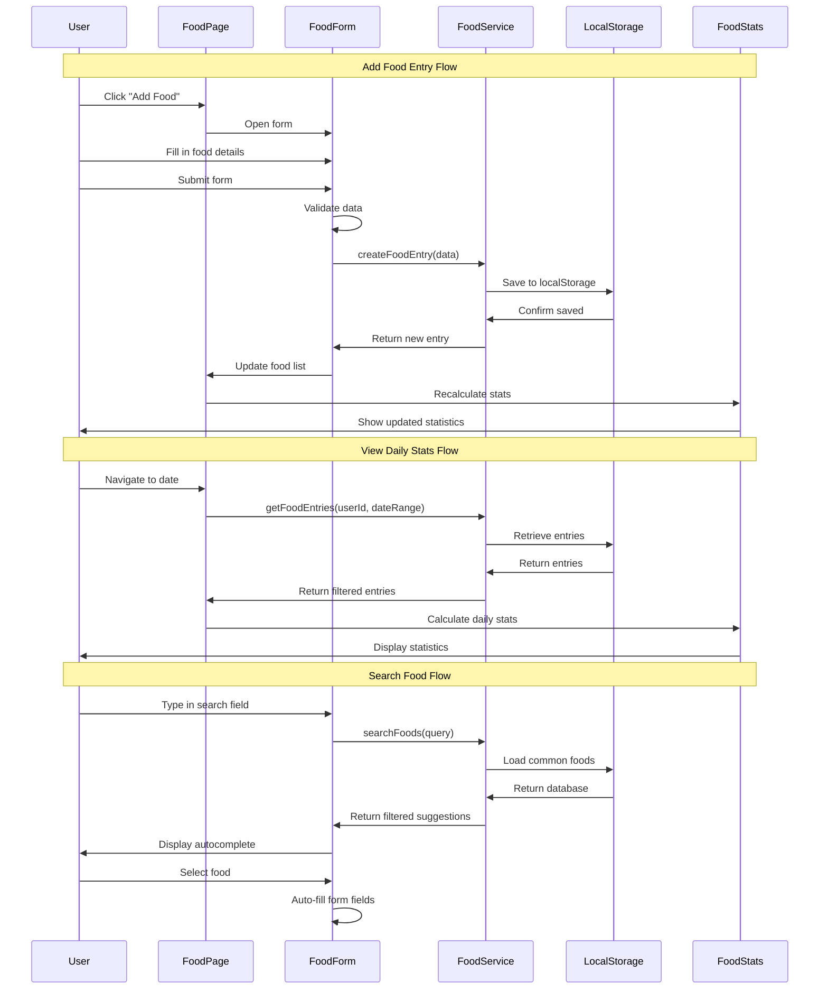

# Story 04 - Record Food Intake - Implementation Planning

## User Story

As a user, I want to record the food I eat throughout the day, so that I can track my nutritional intake and maintain awareness of my eating habits.

## Pre-conditions

- User must be authenticated and logged in
- Local storage is available for data persistence
- Dashboard page exists for integration with overall health tracking
- Navigation system is in place to add food tracking link

## Design

### Visual Layout

The food tracking feature will consist of:

**Main Food Tracking Page:**
- Header with page title and "Add Food" action button
- Navigation tabs for different views (Daily Log, Weekly Summary, Monthly View)
- Search/filter bar for finding logged foods
- Food entry cards displaying meal information in a timeline format
- Quick action buttons for common meal times (Breakfast, Lunch, Dinner, Snacks)

**Food Entry Form:**
- Meal type selector (dropdown or radio buttons)
- Food name input with autocomplete suggestions
- Portion size input with unit selector
- Calorie input (optional if using database)
- Time picker for meal timing
- Macronutrient inputs (Protein, Carbs, Fats) - optional
- Notes field for additional information
- Save and Cancel actions

**Food History View:**
- Timeline view grouped by date
- Filter options by meal type, date range
- Summary statistics cards showing daily totals
- Individual food entry cards with edit/delete actions

### Color and Typography

- **Background Colors**: 
  - Primary: bg-white dark:bg-gray-900
  - Secondary: bg-gray-50 dark:bg-gray-800
  - Accent: bg-green-500 hover:bg-green-600 (nutrition theme)
  - Card backgrounds: bg-white dark:bg-gray-800

- **Typography**:
  - Page headings: text-3xl font-bold text-gray-900 dark:text-white
  - Section headings: text-xl font-semibold text-gray-900 dark:text-white
  - Body text: text-base text-gray-600 dark:text-gray-300
  - Labels: text-sm font-medium text-gray-700 dark:text-gray-300
  - Helper text: text-xs text-gray-500 dark:text-gray-400

- **Component-Specific**:
  - Food cards: bg-white dark:bg-gray-800 shadow-sm hover:shadow-md border border-gray-200
  - Quick action buttons: bg-gradient-to-r from-green-400 to-green-600 text-white
  - Meal type badges: 
    - Breakfast: bg-yellow-100 text-yellow-800
    - Lunch: bg-blue-100 text-blue-800
    - Dinner: bg-purple-100 text-purple-800
    - Snack: bg-pink-100 text-pink-800
  - Input fields: border-gray-300 focus:border-green-500 focus:ring-green-500

### Interaction Patterns

- **Add Food Button**: 
  - Hover: Scale up to 105%, shadow increase
  - Click: Opens modal or slides in form panel
  - Loading: Shows spinner, disabled state
  - Accessibility: Focus ring, keyboard shortcut (Ctrl/Cmd + N)

- **Food Entry Card**:
  - Hover: Slight elevation with shadow transition
  - Click: Expands to show full details
  - Swipe (mobile): Reveal edit/delete actions
  - Long press (mobile): Quick edit mode

- **Form Field Interaction**:
  - Focus: Border highlight with green ring effect
  - Validation: Success (green checkmark) / Error (red icon with message)
  - Autocomplete: Dropdown appears below input with smooth animation
  - Accessibility: Labels, ARIA descriptions, error announcements

- **Time Selection**:
  - Click: Opens time picker modal
  - Quick actions: "Now", "1 hour ago", custom time
  - Format: 12-hour with AM/PM selector

### Measurements and Spacing

- **Container**:
  ```
  max-w-7xl mx-auto px-4 sm:px-6 lg:px-8
  ```

- **Component Spacing**:
  ```
  - Vertical rhythm: space-y-6
  - Card grid gap: gap-4 md:gap-6
  - Section padding: py-8 md:py-12
  - Card padding: p-4 md:p-6
  - Form field spacing: space-y-4
  - Button spacing: px-6 py-3
  ```

- **Food Card Layout**:
  ```
  - Min height: min-h-[120px]
  - Icon size: w-12 h-12
  - Badge size: text-xs px-2 py-1
  - Action button size: w-8 h-8
  ```

### Responsive Behavior

- **Desktop (lg: 1024px+)**:
  ```
  - Two-column layout: Form (1/3) + History (2/3)
  - Grid: grid-cols-2 gap-6 for food cards
  - Sidebar navigation visible
  - Typography: text-base
  - Horizontal stats dashboard
  ```

- **Tablet (md: 768px - 1023px)**:
  ```
  - Single column with tabs
  - Grid: grid-cols-2 gap-4 for cards
  - Collapsible sidebar
  - Typography: text-sm
  - Two-column stats
  ```

- **Mobile (sm: < 768px)**:
  ```
  - Full stack layout: flex flex-col
  - Single column food cards
  - Bottom sheet for form
  - Floating action button for add
  - Single column stats
  - Swipe gestures enabled
  ```

## Technical Requirements

### Component Structure

```
src/app/food/
├── page.tsx                          # Main food tracking page
└── _components/
    ├── FoodForm.tsx                  # Form for adding/editing food entries
    ├── FoodEntryCard.tsx             # Individual food entry display
    ├── FoodHistory.tsx               # Timeline view of food entries
    ├── FoodStats.tsx                 # Daily/weekly statistics display
    ├── MealTypeSelector.tsx          # Quick meal type selection
    ├── FoodSearchAutocomplete.tsx    # Food search with suggestions
    └── PortionSizeInput.tsx          # Portion size input with unit selector

src/lib/services/
├── foodService.ts                    # CRUD operations for food entries
└── nutritionDatabase.ts              # Common foods database (optional)

src/lib/types/
└── food.ts                           # TypeScript interfaces for food data

src/lib/data/
└── commonFoods.ts                    # Pre-populated common food items
```

### Required Components

- FoodForm ⬜
- FoodEntryCard ⬜
- FoodHistory ⬜
- FoodStats ⬜
- MealTypeSelector ⬜
- FoodSearchAutocomplete ⬜
- PortionSizeInput ⬜
- foodService.ts ⬜
- food.ts (types) ⬜
- commonFoods.ts ⬜

### State Management Requirements

```typescript
interface FoodEntry {
  id: string;
  userId: string;
  name: string;
  mealType: MealType;
  portionSize: number;
  portionUnit: PortionUnit;
  calories: number;
  macros?: {
    protein: number;
    carbs: number;
    fats: number;
  };
  timestamp: Date;
  notes?: string;
  createdAt: Date;
  updatedAt: Date;
}

enum MealType {
  BREAKFAST = 'BREAKFAST',
  LUNCH = 'LUNCH',
  DINNER = 'DINNER',
  SNACK = 'SNACK'
}

enum PortionUnit {
  GRAMS = 'g',
  OUNCES = 'oz',
  CUPS = 'cup',
  PIECES = 'piece',
  SERVINGS = 'serving'
}

interface FoodFormData {
  name: string;
  mealType: MealType;
  portionSize: number;
  portionUnit: PortionUnit;
  calories: number;
  protein?: number;
  carbs?: number;
  fats?: number;
  timestamp: string;
  notes?: string;
}

interface FoodPageState {
  // UI States
  isLoading: boolean;
  activeView: 'daily' | 'weekly' | 'monthly';
  isFormOpen: boolean;
  editingEntry: FoodEntry | null;
  
  // Data States
  foodEntries: FoodEntry[];
  dailyStats: DailyNutritionStats | null;
  searchQuery: string;
  selectedDate: Date;
  
  // Filter States
  filterMealType: MealType | 'all';
  dateRange: DateRange;
}

interface DailyNutritionStats {
  date: Date;
  totalCalories: number;
  totalProtein: number;
  totalCarbs: number;
  totalFats: number;
  mealCount: number;
  entriesByMealType: Record<MealType, FoodEntry[]>;
}

// State Actions
const actions = {
  setLoading: (state: boolean) => void;
  setActiveView: (view: 'daily' | 'weekly' | 'monthly') => void;
  toggleForm: (open?: boolean) => void;
  addFoodEntry: (entry: FoodEntry) => void;
  updateFoodEntry: (id: string, updates: Partial<FoodEntry>) => void;
  deleteFoodEntry: (id: string) => void;
  setEditingEntry: (entry: FoodEntry | null) => void;
  setSearchQuery: (query: string) => void;
  setFilterMealType: (type: MealType | 'all') => void;
  setSelectedDate: (date: Date) => void;
  loadFoodEntries: (userId: string, dateRange: DateRange) => Promise<void>;
  calculateDailyStats: (entries: FoodEntry[]) => DailyNutritionStats;
}
```

## Acceptance Criteria

### Layout & Content

1. Header Section
   ```
   - Page title "Food Tracker"
   - "Add Food" button (right-aligned)
   - Date selector with navigation (prev/next day)
   - Daily calorie progress bar
   - Mobile: Floating action button for add
   ```

2. Main Content Area
   ```
   - Tab navigation (Daily, Weekly, Monthly)
   - Filter bar (meal type, search)
   - Food entries timeline
   - Empty state when no entries
   - Loading skeleton during data fetch
   ```

3. Food Entry Card Layout
   ```
   - Meal type badge (colored by type)
   - Food name (prominent)
   - Portion size and unit
   - Calorie count
   - Timestamp
   - Edit/Delete actions (hover or always visible on mobile)
   - Optional: Macro breakdown
   ```

4. Statistics Dashboard
   ```
   - Total daily calories
   - Macronutrient breakdown
   - Meal distribution chart
   - Comparison with previous day/week
   - Goal progress indicators
   ```

### Functionality

1. Add Food Entry

   - [ ] User can open food entry form via "Add Food" button
   - [ ] Form includes all required fields (name, meal type, portion, calories, time)
   - [ ] Meal type can be selected from predefined options
   - [ ] Portion size has flexible unit selection (g, oz, cup, piece, serving)
   - [ ] Time defaults to current time but is editable
   - [ ] Optional fields for macronutrients are available
   - [ ] Form validation prevents submission with missing required fields
   - [ ] Success message appears after successful save
   - [ ] Form clears and closes after successful submission

2. Food Search & Autocomplete

   - [ ] Search bar provides autocomplete suggestions
   - [ ] Common foods database provides pre-populated suggestions
   - [ ] User can select from suggestions to auto-fill form
   - [ ] Custom food entries can be added if not in database
   - [ ] Recent foods appear in quick access
   - [ ] Search is case-insensitive

3. View & Filter Food History

   - [ ] Food entries display in reverse chronological order
   - [ ] Entries are grouped by date
   - [ ] User can filter by meal type (All, Breakfast, Lunch, Dinner, Snack)
   - [ ] User can search food entries by name or notes
   - [ ] Date range can be adjusted (today, yesterday, last 7 days, last 30 days)
   - [ ] Empty state shows helpful message when no entries exist

4. Edit & Delete Food Entries

   - [ ] User can click edit button to modify existing entry
   - [ ] Form pre-populates with existing entry data
   - [ ] Changes are saved and reflected immediately
   - [ ] Delete button includes confirmation dialog
   - [ ] Deleted entries are removed from view immediately
   - [ ] Statistics update after edit/delete operations

5. Daily Statistics & Tracking

   - [ ] Daily total calories are calculated and displayed
   - [ ] Macronutrient totals are shown (if available)
   - [ ] Meal distribution (% of calories per meal) is visualized
   - [ ] Progress toward daily goals is indicated
   - [ ] Statistics update in real-time as entries are added/modified

6. Data Persistence

   - [ ] All food entries are saved to localStorage
   - [ ] Data persists across browser sessions
   - [ ] Entries are associated with the logged-in user
   - [ ] Data loads automatically on page visit
   - [ ] Service handles date serialization properly

### Navigation Rules

- Accessible from main navigation menu with "Food" or "Nutrition" label
- After adding a food entry, user remains on the food tracking page
- Form can be accessed via floating action button on mobile
- User can navigate between daily/weekly/monthly views without losing filter state
- Back navigation maintains scroll position in food history
- Deep linking supported for specific dates (/food?date=2025-11-04)

### Error Handling

- Display user-friendly error messages for validation failures
- Handle localStorage quota exceeded errors gracefully
- Show offline indicator if local storage is unavailable
- Prevent duplicate submissions with debouncing
- Provide retry mechanism for failed operations
- Log errors to console for debugging while showing clean messages to users

## Modified Files

```
src/app/food/
├── page.tsx ⬜                       # Main food tracking page with tabs and filters
└── _components/
    ├── FoodForm.tsx ⬜               # Add/edit food entry form
    ├── FoodEntryCard.tsx ⬜          # Individual food display card
    ├── FoodHistory.tsx ⬜            # Timeline view of entries
    ├── FoodStats.tsx ⬜              # Daily statistics dashboard
    ├── MealTypeSelector.tsx ⬜       # Quick meal type buttons
    ├── FoodSearchAutocomplete.tsx ⬜ # Food search with suggestions
    └── PortionSizeInput.tsx ⬜       # Portion input with unit selector

src/lib/services/
└── foodService.ts ⬜                 # CRUD operations and business logic

src/lib/types/
└── food.ts ⬜                        # TypeScript interfaces

src/lib/data/
└── commonFoods.ts ⬜                 # Pre-populated food database

src/components/layout/
└── Navigation.tsx 🚧                # Add food tracking link (modify existing)

src/app/dashboard/
└── page.tsx 🚧                      # Integrate food data display (modify existing)
```

## Status

🟨 IN PROGRESS

1. Setup & Configuration

   - [ ] Create folder structure for food feature
   - [ ] Define TypeScript interfaces in food.ts
   - [ ] Create common foods database
   - [ ] Setup foodService.ts with localStorage integration
   - [ ] Add food route to navigation

2. Core Components Implementation

   - [ ] Implement FoodForm with validation
   - [ ] Create FoodEntryCard component
   - [ ] Build FoodHistory timeline view
   - [ ] Develop FoodStats dashboard
   - [ ] Implement MealTypeSelector quick actions
   - [ ] Create PortionSizeInput with unit selector
   - [ ] Build FoodSearchAutocomplete component

3. Feature Implementation

   - [ ] Implement add food functionality
   - [ ] Implement edit food functionality
   - [ ] Implement delete food with confirmation
   - [ ] Add food search and filtering
   - [ ] Implement date range selection
   - [ ] Calculate and display daily statistics
   - [ ] Add meal type filtering
   - [ ] Implement data persistence layer
   - [ ] Add loading states and skeleton screens
   - [ ] Implement error handling

4. Integration

   - [ ] Connect to dashboard for nutrition summary
   - [ ] Add navigation menu item
   - [ ] Integrate with existing auth system
   - [ ] Ensure responsive design across devices
   - [ ] Test localStorage integration

5. Testing
   - [ ] Form validation and submission
   - [ ] CRUD operations (Create, Read, Update, Delete)
   - [ ] Search and filtering functionality
   - [ ] Date range selection and navigation
   - [ ] Statistics calculation accuracy
   - [ ] Responsive design on mobile/tablet/desktop
   - [ ] localStorage persistence across sessions
   - [ ] Error handling scenarios
   - [ ] Accessibility compliance (keyboard navigation, screen readers)
   - [ ] Performance with large datasets (100+ entries)

## Dependencies

- Existing authentication system (user context)
- localStorage API for data persistence
- Dashboard integration for nutrition visualization
- Navigation system for adding food tracking link
- Date manipulation library (date-fns) - already in project
- Form validation utilities (if not using a library)

## Related Stories

- Story 03 - Record Exercise Activities (similar pattern for data entry and history)
- Dashboard integration for comprehensive health tracking
- Future: Nutrition goals setting
- Future: Meal planning feature
- Future: Integration with nutrition APIs (USDA, Nutritionix)

## Notes

### Technical Considerations

1. **Data Structure**: Use a flexible structure that can accommodate both simple and detailed food entries (with or without macronutrients)

2. **Search Performance**: For autocomplete, implement debouncing (300ms) to avoid excessive filtering on every keystroke

3. **Date Handling**: Use consistent date serialization (ISO strings) for localStorage and Date objects for calculations

4. **Statistics Calculation**: Calculate stats on-demand rather than storing them to avoid data sync issues

5. **Scalability**: Consider implementing data pagination if users accumulate hundreds of food entries

6. **Offline First**: Design with localStorage as primary storage, making future API integration easier

7. **Common Foods Database**: Start with 50-100 common foods, easily expandable later

8. **Unit Conversions**: Support basic unit conversions (e.g., 1 cup = 240ml) for international users

### Business Requirements

- Enable users to track food intake throughout the day with minimal friction
- Provide awareness of eating habits through statistics and visualizations
- Support both detailed tracking (with macros) and simple tracking (just calories)
- Make it easy to log common/recurring foods
- Help users identify patterns in their nutrition habits
- Integrate with overall health dashboard for comprehensive view

### API Integration (Future Consideration)

While this implementation uses localStorage, the architecture should support future API integration:

#### Type Definitions

```typescript
interface FoodDatabaseEntry {
  id: string;
  name: string;
  brand?: string;
  category: string;
  defaultPortionSize: number;
  defaultPortionUnit: PortionUnit;
  calories: number;
  macros: {
    protein: number;
    carbs: number;
    fats: number;
    fiber?: number;
    sugar?: number;
  };
  micronutrients?: Record<string, number>;
  source: 'user' | 'database' | 'api';
}

interface NutritionGoals {
  userId: string;
  dailyCalories: number;
  protein: number;
  carbs: number;
  fats: number;
}

interface FoodServiceInterface {
  getFoodEntries: (userId: string, dateRange: DateRange) => Promise<FoodEntry[]>;
  createFoodEntry: (data: FoodFormData, userId: string) => Promise<FoodEntry>;
  updateFoodEntry: (id: string, updates: Partial<FoodFormData>) => Promise<FoodEntry>;
  deleteFoodEntry: (id: string) => Promise<void>;
  searchFoods: (query: string) => Promise<FoodDatabaseEntry[]>;
  getDailyStats: (userId: string, date: Date) => Promise<DailyNutritionStats>;
  getWeeklyStats: (userId: string, startDate: Date) => Promise<WeeklyNutritionStats>;
}
```

### Mock Implementation

#### foodService.ts Implementation

```typescript
// localStorage keys
const STORAGE_KEYS = {
  FOOD_ENTRIES: 'food_entries',
  COMMON_FOODS: 'common_foods_database'
};

// Get stored food entries
function getStoredFoodEntries(): FoodEntry[] {
  if (typeof window === 'undefined') return [];
  
  const data = localStorage.getItem(STORAGE_KEYS.FOOD_ENTRIES);
  if (!data) return [];
  
  try {
    const parsed = JSON.parse(data);
    return parsed.map((entry: any) => ({
      ...entry,
      timestamp: new Date(entry.timestamp),
      createdAt: new Date(entry.createdAt),
      updatedAt: new Date(entry.updatedAt)
    }));
  } catch (error) {
    console.error('Error parsing food entries:', error);
    return [];
  }
}

// Save food entries
function saveFoodEntries(entries: FoodEntry[]): void {
  if (typeof window === 'undefined') return;
  
  try {
    localStorage.setItem(STORAGE_KEYS.FOOD_ENTRIES, JSON.stringify(entries));
  } catch (error) {
    console.error('Error saving food entries:', error);
    throw new Error('Failed to save food entries. Storage may be full.');
  }
}

// Create food entry
export async function createFoodEntry(
  data: FoodFormData, 
  userId: string
): Promise<FoodEntry> {
  await new Promise(resolve => setTimeout(resolve, 300));
  
  const newEntry: FoodEntry = {
    id: `food_${Date.now()}_${Math.random().toString(36).substr(2, 9)}`,
    userId,
    name: data.name,
    mealType: data.mealType,
    portionSize: data.portionSize,
    portionUnit: data.portionUnit,
    calories: data.calories,
    macros: (data.protein || data.carbs || data.fats) ? {
      protein: data.protein || 0,
      carbs: data.carbs || 0,
      fats: data.fats || 0
    } : undefined,
    timestamp: new Date(data.timestamp),
    notes: data.notes,
    createdAt: new Date(),
    updatedAt: new Date()
  };
  
  const entries = getStoredFoodEntries();
  entries.push(newEntry);
  saveFoodEntries(entries);
  
  return newEntry;
}

// Get food entries with filters
export async function getFoodEntries(
  userId: string,
  dateRange?: DateRange
): Promise<FoodEntry[]> {
  await new Promise(resolve => setTimeout(resolve, 200));
  
  let entries = getStoredFoodEntries().filter(entry => entry.userId === userId);
  
  if (dateRange) {
    entries = entries.filter(entry => {
      return entry.timestamp >= dateRange.startDate && 
             entry.timestamp <= dateRange.endDate;
    });
  }
  
  return entries.sort((a, b) => b.timestamp.getTime() - a.timestamp.getTime());
}

// Calculate daily statistics
export async function getDailyStats(
  userId: string,
  date: Date
): Promise<DailyNutritionStats> {
  const startOfDay = new Date(date);
  startOfDay.setHours(0, 0, 0, 0);
  
  const endOfDay = new Date(date);
  endOfDay.setHours(23, 59, 59, 999);
  
  const entries = await getFoodEntries(userId, {
    startDate: startOfDay,
    endDate: endOfDay
  });
  
  const stats: DailyNutritionStats = {
    date,
    totalCalories: 0,
    totalProtein: 0,
    totalCarbs: 0,
    totalFats: 0,
    mealCount: entries.length,
    entriesByMealType: {
      [MealType.BREAKFAST]: [],
      [MealType.LUNCH]: [],
      [MealType.DINNER]: [],
      [MealType.SNACK]: []
    }
  };
  
  entries.forEach(entry => {
    stats.totalCalories += entry.calories;
    stats.entriesByMealType[entry.mealType].push(entry);
    
    if (entry.macros) {
      stats.totalProtein += entry.macros.protein;
      stats.totalCarbs += entry.macros.carbs;
      stats.totalFats += entry.macros.fats;
    }
  });
  
  return stats;
}
```

#### commonFoods.ts Data

```typescript
export const COMMON_FOODS: FoodDatabaseEntry[] = [
  {
    id: 'cf_001',
    name: 'Banana',
    category: 'Fruit',
    defaultPortionSize: 1,
    defaultPortionUnit: PortionUnit.PIECES,
    calories: 105,
    macros: { protein: 1.3, carbs: 27, fats: 0.4 }
  },
  {
    id: 'cf_002',
    name: 'Chicken Breast',
    category: 'Protein',
    defaultPortionSize: 100,
    defaultPortionUnit: PortionUnit.GRAMS,
    calories: 165,
    macros: { protein: 31, carbs: 0, fats: 3.6 }
  },
  {
    id: 'cf_003',
    name: 'Brown Rice',
    category: 'Grains',
    defaultPortionSize: 1,
    defaultPortionUnit: PortionUnit.CUPS,
    calories: 218,
    macros: { protein: 5, carbs: 45, fats: 1.6 }
  },
  // Add 50-100 more common foods
];
```

### State Management Flow



### Custom Hooks

```typescript
// useFoodTracking.ts
const useFoodTracking = (userId: string) => {
  const [foodEntries, setFoodEntries] = useState<FoodEntry[]>([]);
  const [dailyStats, setDailyStats] = useState<DailyNutritionStats | null>(null);
  const [isLoading, setIsLoading] = useState(false);
  const [selectedDate, setSelectedDate] = useState(new Date());

  const loadFoodEntries = useCallback(async () => {
    setIsLoading(true);
    try {
      const startOfDay = new Date(selectedDate);
      startOfDay.setHours(0, 0, 0, 0);
      
      const endOfDay = new Date(selectedDate);
      endOfDay.setHours(23, 59, 59, 999);
      
      const entries = await foodService.getFoodEntries(userId, {
        startDate: startOfDay,
        endDate: endOfDay
      });
      
      setFoodEntries(entries);
      
      const stats = await foodService.getDailyStats(userId, selectedDate);
      setDailyStats(stats);
    } catch (error) {
      console.error('Failed to load food entries:', error);
    } finally {
      setIsLoading(false);
    }
  }, [userId, selectedDate]);

  useEffect(() => {
    loadFoodEntries();
  }, [loadFoodEntries]);

  const addFoodEntry = useCallback(async (data: FoodFormData) => {
    try {
      const newEntry = await foodService.createFoodEntry(data, userId);
      setFoodEntries(prev => [newEntry, ...prev]);
      await loadFoodEntries(); // Refresh stats
      return newEntry;
    } catch (error) {
      console.error('Failed to add food entry:', error);
      throw error;
    }
  }, [userId, loadFoodEntries]);

  const deleteFoodEntry = useCallback(async (entryId: string) => {
    try {
      await foodService.deleteFoodEntry(entryId);
      setFoodEntries(prev => prev.filter(entry => entry.id !== entryId));
      await loadFoodEntries(); // Refresh stats
    } catch (error) {
      console.error('Failed to delete food entry:', error);
      throw error;
    }
  }, [loadFoodEntries]);

  return {
    foodEntries,
    dailyStats,
    isLoading,
    selectedDate,
    setSelectedDate,
    addFoodEntry,
    deleteFoodEntry,
    refreshData: loadFoodEntries
  };
};
```

## Testing Requirements

### Integration Tests (Target: 80% Coverage)

1. Core Functionality Tests

```typescript
describe('Food Entry Management', () => {
  it('should create a new food entry with valid data', async () => {
    const data: FoodFormData = {
      name: 'Grilled Chicken',
      mealType: MealType.LUNCH,
      portionSize: 200,
      portionUnit: PortionUnit.GRAMS,
      calories: 330,
      timestamp: new Date().toISOString()
    };
    
    const entry = await foodService.createFoodEntry(data, 'user123');
    expect(entry.id).toBeDefined();
    expect(entry.name).toBe('Grilled Chicken');
    expect(entry.calories).toBe(330);
  });

  it('should retrieve food entries for a specific date range', async () => {
    const today = new Date();
    const entries = await foodService.getFoodEntries('user123', {
      startDate: today,
      endDate: today
    });
    
    expect(Array.isArray(entries)).toBe(true);
  });

  it('should calculate daily statistics correctly', async () => {
    const stats = await foodService.getDailyStats('user123', new Date());
    
    expect(stats.totalCalories).toBeGreaterThanOrEqual(0);
    expect(stats.mealCount).toBeGreaterThanOrEqual(0);
    expect(stats.entriesByMealType).toBeDefined();
  });

  it('should update an existing food entry', async () => {
    const entry = await foodService.createFoodEntry({
      name: 'Apple',
      mealType: MealType.SNACK,
      portionSize: 1,
      portionUnit: PortionUnit.PIECES,
      calories: 95,
      timestamp: new Date().toISOString()
    }, 'user123');
    
    const updated = await foodService.updateFoodEntry(entry.id, {
      calories: 100
    });
    
    expect(updated.calories).toBe(100);
  });

  it('should delete a food entry', async () => {
    const entry = await foodService.createFoodEntry({
      name: 'Orange',
      mealType: MealType.SNACK,
      portionSize: 1,
      portionUnit: PortionUnit.PIECES,
      calories: 62,
      timestamp: new Date().toISOString()
    }, 'user123');
    
    await foodService.deleteFoodEntry(entry.id);
    
    const entries = await foodService.getFoodEntries('user123');
    expect(entries.find(e => e.id === entry.id)).toBeUndefined();
  });
});
```

2. UI Component Tests

```typescript
describe('FoodForm Component', () => {
  it('should render all required form fields', () => {
    render(<FoodForm onSubmit={jest.fn()} onCancel={jest.fn()} />);
    
    expect(screen.getByLabelText(/food name/i)).toBeInTheDocument();
    expect(screen.getByLabelText(/meal type/i)).toBeInTheDocument();
    expect(screen.getByLabelText(/portion size/i)).toBeInTheDocument();
    expect(screen.getByLabelText(/calories/i)).toBeInTheDocument();
  });

  it('should validate required fields before submission', async () => {
    const mockSubmit = jest.fn();
    render(<FoodForm onSubmit={mockSubmit} onCancel={jest.fn()} />);
    
    const submitButton = screen.getByRole('button', { name: /save/i });
    fireEvent.click(submitButton);
    
    expect(mockSubmit).not.toHaveBeenCalled();
    expect(screen.getByText(/food name is required/i)).toBeInTheDocument();
  });

  it('should submit form with valid data', async () => {
    const mockSubmit = jest.fn();
    render(<FoodForm onSubmit={mockSubmit} onCancel={jest.fn()} />);
    
    fireEvent.change(screen.getByLabelText(/food name/i), {
      target: { value: 'Salad' }
    });
    fireEvent.change(screen.getByLabelText(/calories/i), {
      target: { value: '150' }
    });
    
    const submitButton = screen.getByRole('button', { name: /save/i });
    fireEvent.click(submitButton);
    
    await waitFor(() => {
      expect(mockSubmit).toHaveBeenCalled();
    });
  });
});

describe('FoodHistory Component', () => {
  it('should display food entries grouped by date', () => {
    const entries: FoodEntry[] = [
      {
        id: '1',
        userId: 'user123',
        name: 'Breakfast Oatmeal',
        mealType: MealType.BREAKFAST,
        portionSize: 1,
        portionUnit: PortionUnit.CUPS,
        calories: 300,
        timestamp: new Date(),
        createdAt: new Date(),
        updatedAt: new Date()
      }
    ];
    
    render(<FoodHistory entries={entries} onDelete={jest.fn()} onEdit={jest.fn()} />);
    
    expect(screen.getByText('Breakfast Oatmeal')).toBeInTheDocument();
    expect(screen.getByText('300')).toBeInTheDocument();
  });

  it('should show empty state when no entries exist', () => {
    render(<FoodHistory entries={[]} onDelete={jest.fn()} onEdit={jest.fn()} />);
    
    expect(screen.getByText(/no food entries/i)).toBeInTheDocument();
  });
});
```

3. Search and Filter Tests

```typescript
describe('Food Search and Filtering', () => {
  it('should filter entries by meal type', async () => {
    const entries = await foodService.getFoodEntries('user123');
    const breakfastEntries = entries.filter(e => e.mealType === MealType.BREAKFAST);
    
    expect(breakfastEntries.every(e => e.mealType === MealType.BREAKFAST)).toBe(true);
  });

  it('should search foods in autocomplete', async () => {
    const results = await foodService.searchFoods('chicken');
    
    expect(results.length).toBeGreaterThan(0);
    expect(results.every(r => r.name.toLowerCase().includes('chicken'))).toBe(true);
  });
});
```

4. Responsive Tests

```typescript
describe('Responsive Behavior', () => {
  it('should display mobile layout on small screens', () => {
    global.innerWidth = 375;
    global.dispatchEvent(new Event('resize'));
    
    render(<FoodPage />);
    
    const fab = screen.getByRole('button', { name: /add food/i });
    expect(fab).toHaveClass('fixed', 'bottom-6', 'right-6');
  });

  it('should display desktop layout on large screens', () => {
    global.innerWidth = 1024;
    global.dispatchEvent(new Event('resize'));
    
    render(<FoodPage />);
    
    const addButton = screen.getByRole('button', { name: /add food/i });
    expect(addButton).not.toHaveClass('fixed');
  });
});
```

### Performance Tests

```typescript
describe('Performance', () => {
  it('should handle large number of food entries efficiently', async () => {
    const startTime = performance.now();
    
    // Create 100 entries
    const promises = Array(100).fill(null).map((_, i) => 
      foodService.createFoodEntry({
        name: `Food ${i}`,
        mealType: MealType.LUNCH,
        portionSize: 100,
        portionUnit: PortionUnit.GRAMS,
        calories: 200,
        timestamp: new Date().toISOString()
      }, 'user123')
    );
    
    await Promise.all(promises);
    
    const entries = await foodService.getFoodEntries('user123');
    const endTime = performance.now();
    
    expect(entries.length).toBe(100);
    expect(endTime - startTime).toBeLessThan(5000); // Should complete in under 5 seconds
  });

  it('should debounce search input', async () => {
    const mockSearch = jest.fn();
    jest.useFakeTimers();
    
    render(<FoodSearchAutocomplete onSearch={mockSearch} />);
    
    const input = screen.getByRole('textbox');
    
    fireEvent.change(input, { target: { value: 'a' } });
    fireEvent.change(input, { target: { value: 'ap' } });
    fireEvent.change(input, { target: { value: 'app' } });
    
    expect(mockSearch).not.toHaveBeenCalled();
    
    jest.advanceTimersByTime(300);
    
    expect(mockSearch).toHaveBeenCalledTimes(1);
    expect(mockSearch).toHaveBeenCalledWith('app');
    
    jest.useRealTimers();
  });
});
```

### Accessibility Tests

```typescript
describe('Accessibility', () => {
  it('should have proper ARIA labels on form fields', () => {
    render(<FoodForm onSubmit={jest.fn()} onCancel={jest.fn()} />);
    
    expect(screen.getByLabelText(/food name/i)).toHaveAttribute('aria-required', 'true');
    expect(screen.getByLabelText(/calories/i)).toHaveAttribute('type', 'number');
  });

  it('should announce form errors to screen readers', async () => {
    render(<FoodForm onSubmit={jest.fn()} onCancel={jest.fn()} />);
    
    const submitButton = screen.getByRole('button', { name: /save/i });
    fireEvent.click(submitButton);
    
    const errorMessage = await screen.findByRole('alert');
    expect(errorMessage).toBeInTheDocument();
  });

  it('should support keyboard navigation', () => {
    render(<FoodForm onSubmit={jest.fn()} onCancel={jest.fn()} />);
    
    const firstInput = screen.getByLabelText(/food name/i);
    const submitButton = screen.getByRole('button', { name: /save/i });
    
    firstInput.focus();
    expect(document.activeElement).toBe(firstInput);
    
    // Tab through form
    userEvent.tab();
    userEvent.tab();
    userEvent.tab();
    
    // Should eventually reach submit button
    expect(document.activeElement).toBeDefined();
  });
});
```

### Edge Cases

```typescript
describe('Edge Cases', () => {
  it('should handle localStorage quota exceeded', async () => {
    // Mock localStorage to throw quota exceeded error
    Storage.prototype.setItem = jest.fn(() => {
      throw new Error('QuotaExceededError');
    });
    
    await expect(
      foodService.createFoodEntry({
        name: 'Test Food',
        mealType: MealType.LUNCH,
        portionSize: 100,
        portionUnit: PortionUnit.GRAMS,
        calories: 200,
        timestamp: new Date().toISOString()
      }, 'user123')
    ).rejects.toThrow(/storage.*full/i);
  });

  it('should handle corrupted localStorage data', () => {
    localStorage.setItem('food_entries', 'invalid json');
    
    const entries = getStoredFoodEntries();
    expect(entries).toEqual([]);
  });

  it('should handle entries with missing optional fields', async () => {
    const entry = await foodService.createFoodEntry({
      name: 'Simple Food',
      mealType: MealType.SNACK,
      portionSize: 1,
      portionUnit: PortionUnit.PIECES,
      calories: 50,
      timestamp: new Date().toISOString()
      // No notes, no macros
    }, 'user123');
    
    expect(entry.notes).toBeUndefined();
    expect(entry.macros).toBeUndefined();
  });
});
```

## Feature Documentation

This implementation plan provides a comprehensive blueprint for implementing the food intake tracking feature. The architecture follows the same patterns established in the exercise tracking feature (Story 03), ensuring consistency across the application.

Key implementation priorities:
1. Core CRUD operations with localStorage
2. Intuitive form with validation
3. Timeline view of food entries
4. Daily statistics calculation
5. Search and filter functionality
6. Responsive design
7. Dashboard integration

The feature is designed to be implemented incrementally, with each component being testable in isolation before integration.
