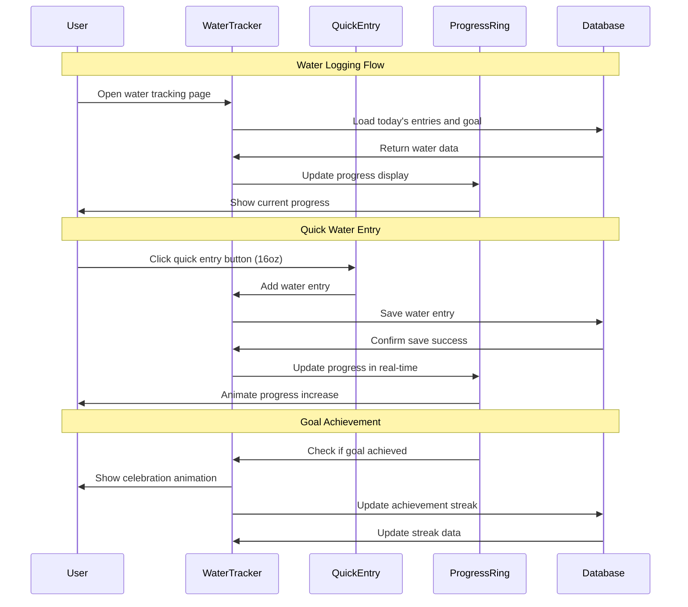

# 05 Track Daily Water Consumption - Implementation Planning

## User Story

As a user, I want to record my daily water intake, so that I can ensure I'm staying properly hydrated and track this aspect of my health.

## Pre-conditions

- User has completed signup and goal selection process
- User has access to the main application with navigation
- Local database (SQLite) is initialized with hydration tracking tables
- User authentication/session is established
- Daily hydration goals are defined based on user profile and health goals
- Water measurement units and conversion factors are configured

## Design

### Visual Layout

The water tracking interface will feature:
- **Quick Action Header**: Today's progress ring with current intake vs. goal
- **Fast Entry Buttons**: Preset water amounts (8oz glass, 16oz bottle, 32oz bottle, custom)
- **Progress Visualization**: Animated water glass or bottle filling up throughout the day
- **Timeline View**: Chronological list of today's water entries with timestamps
- **Goal Settings**: Customizable daily hydration target with smart recommendations
- **Historical Charts**: Weekly and monthly hydration trends and patterns
- **Reminder System**: Smart notifications for hydration reminders
- **Quick Stats**: Average daily intake, streak counters, and achievement badges

### Color and Typography

- **Background Colors**: 
  - Primary: bg-blue-50 dark:bg-blue-900/10
  - Water progress: bg-gradient-to-t from-blue-400 to-blue-200
  - Entry cards: bg-white dark:bg-gray-800
  - Goal achieved: bg-green-50 dark:bg-green-900/20
  - Behind goal: bg-yellow-50 dark:bg-yellow-900/20
  - Quick action buttons: bg-blue-100 dark:bg-blue-900/30

- **Typography**:
  - Main progress: font-inter text-4xl font-bold text-blue-600 dark:text-blue-400
  - Goal label: font-inter text-lg font-semibold text-gray-900 dark:text-white
  - Entry amounts: font-mono text-base font-medium text-blue-700 dark:text-blue-300
  - Timestamps: font-inter text-sm text-gray-500 dark:text-gray-400
  - Quick buttons: font-inter text-sm font-medium text-blue-800 dark:text-blue-200

- **Component-Specific**:
  - Progress ring: stroke-blue-500 with animated fill
  - Quick entry buttons: bg-blue-100 hover:bg-blue-200 dark:bg-blue-900/30 dark:hover:bg-blue-900/50
  - Timeline entries: bg-white dark:bg-gray-800 shadow-sm border-l-4 border-blue-300
  - Achievement badges: bg-gradient-to-r from-green-400 to-blue-500 text-white
  - Goal settings: bg-gray-50 dark:bg-gray-800 border border-gray-200 dark:border-gray-700

### Interaction Patterns

- **Quick Entry Buttons**: 
  - Hover: Gentle scale up (102%) with background lightening (150ms ease)
  - Click: Brief scale down (95%) with haptic feedback
  - Success: Check mark animation with color pulse
  - Accessibility: Focus ring, keyboard activation, screen reader announcements

- **Progress Ring Animation**:
  - Real-time: Smooth arc animation as water is logged (500ms ease-out)
  - Achievement: Celebration animation when goal is reached
  - Visual feedback: Color transitions for different progress levels
  - Accessibility: Progress percentage announced to screen readers

- **Custom Amount Entry**:
  - Focus: Smooth border highlight with blue accent
  - Validation: Real-time feedback for valid amounts
  - Quick convert: Unit switcher (oz/ml/cups) with instant conversion
  - Accessibility: Clear labels, unit announcements, error descriptions

### Measurements and Spacing

- **Container**:
  ```
  max-w-4xl mx-auto px-4 sm:px-6 lg:px-8 py-6
  ```

- **Progress Section**:
  ```
  - Progress ring: w-48 h-48 md:w-56 md:h-56
  - Progress text: text-center space-y-2
  - Quick buttons grid: grid-cols-2 md:grid-cols-4 gap-3
  - Button padding: px-4 py-3
  ```

- **Timeline Layout**:
  ```
  - Timeline container: space-y-3
  - Entry cards: p-4 rounded-lg
  - Timestamp spacing: mb-1
  - Amount spacing: text-right
  ```

### Responsive Behavior

- **Desktop (lg: 1024px+)**:
  ```
  - Three-column layout: progress (1/3), timeline (1/3), insights (1/3)
  - Large progress ring with detailed stats
  - Full timeline with all entries visible
  - Extended quick entry options
  ```

- **Tablet (md: 768px - 1023px)**:
  ```
  - Two-column layout: progress and timeline stacked
  - Medium progress ring with essential stats
  - Scrollable timeline with recent entries
  - Condensed quick entry grid
  ```

- **Mobile (sm: < 768px)**:
  ```
  - Single column with sticky progress header
  - Compact progress indicator
  - Swipe-to-delete timeline entries
  - Large touch-friendly quick entry buttons
  ```

## Technical Requirements

### Component Structure

```
src/app/hydration/
├── page.tsx
└── _components/
    ├── WaterTracker.tsx             # Main water tracking interface
    ├── ProgressRing.tsx             # Circular progress indicator
    ├── QuickEntryButtons.tsx        # Preset amount buttons
    ├── CustomAmountEntry.tsx        # Custom water amount input
    ├── WaterTimeline.tsx            # Daily water entries timeline
    ├── HydrationGoalSetting.tsx     # Goal configuration component
    ├── HydrationInsights.tsx        # Charts and analytics
    ├── WaterEntryCard.tsx           # Individual water entry display
    └── useWaterTracking.ts          # Custom hook for hydration logic
```

### Required Components

- WaterTracker ⬜
- ProgressRing ⬜
- QuickEntryButtons ⬜
- CustomAmountEntry ⬜
- WaterTimeline ⬜
- HydrationGoalSetting ⬜
- HydrationInsights ⬜
- WaterEntryCard ⬜
- useWaterTracking ⬜

### State Management Requirements

```typescript
interface WaterEntry {
  id: string;
  userId: string;
  amount: number; // in milliliters
  unit: WaterUnit;
  displayAmount: number; // amount in display unit
  timestamp: Date;
  source: 'quick' | 'custom' | 'reminder';
  notes?: string;
  createdAt: Date;
}

interface WaterUnit {
  id: string;
  name: string; // "fl oz", "ml", "cups", "liters"
  abbreviation: string;
  mlConversion: number; // conversion factor to ml
  isMetric: boolean;
}

interface HydrationGoal {
  userId: string;
  dailyTargetMl: number;
  unit: WaterUnit;
  displayTarget: number;
  basedOn: 'weight' | 'activity' | 'custom';
  reminderInterval?: number; // minutes
  reminderEnabled: boolean;
  createdAt: Date;
  updatedAt: Date;
}

interface WaterTrackingState {
  // Current Day Data
  selectedDate: Date;
  dailyEntries: WaterEntry[];
  dailyTotal: number; // in ml
  dailyGoal: HydrationGoal;
  
  // UI States
  isAddingCustom: boolean;
  isEditingGoal: boolean;
  selectedUnit: WaterUnit;
  
  // Progress States
  progressPercentage: number;
  isGoalAchieved: boolean;
  streakDays: number;
  
  // Form States
  customAmount: string;
  customUnit: WaterUnit;
  formErrors: Record<string, string>;
  
  // Historical Data
  weeklyData: WaterEntry[];
  monthlyData: WaterEntry[];
  averageDailyIntake: number;
}

// State Updates
const actions = {
  addWaterEntry: (amount: number, unit: WaterUnit) => Promise<void>;
  deleteWaterEntry: (id: string) => Promise<void>;
  updateHydrationGoal: (goal: Partial<HydrationGoal>) => Promise<void>;
  setSelectedDate: (date: Date) => void;
  setCustomAmount: (amount: string) => void;
  setSelectedUnit: (unit: WaterUnit) => void;
  loadDailyEntries: (date: Date) => Promise<void>;
  calculateProgress: () => void;
}
```

## Acceptance Criteria

### Layout & Content

1. Water Tracking Dashboard
   ```
   - Large progress indicator showing today's intake vs. goal
   - Current progress displayed in user's preferred units
   - Quick entry buttons for common water amounts
   - Real-time progress updates as water is logged
   ```

2. Quick Entry Interface
   ```
   - Preset buttons: 8oz glass, 16oz bottle, 32oz bottle, 1 liter
   - Custom amount entry with unit selection
   - One-tap logging with immediate visual feedback
   - Support for multiple measurement units (oz, ml, cups, liters)
   ```

3. Daily Timeline
   ```
   - Chronological list of today's water entries
   - Timestamp and amount for each entry
   - Edit and delete options for existing entries
   - Running total throughout the day
   ```

4. Goal Management
   ```
   - Customizable daily hydration target
   - Smart goal recommendations based on user profile
   - Progress tracking with visual indicators
   - Achievement notifications when goal is reached
   ```

### Functionality

1. Water Entry Management

   - [ ] Log water consumption with preset amounts (8oz, 16oz, 32oz, 1L)
   - [ ] Support custom water amounts with multiple unit options
   - [ ] Provide immediate visual feedback when water is logged
   - [ ] Allow editing and deletion of existing water entries

2. Progress Tracking and Visualization

   - [ ] Display real-time progress toward daily hydration goal
   - [ ] Show percentage completion with animated progress indicator
   - [ ] Provide visual celebrations when daily goal is achieved
   - [ ] Calculate and display running totals throughout the day

3. Goal Setting and Personalization

   - [ ] Allow users to set custom daily hydration targets
   - [ ] Provide smart goal recommendations based on weight and activity
   - [ ] Support different measurement units (fl oz, ml, cups, liters)
   - [ ] Remember user's preferred units across sessions

4. Historical Data and Insights

   - [ ] Store all water consumption data locally in SQLite database
   - [ ] Display historical hydration data for past days/weeks/months
   - [ ] Calculate hydration streaks and average daily intake
   - [ ] Show trends and patterns in hydration habits

### Navigation Rules

- Water tracking accessible from main navigation and dashboard quick actions
- Quick entry available from all pages via floating action button (mobile)
- Progress indicator links to detailed hydration page
- Historical data accessible through date navigation or calendar view
- Goal settings accessible through profile or quick settings

### Error Handling

- Validation for realistic water amounts (prevent accidental large entries)
- Offline functionality with sync when connection restored
- Graceful handling of invalid custom amounts with helpful error messages
- Data backup and recovery for hydration history
- Fallback units when user's preferred unit is unavailable

## Modified Files

```
src/app/hydration/
├── page.tsx ⬜
└── _components/
    ├── WaterTracker.tsx ⬜
    ├── ProgressRing.tsx ⬜
    ├── QuickEntryButtons.tsx ⬜
    ├── CustomAmountEntry.tsx ⬜
    ├── WaterTimeline.tsx ⬜
    ├── HydrationGoalSetting.tsx ⬜
    ├── HydrationInsights.tsx ⬜
    ├── WaterEntryCard.tsx ⬜
    └── useWaterTracking.ts ⬜
├── lib/
│   ├── database/
│   │   └── waterEntries.ts ⬜
│   ├── utils/
│   │   ├── unitConversions.ts ⬜
│   │   └── hydrationCalculations.ts ⬜
│   └── constants/
│       └── waterUnits.ts ⬜
└── types/
    └── hydration.ts ⬜
```

## Status

🟨 IN PROGRESS

1. Setup & Configuration

   - [ ] Define water measurement units and conversion factors
   - [ ] Create database schema for water entries and goals
   - [ ] Setup component file structure and routing
   - [ ] Configure push notifications for hydration reminders

2. Layout Implementation

   - [ ] Create responsive layout for water tracking dashboard
   - [ ] Implement animated progress ring with smooth transitions
   - [ ] Build quick entry buttons with haptic feedback
   - [ ] Add timeline view with edit/delete functionality

3. Feature Implementation

   - [ ] Build water entry logic with unit conversions
   - [ ] Implement goal setting and progress calculations
   - [ ] Create historical data visualization and insights
   - [ ] Add reminder system with smart scheduling

4. Testing
   - [ ] Unit tests for water tracking logic and unit conversions
   - [ ] Integration tests for database operations and goal calculations
   - [ ] User experience testing for quick entry workflow
   - [ ] Performance testing for real-time progress updates

## Dependencies

- SQLite database with date indexing for efficient historical queries
- Push notification system for hydration reminders
- Unit conversion library or custom conversion utilities
- Chart/visualization library for historical data (Recharts)
- Date manipulation library (date-fns or dayjs)

## Related Stories

- 02 ([View Health Dashboard - receives hydration data for visualization])

## Notes

### Technical Considerations

1. **Unit Conversion Accuracy**: Implement precise conversion factors between measurement units
2. **Real-time Updates**: Ensure progress indicators update immediately when water is logged
3. **Offline Functionality**: Support water logging without internet connection
4. **Performance Optimization**: Efficient loading of historical data with pagination
5. **Notification System**: Smart hydration reminders based on user patterns and preferences

### Business Requirements

- Water tracking must be fast and simple for frequent daily use
- Support for different cultural measurement preferences (metric vs imperial)
- Progress visualization should be motivating and encouraging
- Historical data should help users identify hydration patterns
- Reminder system should be helpful without being annoying

### API Integration

#### Type Definitions

```typescript
interface WaterUnit {
  id: string;
  name: string;
  abbreviation: string;
  mlConversion: number;
  isMetric: boolean;
  isCommon: boolean; // for quick entry suggestions
}

interface HydrationRecommendation {
  baseAmount: number; // ml per day
  weightMultiplier: number; // ml per kg body weight
  activityBonus: number; // additional ml for active users
  climateAdjustment: number; // adjustment for hot climates
}

interface HydrationInsight {
  userId: string;
  date: Date;
  totalIntake: number;
  goalAchieved: boolean;
  hoursActive: number; // hours between first and last entry
  averageEntrySize: number;
  entryFrequency: number; // entries per hour
}

interface WaterTrackingStore {
  todayEntries: WaterEntry[];
  currentGoal: HydrationGoal;
  selectedUnit: WaterUnit;
  progressPercentage: number;
  streakDays: number;
  
  addWaterEntry: (amount: number, unit: WaterUnit) => Promise<void>;
  updateGoal: (goal: Partial<HydrationGoal>) => Promise<void>;
  setPreferredUnit: (unit: WaterUnit) => void;
  loadHistoricalData: (startDate: Date, endDate: Date) => Promise<WaterEntry[]>;
  calculateRecommendedGoal: (userProfile: UserProfile) => number;
}
```

### Mock Implementation

#### Mock Server Configuration

```typescript
// filepath: mocks/stub.ts
const mocks = [
  {
    endPoint: '/api/hydration/entries',
    json: 'waterEntries.json',
  },
  {
    endPoint: '/api/hydration/insights',
    json: 'hydrationInsights.json',
  },
];
```

#### Mock Response

```json
// filepath: mocks/responses/waterEntries.json
{
  "status": "SUCCESS",
  "data": {
    "entries": [
      {
        "id": "entry-1",
        "amount": 473,
        "unit": {
          "id": "fl-oz",
          "name": "Fluid Ounces",
          "abbreviation": "fl oz",
          "mlConversion": 29.5735,
          "isMetric": false
        },
        "displayAmount": 16,
        "timestamp": "2025-11-03T08:30:00Z",
        "source": "quick"
      },
      {
        "id": "entry-2",
        "amount": 237,
        "unit": {
          "id": "fl-oz",
          "name": "Fluid Ounces",
          "abbreviation": "fl oz",
          "mlConversion": 29.5735,
          "isMetric": false
        },
        "displayAmount": 8,
        "timestamp": "2025-11-03T10:15:00Z",
        "source": "quick"
      }
    ],
    "dailyGoal": {
      "dailyTargetMl": 2000,
      "unit": {
        "id": "fl-oz",
        "name": "Fluid Ounces",
        "abbreviation": "fl oz",
        "mlConversion": 29.5735,
        "isMetric": false
      },
      "displayTarget": 67.6,
      "basedOn": "weight",
      "reminderEnabled": true,
      "reminderInterval": 120
    },
    "progress": {
      "totalMl": 710,
      "percentage": 35.5,
      "remaining": 1290,
      "isGoalAchieved": false
    }
  }
}
```

### State Management Flow



### Custom Hook Implementation

```typescript
const useWaterTracking = (initialDate: Date = new Date()) => {
  const [selectedDate, setSelectedDate] = useState(initialDate);
  const [dailyEntries, setDailyEntries] = useState<WaterEntry[]>([]);
  const [dailyGoal, setDailyGoal] = useState<HydrationGoal | null>(null);
  const [progressPercentage, setProgressPercentage] = useState(0);
  const [selectedUnit, setSelectedUnit] = useState<WaterUnit>(defaultUnit);

  const loadDailyData = useCallback(async (date: Date) => {
    try {
      const entries = await getWaterEntriesForDate(date);
      const goal = await getUserHydrationGoal();
      
      setDailyEntries(entries);
      setDailyGoal(goal);
      
      // Calculate progress
      const totalMl = entries.reduce((sum, entry) => sum + entry.amount, 0);
      const percentage = goal ? Math.min((totalMl / goal.dailyTargetMl) * 100, 100) : 0;
      setProgressPercentage(percentage);
    } catch (error) {
      console.error('Failed to load daily water data:', error);
    }
  }, []);

  const addWaterEntry = useCallback(async (amount: number, unit: WaterUnit) => {
    try {
      const mlAmount = amount * unit.mlConversion;
      
      const newEntry: WaterEntry = {
        id: generateId(),
        userId: getCurrentUserId(),
        amount: mlAmount,
        unit,
        displayAmount: amount,
        timestamp: new Date(),
        source: 'quick',
        createdAt: new Date(),
      };

      await saveWaterEntry(newEntry);
      
      setDailyEntries(prev => {
        const updated = [...prev, newEntry].sort((a, b) => 
          a.timestamp.getTime() - b.timestamp.getTime()
        );
        return updated;
      });

      // Update progress
      const newTotal = dailyEntries.reduce((sum, entry) => sum + entry.amount, 0) + mlAmount;
      const newPercentage = dailyGoal 
        ? Math.min((newTotal / dailyGoal.dailyTargetMl) * 100, 100) 
        : 0;
      setProgressPercentage(newPercentage);

      // Check for goal achievement
      if (dailyGoal && newTotal >= dailyGoal.dailyTargetMl && 
          dailyEntries.reduce((sum, entry) => sum + entry.amount, 0) < dailyGoal.dailyTargetMl) {
        // Goal just achieved - trigger celebration
        showGoalAchievedNotification();
        await updateHydrationStreak();
      }

      // Trigger dashboard update
      window.dispatchEvent(new CustomEvent('healthDataUpdated', {
        detail: { type: 'hydration', data: newEntry }
      }));

    } catch (error) {
      console.error('Failed to add water entry:', error);
      throw error;
    }
  }, [dailyEntries, dailyGoal]);

  const deleteWaterEntry = useCallback(async (entryId: string) => {
    try {
      await removeWaterEntry(entryId);
      
      setDailyEntries(prev => prev.filter(entry => entry.id !== entryId));
      
      // Recalculate progress
      const updatedEntries = dailyEntries.filter(entry => entry.id !== entryId);
      const newTotal = updatedEntries.reduce((sum, entry) => sum + entry.amount, 0);
      const newPercentage = dailyGoal 
        ? Math.min((newTotal / dailyGoal.dailyTargetMl) * 100, 100) 
        : 0;
      setProgressPercentage(newPercentage);
    } catch (error) {
      console.error('Failed to delete water entry:', error);
      throw error;
    }
  }, [dailyEntries, dailyGoal]);

  const updateHydrationGoal = useCallback(async (goalUpdates: Partial<HydrationGoal>) => {
    if (!dailyGoal) return;

    try {
      const updatedGoal = { ...dailyGoal, ...goalUpdates, updatedAt: new Date() };
      await saveHydrationGoal(updatedGoal);
      setDailyGoal(updatedGoal);
      
      // Recalculate progress with new goal
      const totalMl = dailyEntries.reduce((sum, entry) => sum + entry.amount, 0);
      const percentage = Math.min((totalMl / updatedGoal.dailyTargetMl) * 100, 100);
      setProgressPercentage(percentage);
    } catch (error) {
      console.error('Failed to update hydration goal:', error);
      throw error;
    }
  }, [dailyGoal, dailyEntries]);

  // Load data when date changes
  useEffect(() => {
    loadDailyData(selectedDate);
  }, [selectedDate, loadDailyData]);

  // Load user's preferred unit
  useEffect(() => {
    getUserPreferredWaterUnit().then(unit => {
      if (unit) setSelectedUnit(unit);
    });
  }, []);

  return {
    selectedDate,
    setSelectedDate,
    dailyEntries,
    dailyGoal,
    progressPercentage,
    selectedUnit,
    setSelectedUnit,
    addWaterEntry,
    deleteWaterEntry,
    updateHydrationGoal,
    loadDailyData,
  };
};
```

## Testing Requirements

### Integration Tests (Target: 80% Coverage)

1. Water Entry Management

```typescript
describe('Water Entry Management', () => {
  it('should add water entries with correct unit conversions', async () => {
    // Test water logging with different units
  });

  it('should update progress percentage in real-time', async () => {
    // Test progress calculation and updates
  });

  it('should save water entries to local database', async () => {
    // Test database persistence
  });

  it('should handle goal achievement notifications', async () => {
    // Test goal completion logic
  });
});
```

2. Unit Conversion and Calculations

```typescript
describe('Unit Conversions', () => {
  it('should convert between different water measurement units accurately', async () => {
    // Test conversion accuracy for fl oz, ml, cups, liters
  });

  it('should maintain precision in progress calculations', async () => {
    // Test calculation accuracy
  });

  it('should handle edge cases in unit conversions', async () => {
    // Test boundary conditions
  });
});
```

3. Goal Management and Progress Tracking

```typescript
describe('Goal Management', () => {
  it('should allow users to set and update hydration goals', async () => {
    // Test goal setting functionality
  });

  it('should calculate recommended goals based on user profile', async () => {
    // Test smart goal recommendations
  });

  it('should track hydration streaks accurately', async () => {
    // Test streak calculation
  });
});
```

### Performance Tests

1. Real-time Updates

```typescript
describe('Performance', () => {
  it('should update progress indicators without delays', async () => {
    // Test UI responsiveness
  });

  it('should handle rapid water entry additions smoothly', async () => {
    // Test quick succession of entries
  });

  it('should load historical data efficiently', async () => {
    // Test data loading performance
  });
});
```

### Accessibility Tests

```typescript
describe('Accessibility', () => {
  it('should announce progress updates to screen readers', async () => {
    // Test screen reader integration
  });

  it('should support keyboard navigation for all water entry controls', async () => {
    // Test keyboard accessibility
  });

  it('should provide clear labels and descriptions for water amounts', async () => {
    // Test accessibility labels
  });
});
```

### Test Environment Setup

```typescript
// Test helper functions
const mockWaterUnits = (): WaterUnit[] => {
  // Generate mock water units for testing
};

const createMockWaterEntry = (overrides?: Partial<WaterEntry>): WaterEntry => {
  // Create mock water entry data
};

const renderWaterTracker = (props?: Partial<WaterTrackerProps>) => {
  // Render water tracker with providers and mock data
};

beforeEach(() => {
  jest.clearAllMocks();
  mockDatabase.reset();
  jest.clearAllTimers();
  jest.useFakeTimers();
});

afterEach(() => {
  jest.useRealTimers();
});
```