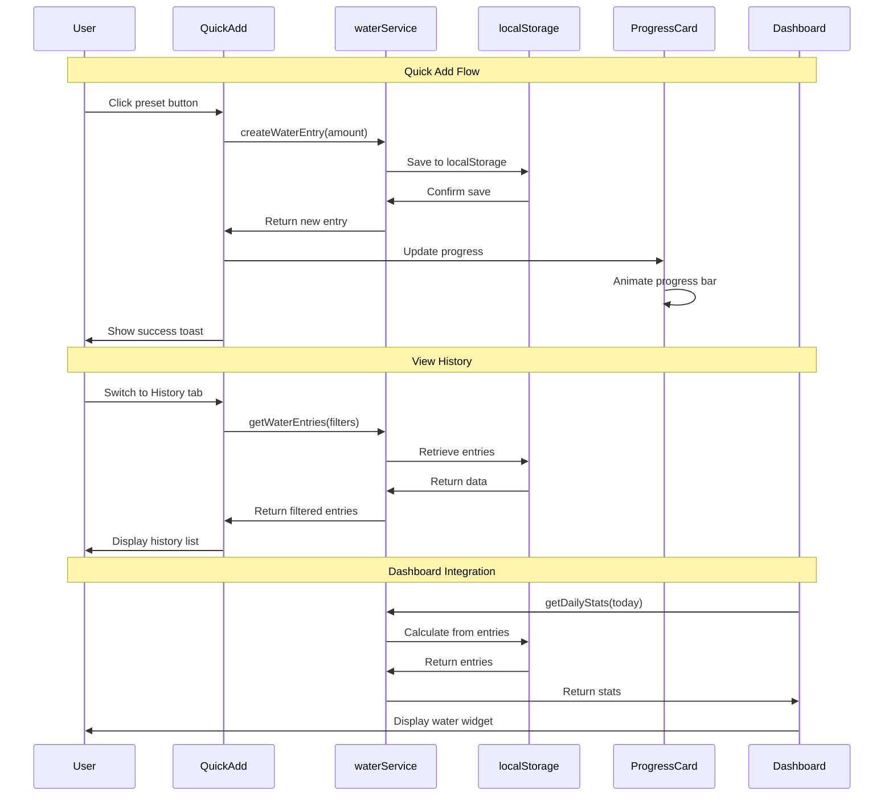

# 05 - Track Daily Water Consumption - Implementation Plan

## User Story

As a user, I want to record my daily water intake, so that I can ensure I'm staying properly hydrated and track this aspect of my health.

## Pre-conditions

- User must be authenticated and logged in
- Dashboard already displays water intake metrics (currently showing default 2.0L)
- Health dashboard infrastructure exists for displaying water data
- localStorage persistence layer is available
- Existing patterns from exercise and food tracking can be followed

## Design

### Visual Layout

The water tracking feature will follow the established patterns from exercise and food tracking:

**Main Components:**
- Quick-add interface with preset amount buttons (prominent placement)
- Custom amount input field for flexibility
- Daily progress indicator showing current intake vs. goal
- Historical log of water entries with timestamps
- Weekly/monthly overview charts

**Layout Structure:**
- Header section with water drop icon and title
- Quick-add card at the top for fast logging
- Statistics card showing daily progress with visual indicator
- Timeline/history section below for viewing past entries
- Tab navigation similar to food tracking (Log, Stats, History)

**Key UI Elements:**
- Large, touch-friendly buttons for preset amounts
- Visual water glass/bottle icons for presets
- Progress bar or circular progress indicator
- Quick delete/undo for recent entries
- Date picker for viewing historical data

### Color and Typography

**Color Scheme (Water/Hydration Theme):**

- **Primary Colors**: 
  - Primary: bg-blue-500 hover:bg-blue-600 (water theme)
  - Secondary: bg-cyan-100 text-cyan-800 (light water accents)
  - Success: bg-green-500 (goal achievement)
  - Progress: bg-gradient-to-r from-blue-400 to-cyan-500

- **Background Colors**:
  - Primary: bg-white dark:bg-gray-900
  - Secondary: bg-blue-50 dark:bg-gray-800 (subtle water tint)
  - Cards: bg-white shadow-sm border border-gray-200
  - Hover: hover:bg-blue-50

- **Typography**:
  - Page Title: text-3xl font-bold text-gray-900
  - Section Headers: text-lg font-semibold text-gray-900
  - Body Text: text-gray-600
  - Stats Numbers: text-3xl font-bold text-blue-600
  - Timestamps: text-sm text-gray-500

- **Component-Specific**:
  - Preset Buttons: bg-blue-500 text-white hover:bg-blue-600 active:bg-blue-700
  - Progress Bar: bg-blue-500 (filled), bg-gray-200 (empty)
  - Entry Cards: bg-white border border-gray-200 hover:shadow-md
  - Icon Backgrounds: bg-blue-100 with text-blue-600

### Interaction Patterns

**Quick-Add Button Interaction**:
- Hover: Scale to 102%, shadow increase
- Click: Scale down to 98%, immediate feedback with animation
- Success: Brief green flash or checkmark animation
- Ripple effect on tap
- Haptic feedback on mobile (if supported)
- Accessibility: Focus ring, keyboard shortcuts (1-4 for presets)

**Custom Input Interaction**:
- Focus: Border highlight with blue ring effect
- Validation: Real-time validation for min/max values
- Submit: Enter key or button click
- Clear: X button appears on focus
- Accessibility: Label, ARIA attributes, error announcements

**Progress Indicator**:
- Animated fill on data change
- Color transition as goal approaches (yellow → green at 100%)
- Celebratory animation on goal completion
- Smooth transitions (300ms ease-in-out)

**Entry Card Interaction**:
- Hover: Slight elevation increase
- Swipe: Delete action on mobile
- Click: Quick delete confirmation
- Undo: Toast notification with undo button (5s timeout)

### Measurements and Spacing

**Container:**
```
max-w-4xl mx-auto px-4 sm:px-6 lg:px-8
```

**Quick-Add Section:**
```
- Container: p-6 space-y-4
- Button grid: grid grid-cols-2 sm:grid-cols-4 gap-3
- Button size: h-24 w-full
- Icon size: w-8 h-8
```

**Component Spacing:**
```
- Page padding: py-8
- Section spacing: space-y-6
- Card padding: p-6
- Grid gap: gap-4 md:gap-6
- Button group: space-x-2
```

**Progress Indicator:**
```
- Height: h-4 (bar) or w-32 h-32 (circular)
- Border radius: rounded-full
- Label spacing: space-y-2
```

### Responsive Behavior

**Desktop (lg: 1024px+):**
```
- Two-column layout: Quick-add and stats side-by-side
- Button grid: 4 columns for presets
- Entry list: 2 columns
- Chart: Full width with detailed view
```

**Tablet (md: 768px - 1023px):**
```
- Stacked layout with larger touch targets
- Button grid: 3 columns for presets
- Entry list: Single column
- Chart: Responsive with touch interactions
```

**Mobile (sm: < 768px):**
```
- Single column stack layout
- Button grid: 2 columns for presets
- Full-width elements
- Simplified chart view
- Bottom sheet for detailed entries
```

## Technical Requirements

### Component Structure

```
src/
├── lib/
│   ├── types/
│   │   └── water.ts                    # TypeScript interfaces
│   ├── services/
│   │   └── waterService.ts             # CRUD operations & localStorage
│   └── data/
│       └── waterPresets.ts             # Preset amount configurations
├── app/
│   ├── water/
│   │   ├── page.tsx                    # Main water tracking page
│   │   └── _components/
│   │       ├── QuickAddWater.tsx       # Quick-add interface with presets
│   │       ├── WaterProgressCard.tsx   # Daily progress indicator
│   │       ├── WaterEntryCard.tsx      # Individual entry display
│   │       ├── WaterHistory.tsx        # Timeline of entries
│   │       ├── WaterStats.tsx          # Statistics dashboard
│   │       └── WaterGoalSettings.tsx   # Goal configuration
│   └── dashboard/
│       └── _components/
│           └── WaterWidget.tsx         # Dashboard widget (update existing)
└── components/
    └── Navigation.tsx                  # Add water link (modify)
```

### Required Components

- **QuickAddWater.tsx** ⬜ - Quick-add interface with preset buttons and custom input
- **WaterProgressCard.tsx** ⬜ - Daily progress visualization with goal comparison
- **WaterEntryCard.tsx** ⬜ - Individual water entry display with delete action
- **WaterHistory.tsx** ⬜ - Timeline view grouped by date
- **WaterStats.tsx** ⬜ - Statistics with charts and insights
- **WaterGoalSettings.tsx** ⬜ - Modal/card for setting daily water goals
- **WaterWidget.tsx** ⬜ - Dashboard widget showing quick stats

### State Management Requirements

```typescript
// src/lib/types/water.ts

export enum WaterUnit {
  ML = 'ml',
  OZ = 'oz',
  CUPS = 'cups',
  LITERS = 'liters'
}

export interface WaterEntry {
  id: string;
  userId: string;
  amount: number;              // Always stored in ml
  unit: WaterUnit;             // User's preferred unit
  timestamp: Date;
  notes?: string;
  presetType?: string;         // e.g., 'glass', 'bottle', 'large_bottle'
  createdAt: Date;
  updatedAt: Date;
}

export interface WaterPreset {
  id: string;
  name: string;
  amount: number;              // in ml
  icon: string;                // Icon name or emoji
  displayUnit: WaterUnit;
  color?: string;
}

export interface DailyWaterStats {
  date: Date;
  totalAmount: number;         // in ml
  goalAmount: number;          // in ml
  percentage: number;
  entryCount: number;
  entries: WaterEntry[];
  hourlyDistribution: { hour: number; amount: number }[];
}

export interface WaterGoal {
  userId: string;
  dailyGoalMl: number;
  unit: WaterUnit;
  reminderEnabled: boolean;
  reminderIntervalHours?: number;
}

export interface WaterFilters {
  dateRange?: {
    startDate: Date;
    endDate: Date;
  };
  minAmount?: number;
  maxAmount?: number;
}

// Component State
interface WaterPageState {
  // UI States
  isLoading: boolean;
  activeTab: 'log' | 'stats' | 'history';
  showCustomInput: boolean;
  showGoalSettings: boolean;
  
  // Data States
  entries: WaterEntry[];
  dailyStats: DailyWaterStats | null;
  goal: WaterGoal | null;
  selectedDate: Date;
  
  // Filter States
  searchQuery: string;
  dateFilter: Date | null;
  
  // Form States
  customAmount: string;
  customUnit: WaterUnit;
  errors: Record<string, string>;
}
```

## Acceptance Criteria

### Layout & Content

1. **Quick-Add Section**
   ```
   - 4 preset buttons in a grid (250ml glass, 500ml bottle, 750ml bottle, 1L bottle)
   - Each button shows icon, amount, and unit
   - Custom input field with unit selector
   - Immediate visual feedback on add
   - Toast notification confirming addition
   ```

2. **Progress Display**
   ```
   - Visual progress bar or circular indicator
   - Current intake / Goal (e.g., "1,500 / 2,000 ml")
   - Percentage display
   - Remaining amount to goal
   - Color-coded progress (red < 50%, yellow 50-99%, green 100%+)
   ```

3. **Entry List**
   ```
   - Chronological list of today's entries
   - Each entry shows: amount, unit, time, delete button
   - Group by date for history view
   - Daily totals at date headers
   - Empty state with motivational message
   ```

4. **Statistics View**
   ```
   - Weekly/monthly intake chart
   - Average daily intake
   - Best/worst days
   - Streak counter (consecutive days meeting goal)
   - Hydration patterns (time of day analysis)
   ```

### Functionality

1. **Quick Water Logging**

   - ✅ Click preset button to instantly log water
   - ✅ Enter custom amount with unit conversion
   - ✅ Validation: min 1ml, max 5000ml per entry
   - ✅ Immediate UI update without page refresh
   - ✅ Success animation/feedback
   - ✅ Undo last entry within 5 seconds

2. **Progress Tracking**

   - ✅ Real-time progress bar update
   - ✅ Goal completion notification
   - ✅ Daily goal customization (save to preferences)
   - ✅ Unit preferences (ml, oz, cups, liters)
   - ✅ Percentage calculation
   - ✅ Visual indicators for progress stages

3. **Entry Management**

   - ✅ View all entries for selected date
   - ✅ Delete individual entries with confirmation
   - ✅ Undo delete within timeout period
   - ✅ Edit entry amount (optional)
   - ✅ Add notes to entries (optional)
   - ✅ Bulk delete for date range (optional)

4. **Historical Data**

   - ✅ Date picker to view past days
   - ✅ Weekly summary view
   - ✅ Monthly calendar view
   - ✅ Export data capability (optional)
   - ✅ Search/filter by date range
   - ✅ Statistics and trends over time

5. **Goal Management**

   - ✅ Set custom daily water goal
   - ✅ Default goal based on user profile (weight-based calculation)
   - ✅ Adjust goal per day
   - ✅ Save goal preferences
   - ✅ Goal reminder settings (optional)

6. **Dashboard Integration**

   - ✅ Update dashboard water widget with real data
   - ✅ Show today's progress on dashboard
   - ✅ Quick-add from dashboard widget
   - ✅ Navigate to water page from widget
   - ✅ Display in health metrics chart

### Navigation Rules

- Main water tracking page accessible from `/water` route
- Link in main navigation menu with droplet icon
- Dashboard widget links to water page
- Tab navigation within water page (Log, Stats, History)
- Back navigation preserves state
- Deep linking to specific dates (e.g., `/water?date=2025-11-04`)
- Mobile: Bottom navigation or hamburger menu

### Error Handling

- **Invalid Input**: Show inline error for invalid amounts (non-numeric, negative, too large)
- **Storage Errors**: Display user-friendly message if localStorage fails, suggest clearing data
- **Network Errors**: Handle gracefully since this is offline-first (future API integration)
- **Date Errors**: Validate date ranges, prevent future dates for logging
- **Goal Errors**: Validate goal amounts (min 500ml, max 10000ml)
- **Delete Errors**: Show error toast if deletion fails, maintain UI state

## Modified Files

```
src/
├── lib/
│   ├── types/
│   │   └── water.ts ⬜                          # TypeScript interfaces and enums
│   ├── services/
│   │   └── waterService.ts ⬜                   # CRUD operations & localStorage
│   └── data/
│       └── waterPresets.ts ⬜                   # Preset configurations
├── app/
│   ├── water/
│   │   ├── page.tsx ⬜                          # Main water tracking page
│   │   └── _components/
│   │       ├── QuickAddWater.tsx ⬜             # Quick-add interface
│   │       ├── WaterProgressCard.tsx ⬜         # Progress indicator
│   │       ├── WaterEntryCard.tsx ⬜            # Entry display component
│   │       ├── WaterHistory.tsx ⬜              # History timeline
│   │       ├── WaterStats.tsx ⬜                # Statistics dashboard
│   │       └── WaterGoalSettings.tsx ⬜         # Goal settings modal
│   └── dashboard/
│       ├── page.tsx ⬜                          # Update to include water data
│       └── _components/
│           └── WaterWidget.tsx ⬜               # New dashboard widget
└── components/
    └── Navigation.tsx ⬜                        # Add water navigation link
```

## Status

🟨 IN PROGRESS

1. Setup & Configuration

   - [ ] Create TypeScript interfaces (water.ts)
   - [ ] Set up waterService with localStorage
   - [ ] Define water presets configuration
   - [ ] Create main water page route
   - [ ] Add navigation link with droplet icon

2. Core Components Implementation

   - [ ] Build QuickAddWater component with presets
   - [ ] Implement WaterProgressCard with animations
   - [ ] Create WaterEntryCard component
   - [ ] Build WaterHistory with date grouping
   - [ ] Implement WaterStats with charts
   - [ ] Create WaterGoalSettings modal

3. Feature Implementation

   - [ ] Implement quick-add functionality
   - [ ] Add custom amount input with validation
   - [ ] Implement delete with undo
   - [ ] Add date filtering for history
   - [ ] Implement goal setting and persistence
   - [ ] Add unit conversion logic
   - [ ] Implement progress calculations

4. Dashboard Integration

   - [ ] Update dashboard to load water data
   - [ ] Create WaterWidget component
   - [ ] Integrate water data into health charts
   - [ ] Update average daily water calculation
   - [ ] Add quick-add from dashboard

5. Testing & Polish
   - [ ] Test CRUD operations
   - [ ] Test unit conversions
   - [ ] Test date filtering and history
   - [ ] Test goal calculations
   - [ ] Test responsive design
   - [ ] Test accessibility features
   - [ ] Test error handling scenarios
   - [ ] Performance optimization

## Dependencies

- **Authentication System**: User must be authenticated to track water
- **Dashboard Infrastructure**: Existing dashboard for displaying water metrics
- **localStorage API**: For data persistence (same pattern as exercise/food)
- **date-fns library**: For date manipulation and formatting
- **Lucide React Icons**: Droplet, Plus, Trash2, Calendar, TrendingUp icons
- **TailwindCSS**: For styling with blue/cyan theme

## Related Stories

- **01-exercise-tracking**: Pattern reference for CRUD operations
- **04-record-food-intake**: Similar tracking interface patterns
- **Dashboard**: Integration point for water metrics

## Notes

### Technical Considerations

1. **Data Storage Strategy**
   - Store all amounts internally in milliliters for consistency
   - Convert to user's preferred unit only for display
   - Default goal: 2000ml (2 liters) - common health recommendation
   - Weight-based calculation optional: bodyWeight(kg) × 30-40ml

2. **Unit Conversion**
   ```typescript
   const conversions = {
     ml: 1,
     oz: 29.5735,
     cups: 236.588,
     liters: 1000
   };
   ```

3. **Preset Amounts** (Common Container Sizes)
   - Small Glass: 250ml (8 oz)
   - Water Bottle: 500ml (16.9 oz)
   - Large Bottle: 750ml (25.4 oz)
   - Extra Large: 1000ml (33.8 oz / 1 liter)

4. **Performance Optimization**
   - Debounce custom input (300ms)
   - Lazy load history entries (virtualization for large datasets)
   - Optimize chart rendering with memoization
   - Cache daily stats calculations

5. **Progressive Enhancement**
   - Core functionality works without JavaScript
   - Offline-first with localStorage
   - Future: Service Worker for background sync
   - Future: Push notifications for reminders

6. **Accessibility**
   - ARIA labels for all interactive elements
   - Keyboard navigation (Tab, Enter, Space)
   - Screen reader announcements for progress updates
   - High contrast mode support
   - Focus management in modals

### Business Requirements

- **Fast Entry**: Logging water should take < 2 seconds (1 tap for presets)
- **Goal Achievement**: Encourage users to meet daily hydration goals
- **Habit Formation**: Streak tracking to build consistent habits
- **Flexibility**: Support various measurement systems (metric/imperial)
- **Privacy**: All data stored locally, no external tracking
- **Motivation**: Positive reinforcement when goals are met

### API Integration

#### Type Definitions

```typescript
// src/lib/services/waterService.ts

export const waterService = {
  // Create water entry
  createWaterEntry: async (
    data: Omit<WaterEntry, 'id' | 'createdAt' | 'updatedAt'>,
    userId: string
  ): Promise<WaterEntry> => {},

  // Get water entries
  getWaterEntries: async (
    userId: string,
    filters?: WaterFilters
  ): Promise<WaterEntry[]> => {},

  // Get daily stats
  getDailyStats: async (
    userId: string,
    date: Date
  ): Promise<DailyWaterStats> => {},

  // Get weekly stats
  getWeeklyStats: async (
    userId: string,
    startDate: Date
  ): Promise<DailyWaterStats[]> => {},

  // Update water entry
  updateWaterEntry: async (
    id: string,
    updates: Partial<WaterEntry>
  ): Promise<WaterEntry> => {},

  // Delete water entry
  deleteWaterEntry: async (id: string): Promise<void> => {},

  // Goal management
  getWaterGoal: async (userId: string): Promise<WaterGoal> => {},
  
  updateWaterGoal: async (
    userId: string,
    goal: Partial<WaterGoal>
  ): Promise<WaterGoal> => {},

  // Unit conversions
  convertUnit: (
    amount: number,
    fromUnit: WaterUnit,
    toUnit: WaterUnit
  ): number => {},

  // Calculate recommended goal based on weight
  calculateRecommendedGoal: (weightKg: number): number => {}
};
```

#### Storage Schema

```typescript
// localStorage keys
const STORAGE_KEYS = {
  WATER_ENTRIES: 'water_entries',
  WATER_GOAL: 'water_goal'
};

// Stored data structure
interface StoredWaterData {
  entries: WaterEntry[];
  goals: Record<string, WaterGoal>; // userId -> goal
}
```

### State Management Flow



### Custom Hook Implementation

```typescript
// src/app/water/_components/useWaterTracking.ts

const useWaterTracking = () => {
  const { user } = useAuth();
  const [entries, setEntries] = useState<WaterEntry[]>([]);
  const [dailyStats, setDailyStats] = useState<DailyWaterStats | null>(null);
  const [goal, setGoal] = useState<WaterGoal | null>(null);
  const [isLoading, setIsLoading] = useState(true);

  // Load initial data
  useEffect(() => {
    if (user?.id) {
      loadWaterData();
    }
  }, [user?.id]);

  const loadWaterData = async () => {
    setIsLoading(true);
    try {
      const today = new Date();
      today.setHours(0, 0, 0, 0);

      const [entriesData, statsData, goalData] = await Promise.all([
        waterService.getWaterEntries(user.id),
        waterService.getDailyStats(user.id, today),
        waterService.getWaterGoal(user.id)
      ]);

      setEntries(entriesData);
      setDailyStats(statsData);
      setGoal(goalData);
    } catch (error) {
      console.error('Failed to load water data:', error);
    } finally {
      setIsLoading(false);
    }
  };

  const addWaterEntry = async (amount: number, unit: WaterUnit, presetType?: string) => {
    if (!user?.id) return;

    try {
      const newEntry = await waterService.createWaterEntry({
        userId: user.id,
        amount,
        unit,
        timestamp: new Date(),
        presetType
      }, user.id);

      // Optimistic update
      setEntries(prev => [newEntry, ...prev]);
      
      // Reload stats
      const today = new Date();
      today.setHours(0, 0, 0, 0);
      const stats = await waterService.getDailyStats(user.id, today);
      setDailyStats(stats);

      return newEntry;
    } catch (error) {
      console.error('Failed to add water entry:', error);
      throw error;
    }
  };

  const deleteWaterEntry = async (entryId: string) => {
    if (!user?.id) return;

    try {
      await waterService.deleteWaterEntry(entryId);
      
      setEntries(prev => prev.filter(e => e.id !== entryId));
      
      // Reload stats
      const today = new Date();
      today.setHours(0, 0, 0, 0);
      const stats = await waterService.getDailyStats(user.id, today);
      setDailyStats(stats);
    } catch (error) {
      console.error('Failed to delete water entry:', error);
      throw error;
    }
  };

  const updateGoal = async (newGoal: Partial<WaterGoal>) => {
    if (!user?.id) return;

    try {
      const updatedGoal = await waterService.updateWaterGoal(user.id, newGoal);
      setGoal(updatedGoal);
      
      // Recalculate stats with new goal
      await loadWaterData();
    } catch (error) {
      console.error('Failed to update goal:', error);
      throw error;
    }
  };

  return {
    entries,
    dailyStats,
    goal,
    isLoading,
    addWaterEntry,
    deleteWaterEntry,
    updateGoal,
    reloadData: loadWaterData
  };
};
```

## Testing Requirements

### Integration Tests (Target: 80% Coverage)

1. **Core Functionality Tests**

```typescript
describe('Water Tracking - Core Functionality', () => {
  it('should add water entry with preset amount', async () => {
    // Test quick-add with preset button
  });

  it('should add water entry with custom amount', async () => {
    // Test custom input with validation
  });

  it('should update progress bar after adding water', async () => {
    // Test UI update and animation
  });

  it('should calculate daily stats correctly', async () => {
    // Test stats calculation logic
  });

  it('should persist entries to localStorage', async () => {
    // Test data persistence
  });
});
```

2. **Goal Management Tests**

```typescript
describe('Water Goal Management', () => {
  it('should set custom daily goal', async () => {
    // Test goal setting
  });

  it('should calculate goal progress percentage', async () => {
    // Test percentage calculation
  });

  it('should show goal completion notification', async () => {
    // Test notification trigger
  });

  it('should persist goal preferences', async () => {
    // Test goal storage
  });
});
```

3. **Entry Management Tests**

```typescript
describe('Entry Management', () => {
  it('should delete water entry', async () => {
    // Test delete functionality
  });

  it('should undo delete within timeout', async () => {
    // Test undo mechanism
  });

  it('should filter entries by date range', async () => {
    // Test date filtering
  });

  it('should group entries by date in history', async () => {
    // Test grouping logic
  });
});
```

4. **Unit Conversion Tests**

```typescript
describe('Unit Conversions', () => {
  it('should convert ml to oz correctly', async () => {
    expect(convertUnit(1000, 'ml', 'oz')).toBeCloseTo(33.8, 1);
  });

  it('should convert oz to ml correctly', async () => {
    expect(convertUnit(8, 'oz', 'ml')).toBeCloseTo(236.6, 1);
  });

  it('should handle liters to cups conversion', async () => {
    expect(convertUnit(1, 'liters', 'cups')).toBeCloseTo(4.23, 1);
  });

  it('should display amount in user preferred unit', async () => {
    // Test UI display with unit preference
  });
});
```

5. **Edge Cases**

```typescript
describe('Edge Cases', () => {
  it('should handle zero entries for the day', async () => {
    // Test empty state
  });

  it('should handle exceeding daily goal', async () => {
    // Test over 100% progress
  });

  it('should validate maximum entry amount', async () => {
    // Test validation (max 5000ml)
  });

  it('should handle invalid date ranges', async () => {
    // Test date validation
  });

  it('should handle localStorage quota exceeded', async () => {
    // Test storage error handling
  });
});
```

### Performance Tests

1. **Quick-Add Performance**

```typescript
describe('Performance', () => {
  it('should add entry in under 200ms', async () => {
    const start = Date.now();
    await addWaterEntry(250, 'ml');
    const duration = Date.now() - start;
    expect(duration).toBeLessThan(200);
  });

  it('should handle rapid successive additions', async () => {
    // Test multiple quick additions
  });
});
```

2. **Chart Rendering**

```typescript
describe('Chart Performance', () => {
  it('should render weekly chart efficiently', async () => {
    // Test chart rendering performance
  });

  it('should handle large datasets (1000+ entries)', async () => {
    // Test performance with large data
  });
});
```

### Accessibility Tests

```typescript
describe('Accessibility', () => {
  it('should have proper ARIA labels on preset buttons', async () => {
    // Test ARIA attributes
  });

  it('should announce progress updates to screen readers', async () => {
    // Test screen reader announcements
  });

  it('should support keyboard navigation', async () => {
    // Test Tab, Enter, Space keys
  });

  it('should have sufficient color contrast', async () => {
    // Test WCAG compliance
  });

  it('should manage focus in goal settings modal', async () => {
    // Test focus trap in modal
  });
});
```

### Test Environment Setup

```typescript
// Test helpers
const mockWaterService = {
  createWaterEntry: jest.fn(),
  getWaterEntries: jest.fn(),
  getDailyStats: jest.fn(),
  getWaterGoal: jest.fn()
};

const createMockEntry = (overrides?: Partial<WaterEntry>): WaterEntry => ({
  id: 'test-id',
  userId: 'test-user',
  amount: 250,
  unit: WaterUnit.ML,
  timestamp: new Date(),
  createdAt: new Date(),
  updatedAt: new Date(),
  ...overrides
});

beforeEach(() => {
  localStorage.clear();
  jest.clearAllMocks();
});
```
