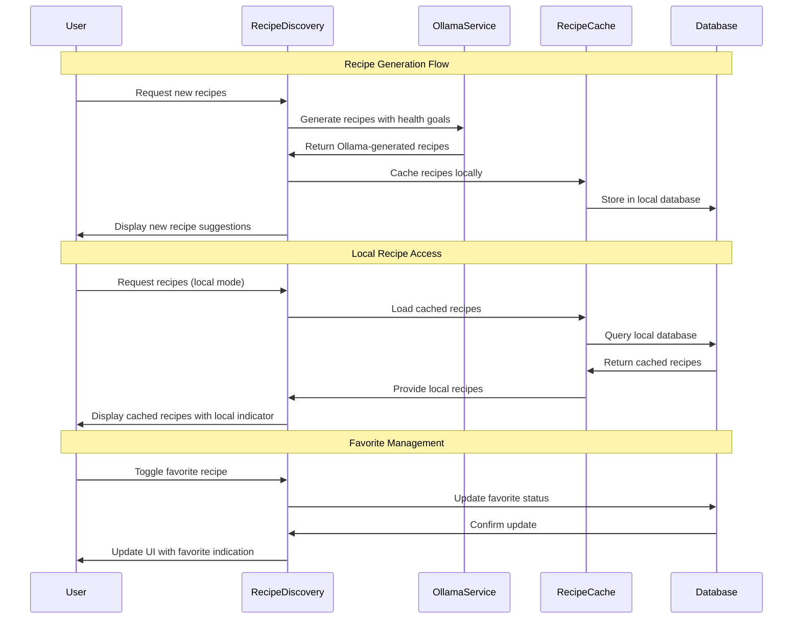

# 06 Get AI-Generated Recipe Suggestions - Implementation Planning

## User Story

As a user, I want to receive personalized healthy recipe suggestions, so that I can discover new nutritious meals that align with my health goals.

## Pre-conditions

- User has completed signup and selected health goals
- User has access to the main application with navigation
- Local database (SQLite) is initialized with recipe caching tables
- AI service integration (ChatGPT API or local LLaMA) is configured
- User's health goals and dietary preferences are stored
- Internet connection available for new recipe generation (offline for cached recipes)

## Design

### Visual Layout

The AI recipe suggestions interface will feature:
- **Header Section**: Page title, filter controls, and refresh/generate new recipes button
- **Recipe Discovery Grid**: Visually appealing recipe cards with images and key information
- **Recipe Detail Modal**: Full recipe view with ingredients, instructions, and nutrition facts
- **Personalization Panel**: Health goal indicators and dietary preference filters
- **Favorites Collection**: Saved recipes organized by categories and meal types
- **Generation Status**: Loading states and local AI generation progress indicators
- **Ollama Status**: Indicator showing local Ollama service availability and model status
- **Smart Suggestions**: Local AI-powered recommendations based on user's food tracking history

### Color and Typography

- **Background Colors**: 
  - Primary: bg-orange-50 dark:bg-orange-900/10
  - Recipe cards: bg-white dark:bg-gray-800
  - Ollama generation indicator: bg-gradient-to-r from-green-400 to-blue-400
  - Favorite badges: bg-yellow-100 dark:bg-yellow-900/30
  - Health goal tags: bg-green-100 dark:bg-green-900/30
  - Loading states: bg-gray-100 dark:bg-gray-800 animate-pulse

- **Typography**:
  - Page title: font-inter text-3xl font-bold text-gray-900 dark:text-white
  - Recipe titles: font-inter text-xl font-semibold text-gray-900 dark:text-white
  - Cooking time: font-inter text-sm font-medium text-orange-600 dark:text-orange-400
  - Ingredients: font-inter text-base text-gray-700 dark:text-gray-300
  - Instructions: font-inter text-base leading-relaxed text-gray-800 dark:text-gray-200
  - Ollama attribution: font-inter text-xs text-green-600 dark:text-green-400

- **Component-Specific**:
  - Recipe cards: bg-white dark:bg-gray-800 shadow-md hover:shadow-lg rounded-xl
  - Favorite button: bg-yellow-100 hover:bg-yellow-200 text-yellow-800
  - Generate button: bg-gradient-to-r from-green-500 to-blue-500 hover:from-green-600 hover:to-blue-600 text-white
  - Health goal tags: bg-green-100 text-green-800 rounded-full px-3 py-1
  - Difficulty badges: bg-blue-100 text-blue-800 rounded-md px-2 py-1

### Interaction Patterns

- **Recipe Card Interactions**: 
  - Hover: Gentle lift effect with shadow increase (200ms ease)
  - Click: Modal open with smooth transition and backdrop blur
  - Favorite toggle: Heart animation with color transition
  - Accessibility: Focus ring, keyboard navigation, card descriptions

- **Ollama Generation Process**:
  - Loading: Pulsing gradient with progress indicators
  - Success: Smooth card entrance animations
  - Error: Clear error messaging with retry options
  - Progress: Real-time local AI generation status updates
  - Accessibility: Loading announcements, completion notifications

- **Recipe Detail Modal**:
  - Open: Smooth scale-in animation with backdrop fade
  - Close: Scale-out with backdrop fade
  - Navigation: Smooth transitions between recipe sections
  - Actions: Save, share, and rate recipe with clear feedback
  - Accessibility: Focus trapping, ESC key closing, proper heading structure

### Measurements and Spacing

- **Container**:
  ```
  max-w-7xl mx-auto px-4 sm:px-6 lg:px-8 py-6
  ```

- **Recipe Grid Layout**:
  ```
  - Grid: grid-cols-1 md:grid-cols-2 lg:grid-cols-3 xl:grid-cols-4 gap-6
  - Card dimensions: aspect-ratio-4/3 min-h-[320px]
  - Card padding: p-4
  - Image area: h-48 object-cover rounded-lg
  ```

- **Component Spacing**:
  ```
  - Section margins: space-y-8
  - Card spacing: space-y-4
  - Tag spacing: space-x-2 space-y-2
  - Button groups: space-x-3
  ```

### Responsive Behavior

- **Desktop (lg: 1024px+)**:
  ```
  - Grid: 4 columns with sidebar for filters
  - Full recipe detail modal with side-by-side layout
  - Extended recipe information and nutrition details
  - Hover effects and smooth animations
  ```

- **Tablet (md: 768px - 1023px)**:
  ```
  - Grid: 2-3 columns with collapsible filters
  - Full-screen modal with tabbed content
  - Touch-friendly interactions
  - Simplified nutrition display
  ```

- **Mobile (sm: < 768px)**:
  ```
  - Single column with vertical scrolling
  - Bottom sheet modal for recipe details
  - Swipe gestures for navigation
  - Large touch targets for all actions
  ```

## Technical Requirements

### Component Structure

```
src/app/recipes/
├── page.tsx
├── [id]/
│   └── page.tsx
└── _components/
    ├── RecipeDiscovery.tsx          # Main recipe suggestion interface
    ├── RecipeGrid.tsx               # Grid layout for recipe cards
    ├── RecipeCard.tsx               # Individual recipe card component
    ├── RecipeDetailModal.tsx        # Full recipe view modal
    ├── RecipeFilters.tsx            # Health goal and dietary filters
    ├── FavoriteRecipes.tsx          # Saved recipes collection
    ├── OllamaGenerationIndicator.tsx # Local AI loading and status display
    ├── NutritionFacts.tsx           # Recipe nutrition information
    ├── RecipeInstructions.tsx       # Step-by-step cooking instructions
    └── useRecipeSuggestions.ts      # Custom hook for Ollama recipe management
```

### Required Components

- RecipeDiscovery ⬜
- RecipeGrid ⬜
- RecipeCard ⬜
- RecipeDetailModal ⬜
- RecipeFilters ⬜
- FavoriteRecipes ⬜
- OllamaGenerationIndicator ⬜
- NutritionFacts ⬜
- RecipeInstructions ⬜
- useRecipeSuggestions ⬜

### State Management Requirements

```typescript
interface Recipe {
  id: string;
  title: string;
  description: string;
  cookingTime: number; // minutes
  servings: number;
  difficulty: 'easy' | 'medium' | 'hard';
  healthGoalAlignment: HealthGoal[];
  dietaryTags: DietaryTag[];
  ingredients: Ingredient[];
  instructions: Instruction[];
  nutritionFacts: NutritionInfo;
  imageUrl?: string;
  aiGenerated: boolean;
  generatedAt: Date;
  isFavorite: boolean;
  createdAt: Date;
}

interface Ingredient {
  id: string;
  name: string;
  amount: number;
  unit: string;
  category: string;
  isOptional?: boolean;
  substitutes?: string[];
}

interface Instruction {
  id: string;
  stepNumber: number;
  description: string;
  duration?: number; // minutes
  temperature?: number; // celsius
  tips?: string[];
}

interface DietaryTag {
  id: string;
  name: string; // "vegetarian", "gluten-free", "low-carb", etc.
  description: string;
  color: string;
}

interface RecipeGenerationRequest {
  healthGoals: HealthGoal[];
  dietaryRestrictions: DietaryTag[];
  preferredIngredients: string[];
  mealType: 'breakfast' | 'lunch' | 'dinner' | 'snack';
  cookingTime: number;
  servings: number;
  cuisinePreference?: string;
}

interface RecipeSuggestionsState {
  // Recipe Data
  recipes: Recipe[];
  favoriteRecipes: Recipe[];
  currentRecipe: Recipe | null;
  
  // Ollama Generation States
  isGenerating: boolean;
  generationProgress: number;
  lastGeneratedAt: Date | null;
  ollamaStatus: 'connected' | 'disconnected' | 'loading';
  currentModel: string; // e.g., 'llama2', 'mistral', 'codellama'
  
  // UI States
  selectedFilters: DietaryTag[];
  searchQuery: string;
  showFavoritesOnly: boolean;
  
  // Modal States
  isRecipeModalOpen: boolean;
  isFiltersOpen: boolean;
  
  // User Preferences
  userHealthGoals: HealthGoal[];
  preferredCuisines: string[];
  dietaryRestrictions: DietaryTag[];
}

// State Updates
const actions = {
  generateNewRecipes: (request: RecipeGenerationRequest) => Promise<void>;
  refreshRecipeSuggestions: () => Promise<void>;
  toggleFavoriteRecipe: (recipeId: string) => Promise<void>;
  openRecipeModal: (recipe: Recipe) => void;
  closeRecipeModal: () => void;
  updateFilters: (filters: DietaryTag[]) => void;
  searchRecipes: (query: string) => void;
  loadCachedRecipes: () => Promise<void>;
}
```

## Acceptance Criteria

### Layout & Content

1. Recipe Discovery Page Layout
   ```
   - Header with page title and AI generation controls
   - Filter panel for health goals and dietary preferences
   - Grid layout displaying recipe cards with images and key info
   - Load more/pagination for extensive recipe collections
   ```

2. Recipe Card Content
   ```
   - Appetizing recipe image or placeholder
   - Recipe title and brief description
   - Cooking time, servings, and difficulty indicators
   - Health goal alignment tags
   - Favorite/save button with heart icon
   - AI-generated badge for transparency
   ```

3. Recipe Detail Modal
   ```
   - Full recipe view with large image
   - Complete ingredients list with measurements
   - Step-by-step cooking instructions
   - Detailed nutrition facts and health benefits
   - Save to favorites and share functionality
   ```

4. Ollama Generation Interface
   ```
   - Clear indication when recipes are being generated locally
   - Progress indicators for local AI processing
   - Success/error messaging for generation status
   - Ollama service status indicator with model information
   ```

### Functionality

1. Ollama Recipe Generation

   - [ ] Generate personalized recipes using local Ollama models
   - [ ] Use Ollama API to create original recipe content locally
   - [ ] Include complete ingredients list, instructions, and nutrition information
   - [ ] Align recipe suggestions with user's selected health objectives

2. Recipe Management and Caching

   - [ ] Cache generated recipes locally for offline access
   - [ ] Allow users to save favorite recipes for future reference
   - [ ] Support recipe filtering by dietary preferences and health goals
   - [ ] Refresh recipe suggestions periodically or on user request

3. Personalization and Preferences

   - [ ] Consider user's food tracking history for better recommendations
   - [ ] Respect dietary restrictions and preferences in recipe generation
   - [ ] Adapt recipe complexity based on user's cooking experience
   - [ ] Learn from user's favorite recipes to improve future suggestions

4. Local AI Integration

   - [ ] Work with local Ollama models for all recipe generation
   - [ ] No internet connection required for AI-generated content
   - [ ] Use only local data and models for privacy and reliability
   - [ ] Provide clear indicators for Ollama model status and generation progress

### Navigation Rules

- Recipe page accessible from main navigation and dashboard quick actions
- Recipe details open in modal or full-page view depending on screen size
- Favorites accessible through dedicated section and filtering options
- AI generation initiated through prominent "Generate New Recipes" button
- Deep linking support for individual recipes and sharing

### Error Handling

- Graceful handling of Ollama service unavailability with cached recipe fallback
- Clear error messaging for failed recipe generation with retry options
- Local model error handling with fallback to alternative Ollama models
- Rate limiting awareness with appropriate user messaging for Ollama API
- Data validation for recipe content to ensure completeness and accuracy

## Modified Files

```
src/app/recipes/
├── page.tsx ⬜
├── [id]/
│   └── page.tsx ⬜
└── _components/
    ├── RecipeDiscovery.tsx ⬜
    ├── RecipeGrid.tsx ⬜
    ├── RecipeCard.tsx ⬜
    ├── RecipeDetailModal.tsx ⬜
    ├── RecipeFilters.tsx ⬜
    ├── FavoriteRecipes.tsx ⬜
    ├── OllamaGenerationIndicator.tsx ⬜
    ├── NutritionFacts.tsx ⬜
    ├── RecipeInstructions.tsx ⬜
    └── useRecipeSuggestions.ts ⬜
├── lib/
│   ├── ai/
│   │   ├── ollama.ts ⬜
│   │   └── recipePrompts.ts ⬜
│   ├── database/
│   │   └── recipes.ts ⬜
│   └── utils/
│       ├── recipeParser.ts ⬜
│       └── nutritionCalculator.ts ⬜
└── types/
    └── recipes.ts ⬜
```

## Status

🟨 IN PROGRESS

1. Setup & Configuration

   - [ ] Configure Ollama local AI service integration
   - [ ] Create database schema for recipe storage and caching
   - [ ] Setup recipe parsing and nutrition calculation utilities
   - [ ] Define recipe prompt templates for Ollama generation

2. Layout Implementation

   - [ ] Create responsive recipe discovery page with grid layout
   - [ ] Implement recipe card components with appealing visual design
   - [ ] Build recipe detail modal with comprehensive information display
   - [ ] Add Ollama generation status indicators and loading states

3. Feature Implementation

   - [ ] Build Ollama recipe generation with health goal personalization
   - [ ] Implement recipe caching system for offline access
   - [ ] Create favorite recipe management with local storage
   - [ ] Add recipe filtering and search functionality

4. Testing
   - [ ] Unit tests for Ollama prompt generation and response parsing
   - [ ] Integration tests for recipe caching and favorite management
   - [ ] User experience testing for recipe discovery workflow
   - [ ] Performance testing for Ollama generation and large recipe collections

## Dependencies

- Ollama local AI service installation and setup
- Image generation/sourcing service for recipe visuals
- Local models for recipe generation (no internet required)
- SQLite database with full-text search for recipe caching
- User health goals and dietary preferences from onboarding

## Related Stories

- 01 ([Set Health Goals During Signup - provides goal data for recipe personalization])
- 04 ([Record Food Intake - provides food preferences and history for better recommendations])

## Notes

### Technical Considerations

1. **Ollama Service Setup**: Local Ollama installation with appropriate cooking/recipe models
2. **Recipe Quality Assurance**: Implement validation to ensure generated recipes are practical and safe
3. **Caching Strategy**: Intelligent caching based on user preferences and generation frequency
4. **Rate Limiting**: Respect Ollama API rate limits with appropriate user feedback
5. **Content Parsing**: Robust parsing of Ollama-generated content into structured recipe data

### Business Requirements

- Recipe suggestions must align with user's selected health goals
- Generated recipes should be practical and achievable for home cooking
- Local AI functionality ensures recipes work without internet dependency
- Favorite recipe system encourages user engagement and retention
- Ollama transparency builds trust through clear generation indicators

### API Integration

#### Type Definitions

```typescript
interface OllamaRecipePrompt {
  healthGoals: string[];
  dietaryRestrictions: string[];
  mealType: string;
  cookingTime: number;
  servings: number;
  cuisineStyle?: string;
  availableIngredients?: string[];
}

interface AIRecipeResponse {
  title: string;
  description: string;
  cookingTime: number;
  servings: number;
  difficulty: string;
  ingredients: {
    name: string;
    amount: string;
    unit: string;
  }[];
  instructions: {
    step: number;
    description: string;
  }[];
  nutritionEstimate: {
    calories: number;
    protein: number;
    carbohydrates: number;
    fat: number;
  };
  healthBenefits: string[];
}

interface RecipeCache {
  id: string;
  recipe: Recipe;
  generatedFor: HealthGoal[];
  cacheExpiry: Date;
  accessCount: number;
  lastAccessed: Date;
}

interface RecipeSuggestionsStore {
  recipes: Recipe[];
  favorites: Recipe[];
  aiGenerationStatus: 'idle' | 'generating' | 'success' | 'error';
  lastError: string | null;
  
  generateRecipes: (prompt: AIRecipePrompt) => Promise<Recipe[]>;
  toggleFavorite: (recipeId: string) => Promise<void>;
  loadCachedRecipes: () => Promise<Recipe[]>;
  searchRecipes: (query: string, filters: DietaryTag[]) => Recipe[];
}
```

### Mock Implementation

#### Mock Server Configuration

```typescript
// filepath: mocks/stub.ts
const mocks = [
  {
    endPoint: '/api/recipes/generate',
    json: 'generatedRecipes.json',
  },
  {
    endPoint: '/api/recipes/favorites',
    json: 'favoriteRecipes.json',
  },
];
```

#### Mock Response

```json
// filepath: mocks/responses/generatedRecipes.json
{
  "status": "SUCCESS",
  "data": {
    "recipes": [
      {
        "id": "recipe-1",
        "title": "Protein-Packed Quinoa Bowl",
        "description": "A nutritious bowl perfect for muscle building goals with quinoa, grilled chicken, and colorful vegetables.",
        "cookingTime": 25,
        "servings": 2,
        "difficulty": "easy",
        "healthGoalAlignment": ["muscle_gain"],
        "dietaryTags": [
          {
            "id": "gluten-free",
            "name": "Gluten-Free",
            "color": "green"
          },
          {
            "id": "high-protein",
            "name": "High Protein",
            "color": "blue"
          }
        ],
        "ingredients": [
          {
            "name": "Quinoa",
            "amount": 1,
            "unit": "cup",
            "category": "grains"
          },
          {
            "name": "Chicken Breast",
            "amount": 8,
            "unit": "oz",
            "category": "protein"
          },
          {
            "name": "Bell Peppers",
            "amount": 2,
            "unit": "medium",
            "category": "vegetables"
          }
        ],
        "instructions": [
          {
            "stepNumber": 1,
            "description": "Rinse quinoa and cook according to package directions.",
            "duration": 15
          },
          {
            "stepNumber": 2,
            "description": "Season and grill chicken breast until cooked through.",
            "duration": 8
          }
        ],
        "nutritionFacts": {
          "calories": 485,
          "protein": 42,
          "carbohydrates": 45,
          "fat": 12,
          "fiber": 6
        },
        "aiGenerated": true,
        "generatedAt": "2025-11-03T10:30:00Z"
      }
    ],
    "generationMeta": {
      "promptUsed": "muscle building, high protein, 25 minutes",
      "aiModel": "ollama-llama2",
      "generatedAt": "2025-11-03T10:30:00Z"
    }
  }
}
```

### State Management Flow



### Custom Hook Implementation

```typescript
const useRecipeSuggestions = () => {
  const [recipes, setRecipes] = useState<Recipe[]>([]);
  const [favoriteRecipes, setFavoriteRecipes] = useState<Recipe[]>([]);
  const [isGenerating, setIsGenerating] = useState(false);
  const [ollamaStatus, setOllamaStatus] = useState<'available' | 'unavailable' | 'checking'>('checking');
  const [currentModel, setCurrentModel] = useState<string>('llama2');
  const [selectedFilters, setSelectedFilters] = useState<DietaryTag[]>([]);

  const generateNewRecipes = useCallback(async (request: RecipeGenerationRequest) => {
    setIsGenerating(true);
    try {
      // Build Ollama prompt based on user preferences
      const prompt = buildRecipePrompt({
        healthGoals: request.healthGoals.map(goal => goal.id),
        dietaryRestrictions: request.dietaryRestrictions.map(tag => tag.name),
        mealType: request.mealType,
        cookingTime: request.cookingTime,
        servings: request.servings,
        cuisinePreference: request.cuisinePreference
      });

      let newRecipes: Recipe[];
      if (ollamaStatus === 'available') {
        newRecipes = await generateRecipesWithOllama(prompt, currentModel);
      } else {
        throw new Error('Ollama service unavailable');
      }

      // Process and validate generated recipes
      const processedRecipes = await Promise.all(
        newRecipes.map(async (recipe) => {
          const nutritionFacts = await calculateNutritionFacts(recipe.ingredients);
          return {
            ...recipe,
            id: generateId(),
            nutritionFacts,
            aiGenerated: true,
            generatedAt: new Date(),
            isFavorite: false,
            createdAt: new Date()
          };
        })
      );

      // Cache recipes locally
      await cacheRecipes(processedRecipes);
      
      setRecipes(prev => [...processedRecipes, ...prev]);
      
    } catch (error) {
      console.error('Failed to generate recipes:', error);
      
      // Fallback to cached recipes if generation fails
      const cachedRecipes = await loadCachedRecipes();
      setRecipes(cachedRecipes);
      
      throw error;
    } finally {
      setIsGenerating(false);
    }
  }, [ollamaStatus, currentModel]);

  const toggleFavoriteRecipe = useCallback(async (recipeId: string) => {
    try {
      const recipe = recipes.find(r => r.id === recipeId);
      if (!recipe) return;

      const updatedRecipe = { ...recipe, isFavorite: !recipe.isFavorite };
      
      await updateRecipeFavoriteStatus(recipeId, updatedRecipe.isFavorite);
      
      setRecipes(prev => 
        prev.map(r => r.id === recipeId ? updatedRecipe : r)
      );

      if (updatedRecipe.isFavorite) {
        setFavoriteRecipes(prev => [...prev, updatedRecipe]);
      } else {
        setFavoriteRecipes(prev => prev.filter(r => r.id !== recipeId));
      }
    } catch (error) {
      console.error('Failed to toggle favorite:', error);
      throw error;
    }
  }, [recipes]);

  const loadCachedRecipes = useCallback(async () => {
    try {
      const cached = await getCachedRecipes();
      setRecipes(cached);
      
      const favorites = cached.filter(recipe => recipe.isFavorite);
      setFavoriteRecipes(favorites);
    } catch (error) {
      console.error('Failed to load cached recipes:', error);
    }
  }, []);

  const filteredRecipes = useMemo(() => {
    if (selectedFilters.length === 0) return recipes;
    
    return recipes.filter(recipe =>
      selectedFilters.every(filter =>
        recipe.dietaryTags.some(tag => tag.id === filter.id)
      )
    );
  }, [recipes, selectedFilters]);

  // Load cached recipes on mount
  useEffect(() => {
    loadCachedRecipes();
  }, [loadCachedRecipes]);

  // Monitor online status
  useEffect(() => {
    const handleOnlineStatus = () => setIsOnline(navigator.onLine);
    
    window.addEventListener('online', handleOnlineStatus);
    window.addEventListener('offline', handleOnlineStatus);
    
    return () => {
      window.removeEventListener('online', handleOnlineStatus);
      window.removeEventListener('offline', handleOnlineStatus);
    };
  }, []);

  return {
    recipes: filteredRecipes,
    favoriteRecipes,
    isGenerating,
    isOnline,
    selectedFilters,
    setSelectedFilters,
    generateNewRecipes,
    toggleFavoriteRecipe,
    loadCachedRecipes,
  };
};
```

## Testing Requirements

### Integration Tests (Target: 80% Coverage)

1. AI Recipe Generation

```typescript
describe('AI Recipe Generation', () => {
  it('should generate recipes based on user health goals', async () => {
    // Test AI recipe generation with different health goals
  });

  it('should cache generated recipes for offline access', async () => {
    // Test recipe caching mechanism
  });

  it('should handle AI service failures gracefully', async () => {
    // Test fallback to cached recipes when AI is unavailable
  });

  it('should validate generated recipe content for completeness', async () => {
    // Test recipe validation and error handling
  });
});
```

2. Recipe Management and Favorites

```typescript
describe('Recipe Management', () => {
  it('should allow users to save and remove favorite recipes', async () => {
    // Test favorite recipe functionality
  });

  it('should filter recipes by dietary preferences and health goals', async () => {
    // Test recipe filtering logic
  });

  it('should load cached recipes when offline', async () => {
    // Test offline recipe access
  });
});
```

3. Personalization and User Preferences

```typescript
describe('Recipe Personalization', () => {
  it('should align recipe suggestions with user health goals', async () => {
    // Test health goal alignment in recipes
  });

  it('should consider user food tracking history for recommendations', async () => {
    // Test personalization based on food history
  });

  it('should respect dietary restrictions in generated recipes', async () => {
    // Test dietary restriction handling
  });
});
```

### Performance Tests

1. AI Generation Performance

```typescript
describe('Performance', () => {
  it('should generate recipes within acceptable time limits', async () => {
    // Test AI response time and timeout handling
  });

  it('should handle multiple concurrent recipe generation requests', async () => {
    // Test concurrent AI requests
  });

  it('should efficiently cache and retrieve recipes', async () => {
    // Test caching performance
  });
});
```

### Accessibility Tests

```typescript
describe('Accessibility', () => {
  it('should provide keyboard navigation for recipe cards and modals', async () => {
    // Test keyboard accessibility
  });

  it('should announce recipe generation status to screen readers', async () => {
    // Test screen reader integration
  });

  it('should support high contrast mode for recipe content', async () => {
    // Test visual accessibility
  });
});
```

### Test Environment Setup

```typescript
// Test helper functions
const mockAIService = () => {
  // Mock AI service responses for testing
};

const createMockRecipe = (overrides?: Partial<Recipe>): Recipe => {
  // Generate mock recipe data
};

const renderRecipeDiscovery = (props?: Partial<RecipeDiscoveryProps>) => {
  // Render recipe discovery with providers and mock data
};

beforeEach(() => {
  jest.clearAllMocks();
  mockDatabase.reset();
  mockAIService();
});
```